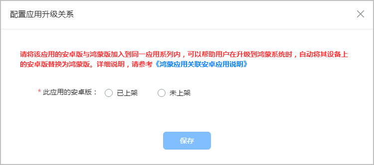
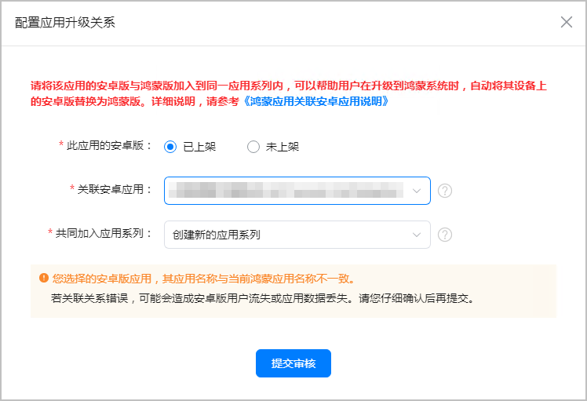
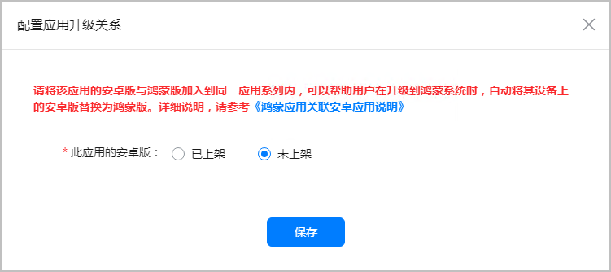
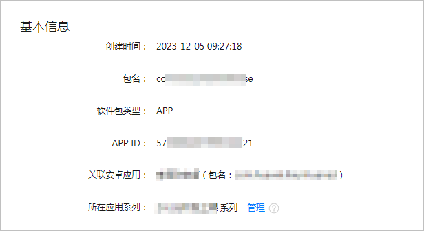
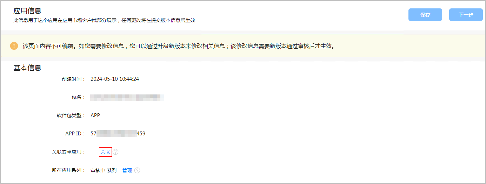

* 一个HarmonyOS应用仅能关联一个在架Android应用。
* 关联关系建立后不可再变更，后续升级不支持重新编辑关联关系。

在AppGallery Connect发布版本点击“提交审核”时，系统会自动按匹配规则检测您名下是否存在可关联的Android应用。如有，则弹出下图所示窗口。

* 如果需要关联的Android应用已经上架：
  + 此应用的安卓版：选择“已上架”
  + 关联安卓应用：选择需要关联的Android应用

    

    需要资产转移的HarmonyOS游戏必须选择“已上架”的Android应用。
  + 共同加入应用系列：进行关联的Android应用和HarmonyOS应用将维护在一个应用系列中，如果您之前已经维护了应用系列，可以选择对应的应用系列，否则则创建新的应用系列。

  
* 如果需要关联的Android应用还未上架：

  “此应用的安卓版”选择“未上架”，点击“保存”，然后提交版本发布审核。

  

  当HarmonyOS应用版本发布成功后，您可以在“应用信息”界面查看关联的Android应用。

  

如果您在提交发布版本时没有配置关联Android应用，还可以在“应用信息”界面的“关联安卓应用”处进行关联。

