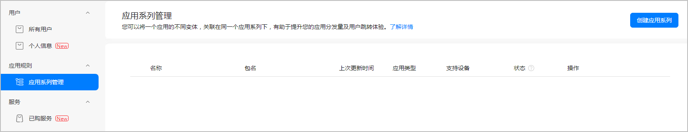
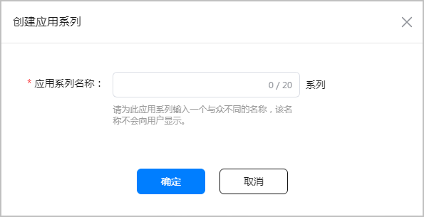
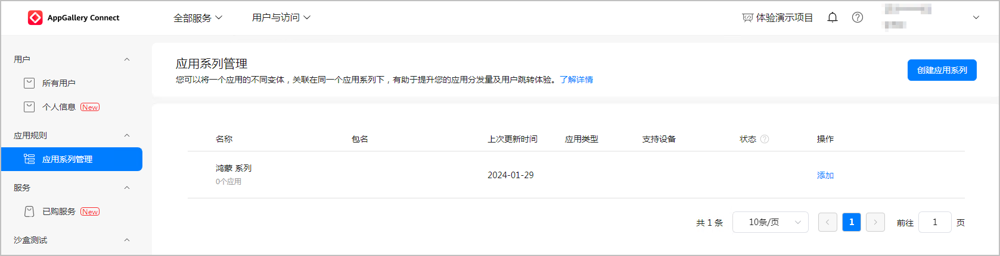
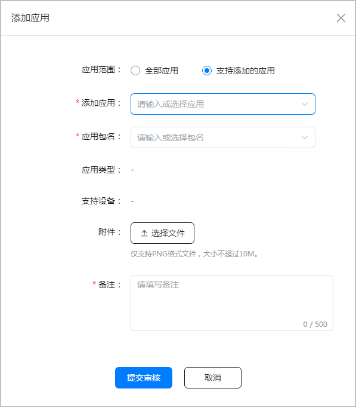

应用系列是指您可将同一应用的不同变体（如：HarmonyOS版本、Android版本、元服务等不同格式），关联在同一个应用系列里面，有助于提升您的应用分发量及用户跳转体验。

当用户设备升级至HarmonyOS 5及以上版本时，可以通过应用系列里的关联关系，快速将设备上的Android应用自动替换为HarmonyOS应用，并完成用户数据迁移。

管理应用系列存在如下限制条件：

* 只有在中国大陆注册的开发者团队账号才可以关联应用系列。
* 只能将本人开发者账号下已上架的应用添加到应用系列。
* 只有全网状态的应用，才支持维护应用系列关系。
* 为保障用户体验的稳定性，一个应用在一个自然年度内，最多只能修改1次关联的应用系列，请慎重操作关联。

AppGallery Connect会根据相关性判断，将部分满足条件的应用自动加入到同一应用系列内，您可以在此基础上，自行维护管理应用系列。

#### 管理应用系列

1. 登录[AppGallery Connect](https://developer.huawei.com/consumer/cn/service/josp/agc/index.html)，选择“用户与访问”。
2. 左侧菜单选择“应用规则 > 应用系列管理”，进入“应用系列管理”界面。

   
3. 点击“创建应用系列”，输入一个与众不同的名称，以方便您区分不同的应用系列，点击“确定”。

   
4. 创建应用系列后，列表中会出现一条应用系列，此时应用系列里还没有关联任何应用，点击“添加”加入应用。

   
5. 选择“支持添加的应用”，系统将为您筛选出符合添加规则的应用范围，您可以在此范围内，选择合适的应用添加到系列中。

   

   | 参数 | 说明 |
   | --- | --- |
   | 应用范围 | 默认选择“支持添加的应用”。  * 选择“支持添加的应用”，则“添加应用”可以选择开发者账号下满足规则的在架态应用。 * 选择“全部应用”，则“添加应用”可以选择开发者账号下全部在架态应用。 |
   | 添加应用 | 选择需要添加到应用系列的应用。 |
   | 应用包名 | 选择需要添加到应用系列的应用对应的应用包名。  * 若“添加应用”选择应用后，则“应用包名”可以选择该应用下的应用包名。 * 若“添加应用”不选择，则“应用包名”同样根据“应用范围”的选择展示相应的包名。 |
   | 应用类型 | 应用名称和应用包名确认后，应用类型自动带出。 |
   | 支持设备 | 应用名称和应用包名确认后，支持设备自动带出。 |
   | 附件 | 上传可以证明添加应用与应用系列中已存在其他应用具有关联性的材料，用于华为方审核。  支持上传PNG格式图片，不超过10MB。 |
   | 备注 | 必填，说明添加应用与应用系列中已存在其他应用具有关联性，不超过500字符，用于华为方审核。 |

   

   已加入应用系列内的应用，不支持移出，有问题可以联系[华为客服](https://developer.huawei.com/consumer/cn/support/feedback/#/)。

#### 审核应用系列

提交审核的应用系列审核时长大约10个工作日，审核结果将通过互动消息反馈。

#### 删除应用系列

当应用系列内仅剩1个或0个应用时，才支持删除。
