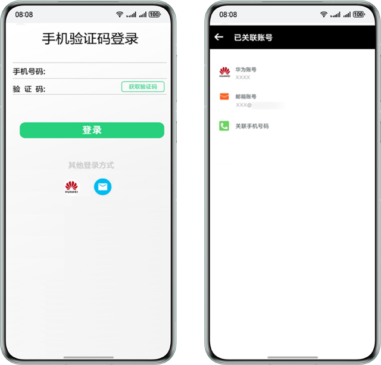
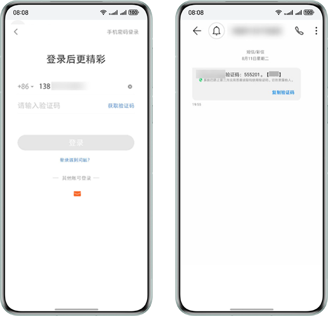
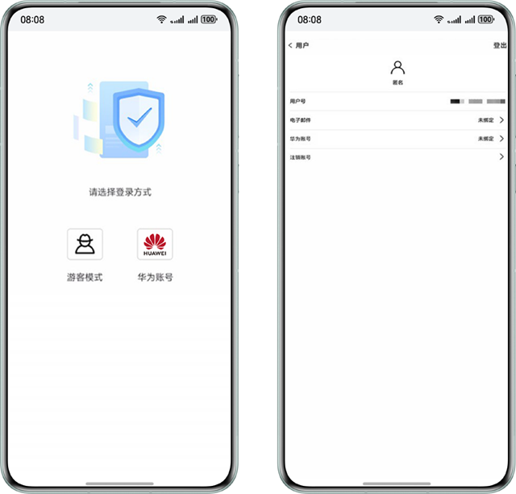

#### 向用户提供多种登录方式

认证方式可以支撑您的应用向用户提供多种登录方式，并允许用户关联多种账号，无论用户采用何种方式登录，都能获得统一的身份和业务体验。

通过认证服务来构建相关能力，相比传统开发模式，可以大幅降低您的工作量 。

#### 验证码方式登录

为了消除用户经常忘记密码的困扰，您可以向用户提供验证码登录方式。用户无需录入密码，只需要获取并提交验证码即可完成登录。

认证服务的手机账号和邮箱账号都提供了验证码的支撑。对于发往中国大陆的手机验证/通知短信，您需要自行购买第三方短信服务完成发送，认证服务可对接您提供的短信发送接口，来进行后续短信的正常下发。对于邮箱验证邮件，您无需自行对接邮箱代理，认证服务会帮您完成验证邮件的发送。认证服务内置了78种语言的验证邮件模板，能够根据用户设备的语言自动匹配邮件语言。

#### 游客模式

您可以为您的应用提供游客模式，以便降低用户的访问门槛，提升您的用户转化率。用户不必注册和登录即可访问应用的部分内容，仅当用户在应用内进行特定操作、访问特定内容或者触发您设定的特定限制时才引导用户进行注册和登录。

您可以方便地使用认证服务的匿名账号来实现这一场景。当用户选择游客模式时，您为用户进行匿名登录，此时用户会隐式注册成为一个匿名用户。当匿名用户改用其他登录方式登录应用时，您可以将其他登录账号关联到匿名用户，以便匿名用户转化为正式用户，正式用户会继承匿名用户的用户标识，以确保其业务连贯。

