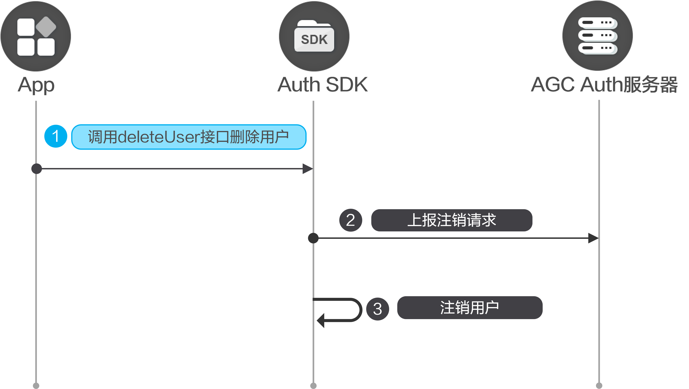

#### 前提条件

* 您需要在AppGallery Connect[开通认证服务](/docs/distribute/agc/agc-help-auth-preparation-0000002236496826/agc-help-auth-enable-service-0000002271422405)。
* 您需要先在您的应用中[集成SDK](/docs/distribute/agc/agc-help-auth-0000002236336998/agc-help-auth-integration-sdk-0000002236337006)。

#### 开发步骤



当用户不再使用应用，可以注销当前用户。您需要调用[Auth.deleteUser](/docs/distribute/agc/agc-help-auth-api-0000002273777077/agc-help-auth-api-auth-0000002273777093#section197703751114)实现该功能，用户一旦被注销，将会在删除服务端侧用户信息的同时，清空客户端侧用户信息和Token。

```
import auth from '@hw-agconnect/auth';

auth.deleteUser();
```


对于销户操作，要求用户必须在5分钟内登录过应用才能执行。若登录已超时，请参见[账号重认证](/docs/distribute/agc/agc-help-auth-0000002236336998/agc-help-auth-reauthenticate-0000002271416149)先完成重认证。
