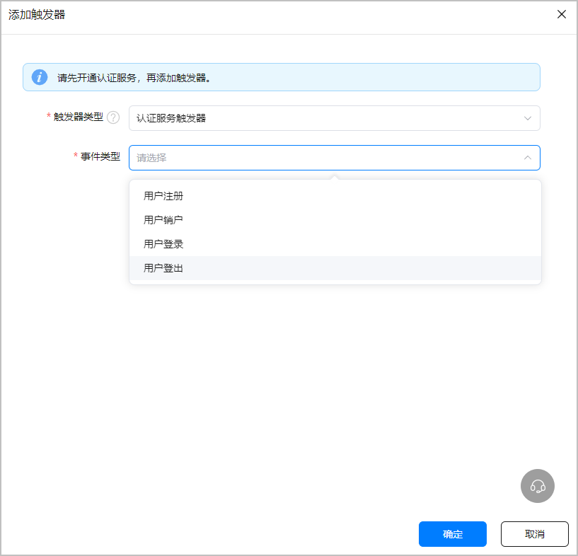

认证服务为您提供了基于云函数的扩展机制，您可以通过为云函数配置相应事件类型的认证服务触发器来接收用户的注册、登录等关键事件，并在云函数中扩展您的处理。

比如，您可以创建函数并监听用户注册事件以便进行用户业务数据的初始化，您也可以创建函数并监听用户销户事件以便进行用户业务数据的清理。

#### 为函数设置认证服务触发器

为函数添加触发器时，可以选择认证服务触发器，请参见[创建认证服务触发器](https://developer.huawei.com/consumer/cn/doc/AppGallery-connect-Guides/agc-cloudfunction-authtrigger-0000001658717860)。



认证服务触发器提供了四种事件类型：

* 用户注册
* 用户销户
* 用户登录
* 用户登出

#### 在函数中获取用户信息

您可以从认证服务触发的云函数的参数中获取相关的用户信息，请参见[认证服务触发器对象格式](https://developer.huawei.com/consumer/cn/doc/AppGallery-connect-Guides/agc-cloudfunction-trigger-event-0000001620581529#section750223942812)。

```
// 获取用户标识
var uid = event.uid;

// 获取用户操作类型: 0 用户注册, 1 用户销户, 2 用户登录, 3 用户登出
var op = event.op;
```
