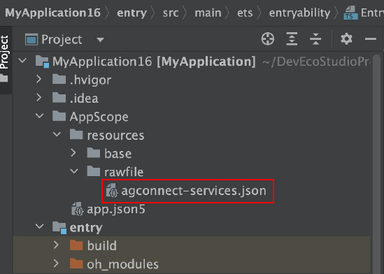
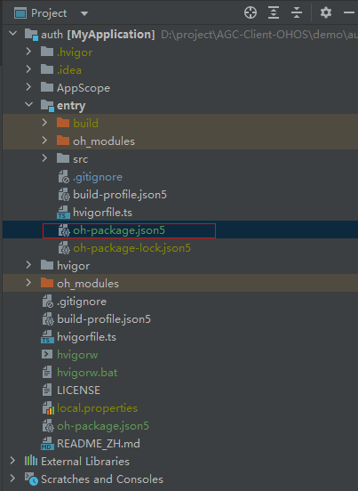
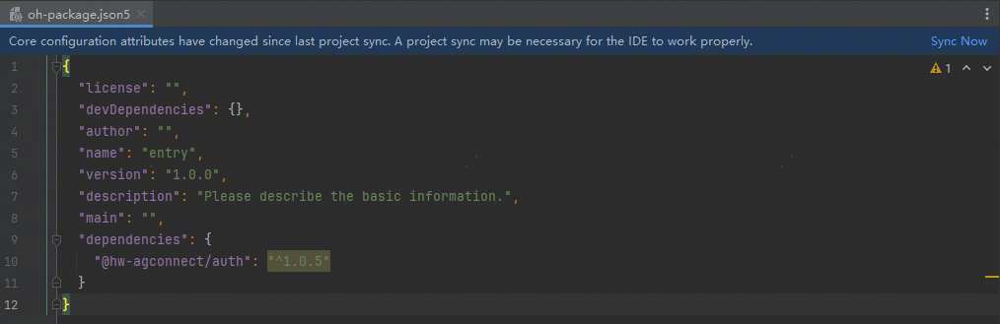
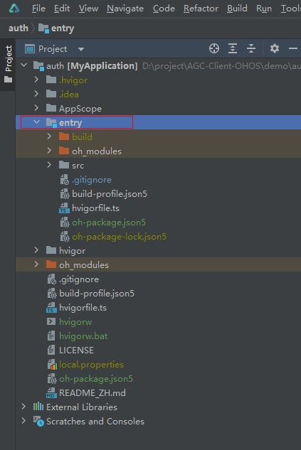
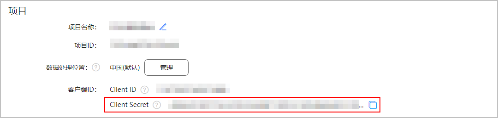
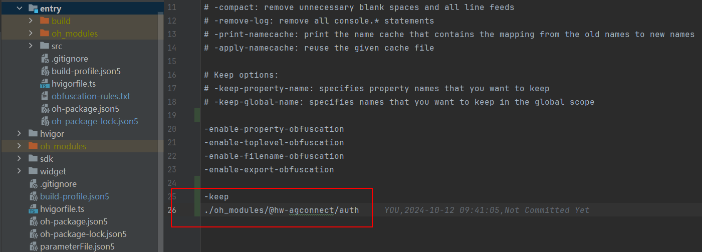

AGC 认证服务SDK能为您的应用迅速搭建安全可靠的用户认证系统，您只需在应用中调用认证服务的相关功能，无需担心云侧的设施和实现细节。内置了多种认证方式，让您可以轻松完成用户认证的开发工作。

SDK名称：AGC 认证服务SDK

包名：@hw-agconnect/auth

版本号：1.0.5

md5值：53d14451f0cb3d97a049a6ebc8e84297

开发者：华为软件技术有限公司

隐私政策：[SDK隐私政策](/docs/distribute/agc/agc-help-auth-0000002236336998/agc-help-auth-sdksecurity-0000002236496854)

合规指引：[SDK合规使用指南](/docs/distribute/agc/agc-help-auth-0000002236336998/agc-help-auth-personal-data-0000002236337034)

#### 前提条件

* 安装HUAWEI DevEco Studio 5.0.3.100及以上版本
* 配置 SDK API Version 12及以上
  + Compile SDK Version 12及以上
  + Compatible SDK Version 12及以上

#### 添加应用配置文件

1. [获取“agconnect-services.json”文件](/docs/distribute/agc/agc-help-auth-preparation-0000002236496826/agc-help-auth-obtain-files-0000002236343310#section99771326132714)。
2. 将“agconnect-services.json”文件拷贝到DevEco Studio项目的“AppScope/resources/rawfile”目录下。

   

   “AppScope/resources”目录下默认不存在“rawfile”文件夹，需要您手动创建。

   

#### 配置SDK依赖

添加配置文件后，需要在DevEco Studio项目中配置SDK依赖，您可以通过以下任意一种方式配置SDK依赖：

#### [h2]方式一

1. 打开DevEco Studio应用级（一般为entry）下的“oh-package.json5”文件。

   
2. 在“oh-package.json5”文件里面添加认证服务的编译依赖和SDK依赖。

   ```
   "dependencies": {
     "@hw-agconnect/auth": "^1.0.5"
   }
   ```

3. 打开修改完的“oh-package.json5”文件，右上方出现“Sync Now”链接，点击“Sync Now”等待同步完成。

   

#### [h2]方式二

1. 打开您的工程，在命令行窗口执行**cd** **entry**命令，切换到工程的“entry”目录。

   
2. 安装SDK到您的项目中。

   ```
   ohpm install @hw-agconnect/auth
   ```

#### 集成SDK


* 工程的应用框架必须为Stage模型，即“apiType”为“stageMode”。
* 请确保SDK的Compile API版本不低于12。
* 请确保采用ohpm方式编译。

1. 在您的项目中导入agc组件。

   ```
   import auth from '@hw-agconnect/auth';
   ```
2. 在您的应用初始化阶段使用context初始化SDK，推荐在“entry/src/main/ets/entryability/EntryAbility.ets”的onCreate中进行。

   ```
   // 初始化SDK
   onCreate(want, launchParam) {
     let file = this.context.resourceManager.getRawFileContentSync('agconnect-services.json');
     let json: string = buffer.from(file.buffer).toString();
     auth.init(this.context, json);
   }
   ```
3. 在“entry/src/main/module.json5”文件中添加网络权限。

   ```
   "requestPermissions": [
     {
       "name": "ohos.permission.INTERNET"
     }
   ]
   ```

#### （可选）设置配置文件参数

如果您在下载配置文件时选择了“不包含密钥”，配置信息中将不包含Client ID和Client Secret，您还需调用AGC SDK的接口手动将Client ID和Client Secret传给AppGallery Connect使用。

1. 在“项目设置 > 常规”页面中获取Client ID和Client Secret。

   

2. 在应用启动调用初始化方法完成后将参数设置给AGC SDK。

   ```
   import auth from '@hw-agconnect/auth';

   let file = this.context.resourceManager.getRawFileContentSync('agconnect-services.json');
   let json: string = buffer.from(file.buffer).toString();
   auth.init(this.context, json);
   auth.setClientId("xxx"); // 设置Client ID
   auth.setClientSecret("xxx"); // 设置Client Secret
   ```

#### 配置混淆脚本

当前认证服务SDK开启了混淆，如果您的工程中也开启了混淆并配置了混淆规则，则需要您在工程的混淆规则配置文件“obfuscation-rules.txt”中添加认证服务SDK的混淆规则。

1. 打开混淆规则配置文件“obfuscation-rules.txt”。
2. 参照如下示例添加混淆规则。

   ```
   -keep
   XXX/oh_modules/@hw-agconnect/auth
   ```

   其中，“XXX”表示认证服务SDK在“oh\_modules”文件夹下的路径，例如下图中“oh\_modules”和“obfuscation-rules.txt”同在“entry”目录下。

   
