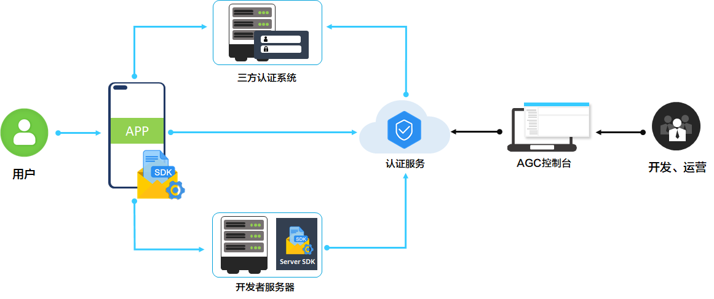
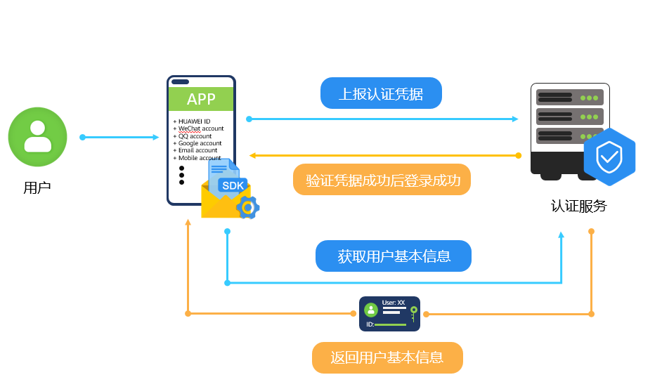
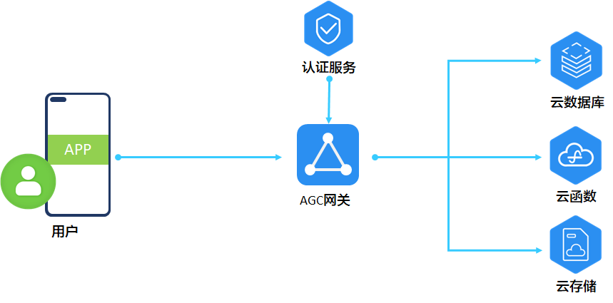

认证服务能为您的应用迅速搭建起安全可靠的用户认证系统，您只需在应用中调用认证服务的相关功能，无需担心云侧的设施和实现细节。认证服务提供了SDK和后端支持，内置多种认证方式，配备强大的管理平台，让您可以轻松完成用户认证的开发与管理工作。

**了解更多信息：**

* [有哪些应用场景](/docs/distribute/agc/agc-help-auth-0000002236336998/agc-help-auth-applicationscenarios-0000002271416133)
* [有哪些使用限制](/docs/distribute/agc/agc-help-auth-0000002236336998/agc-help-auth-restrict-0000002236337002)
* [认证服务与华为账号服务的区别和关系？](/docs/distribute/agc/agc-help-auth-0000002236336998/agc-help-auth-faq-0000002271496205#section444019195133)

#### 主要功能

您可以通过在应用中集成认证服务SDK来轻松快速地向您的用户推出注册、登录等相关功能。您可以选择向您的用户提供以下一种或多种认证方式。

|  |  |  |
| --- | --- | --- |
| [手机号码](/docs/distribute/agc/agc-help-auth-login-0000002271496189/agc-help-auth-login-phone-0000002271416141) | 通过手机号码来对用户进行身份认证，您的用户可以使用“手机号码+密码”或者“手机号码+验证码”方式来登录您的应用。  认证服务提供了基于手机号码的注册、登录、密码修改、密码重置、验证短信推送等能力和接口。 | |
| [邮箱账号](/docs/distribute/agc/agc-help-auth-login-0000002271496189/agc-help-auth-login-email-0000002236496830) | 通过邮箱地址来对用户进行身份认证，您的用户可以使用邮箱地址和密码或者邮箱地址和验证码来登录您的应用。  认证服务提供了基于邮箱地址的注册、登录、密码修改、密码重置、验证邮件推送等能力和接口。 | |
| [华为账号](/docs/distribute/agc/agc-help-auth-login-0000002271496189/agc-help-auth-login-hwaccount-0000002236337010) | 通过华为账号来对用户进行身份认证。您的用户可以使用华为账号和密码来登录您的应用。 | |
| [自有账号](/docs/distribute/agc/agc-help-auth-login-0000002271496189/agc-help-auth-login-self-0000002271496193) | 如果您已经自行构建了认证系统，您可以通过自有账号对接让您已构建的认证系统与认证服务协同工作，比如：让认证服务来提供您的自有认证系统所不具备的认证方式。 | |
| [匿名账号](/docs/distribute/agc/agc-help-auth-login-0000002271496189/agc-help-auth-login-anonymous-0000002271416145) | 匿名账号支持应用的游客访问模式。认证服务可以为您的游客分配用户标识，使您能够识别不同的游客并为他们提供差异化的服务。游客可通过关联其他认证方式来转化成为正式用户，并保留其原来的用户标识不变，以使其业务保持连贯。  注意：  中国大陆地区游戏不支持匿名登录。 | |
| [关联账号](/docs/distribute/agc/agc-help-auth-login-0000002271496189/agc-help-auth-login-linkaccount-0000002236496838) | 您可以将身份验证提供方凭据关联至现有用户账号，允许用户使用多个身份验证提供方服务登录您的应用。无论用户使用哪个身份验证提供方服务登录，均可通过同一AppGallery Connect用户ID识别用户。 | |

如果您的游戏集成华为联运服务，请遵守与华为游戏联运有关账号的相关约定，请参见[联运游戏开发](https://developer.huawei.com/consumer/cn/doc/app/joint-operation-game-0000002024369570)**。**

#### 工作原理

#### [h2]系统上下文

* 认证服务提供了SDK，您可以在应用中集成认证服务SDK，以便您访问认证服务提供的各项能力。
* 认证服务提供了控制台，您的开发和运营人员可以在控制台上配置认证服务和管理用户。
* 如果您向用户提供华为账号认证方式，那么认证服务会帮助您的应用完成在云侧与第三方认证系统的交互。

#### [h2]登录流程

1. 获取认证凭据。

   认证方式不同，其认证凭据的获取方式也不相同。

   * 对于手机账号，认证凭据是用户的手机号码和密码或者手机号码和验证码。
   * 对于邮箱账号，认证凭据是用户的邮箱地址和密码或者邮箱地址和验证码。
   * 对于华为账号，认证凭据是第三方认证服务颁发的OAuth令牌。
   * 对于匿名账号，认证凭据是认证服务SDK为该应用安装实例生成的唯一标识。
   * 对于自有账号，认证凭据是您已有认证系统通过Server SDK生成的Token。
2. 上报认证凭据。

   应用将认证凭据通过认证服务SDK上报给认证服务。
3. 验证认证凭据。

   认证服务对认证凭据进行验证。
4. 返回认证结果。

   认证服务将认证结果返回给应用。此时：

   * 应用可以访问和维护该用户的基本个人资料信息（昵称、头像等）。
   * 应用可以访问和操作其他Serverless服务中的受安全规则保护的数据，参见[认证服务与Serverless](#section11147103935719)。

#### [h2]认证服务与云开发服务

您可以单独使用认证服务，也可以配套云开发服务一起使用。

认证服务为云函数、云数据库、云存储等服务提供了全面且自适应的安全支撑，可令您对用户数据的保护事半功倍。配合认证服务：

* 您可以直接从云函数的参数中获取用户信息并在您的函数逻辑中使用它。
* 您也可以在云数据库和云存储中直接基于用户信息来编辑安全规则，实现基于用户和用户属性的数据和文件访问安全控制。

#### 实现流程

| 序号 | 步骤 | 详情 |
| --- | --- | --- |
| 1 | 启用认证方式 | 在认证服务控制台启用您想要支持的认证方式，并按照界面引导提供必要的配置信息。  对于华为账号认证，需要提供在第三方认证系统中申请的应用标识及秘钥。 |
| 2 | 在应用客户端实现登录界面流程 | 在应用客户端代码中实现用户登录所需的界面流程：   * 对于手机账号和邮箱账号认证，请实现用户输入账号信息、密码或者验证码信息界面流程，并且实现注册、登录、密码修改、密码重置、验证码推送等流程。 * 对于华为账号认证，需要按照第三方认证系统的要求实现登录界面流程。 * 对于匿名账号认证，您需要帮助或引导游客完成匿名登录。 * 对于自有账号认证，您可以保持您原有的登录体验，并在流程中增加认证服务所需Token的生成和传递。 |
| 3 | 端侧集成认证服务SDK | 在应用的端侧代码中集成认证服务SDK，并通过认证服务SDK上报认证凭据、接收认证结果。 |
