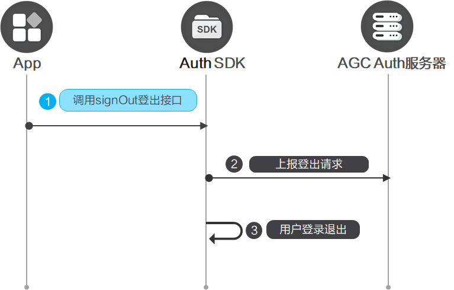

#### 前提条件

* 您需要在AppGallery Connect[开通认证服务](https://developer.huawei.com/consumer/cn/doc/app/agc-help-auth-enable-service-0000002271422405)。
* 您需要先在您的应用中[集成SDK](https://developer.huawei.com/consumer/cn/doc/app/agc-help-auth-integration-sdk-0000002236337006)。

#### 开发步骤



当用户不再使用应用，或者需要使用其他账号登录时，需要调用[Auth.signOut](https://developer.huawei.com/consumer/cn/doc/app/agc-help-auth-api-auth-0000002273777093#section4122193119119)登出当前用户。用户一旦被登出，端侧的用户信息和Token将被清除。

```
import auth from '@hw-agconnect/auth';
import { BusinessError } from '@kit.BasicServicesKit';

auth.signOut().then(() => {
  // 登出成功
}).catch((error: BusinessError) => {
  // 登出失败
});
```
