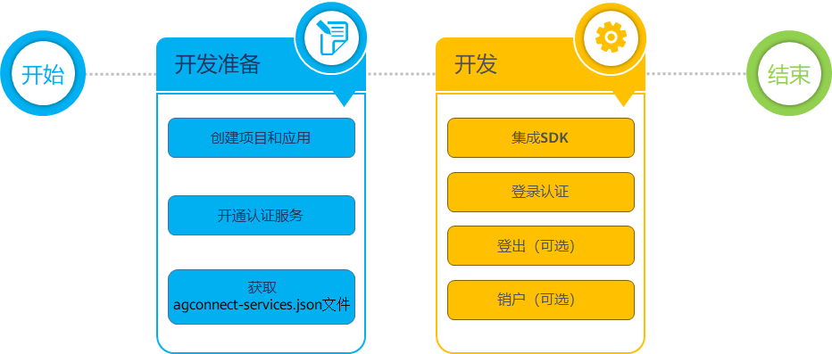

| 序号 | 任务 | 说明 |
| --- | --- | --- |
| 1 | [创建项目](https://developer.huawei.com/consumer/cn/doc/app/agc-help-create-project-0000002242804048)  [创建应用](https://developer.huawei.com/consumer/cn/doc/app/agc-help-create-app-0000002247955506) | 项目是您在AppGallery Connect资源的组织实体，您可以将一个应用的不同平台版本添加到同一个项目中。  说明：  您可以通过创建不同的项目，实现分别在测试环境和开发环境使用认证服务。 |
| 2 | [开通认证服务](https://developer.huawei.com/consumer/cn/doc/app/agc-help-auth-enable-service-0000002271422405) | - |
| 3 | [获取agconnect-services.json文件](https://developer.huawei.com/consumer/cn/doc/app/agc-help-auth-obtain-files-0000002236343310#section99771326132714) | - |
| 4 | [集成SDK](https://developer.huawei.com/consumer/cn/doc/app/agc-help-auth-integration-sdk-0000002236337006) | 在工程中集成AGC SDK以及认证服务SDK。 |
| 5 | 根据业务需要，实现不同账号的登录认证。   * [手机号码](https://developer.huawei.com/consumer/cn/doc/app/agc-help-auth-login-phone-0000002271416141) * [邮箱](https://developer.huawei.com/consumer/cn/doc/app/agc-help-auth-login-email-0000002236496830) * [华为账号](https://developer.huawei.com/consumer/cn/doc/app/agc-help-auth-login-hwaccount-0000002236337010) * [自有账号](https://developer.huawei.com/consumer/cn/doc/app/agc-help-auth-login-self-0000002271496193) * [匿名账号](https://developer.huawei.com/consumer/cn/doc/app/agc-help-auth-login-anonymous-0000002271416145) * [关联账号](https://developer.huawei.com/consumer/cn/doc/app/agc-help-auth-login-linkaccount-0000002236496838) | - |
| 6 | [登出](https://developer.huawei.com/consumer/cn/doc/app/agc-help-auth-logout-0000002236337014) | 当用户不需要使用应用，或者需要切换其他账号登录认证时，可以进行登出。登出后，端侧保留的用户信息和Token将被删除。 |
| 7 | [销户](https://developer.huawei.com/consumer/cn/doc/app/agc-help-auth-deregistration-0000002271496197) | 当用户需要注销当前账号时，可以进行销户。 |
