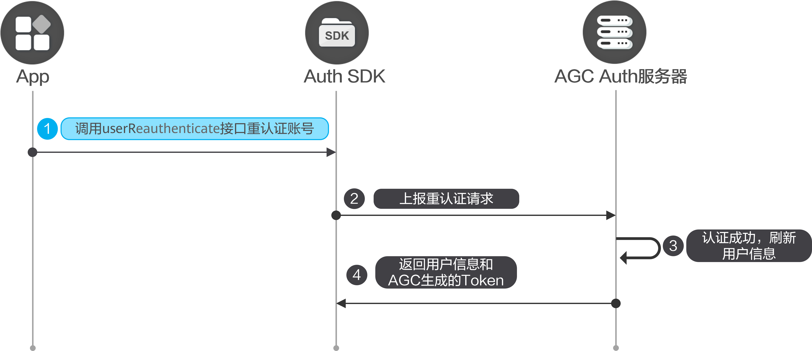

#### 前提条件

* 您需要在AppGallery Connect[开通认证服务](https://developer.huawei.com/consumer/cn/doc/app/agc-help-auth-enable-service-0000002271422405)。
* 您需要先在您的应用中[集成SDK](https://developer.huawei.com/consumer/cn/doc/app/agc-help-auth-integration-sdk-0000002236337006)。

#### 开发步骤



对于销户、修改密码、关联账号以及重置手机账号和邮箱账号这些敏感操作，要求用户必须在5分钟内登录过应用才能执行。如果您执行敏感操作时已经登录超过5分钟，该操作会抛出AGCAuthError异常，并收到错误码为203818081的错误，这种情况下您可以先调用[AuthUser.userReauthenticate](https://developer.huawei.com/consumer/cn/doc/app/agc-help-auth-api-authuser-0000002273781645#section49111416135613)，重认证账号后再执行敏感操作。

```
import auth from '@hw-agconnect/auth';

auth.getCurrentUser().then(user => {
  if (!user) {
    return;
  }
  user.userReauthenticate({
    credentialInfo: {
      kind: 'phone',
      password: 'your password',
      phoneNumber: '138********',
      countryCode: '86',
      verifyCode: 'xxxxxx'
    }
  });
});
```
