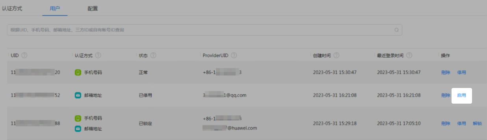
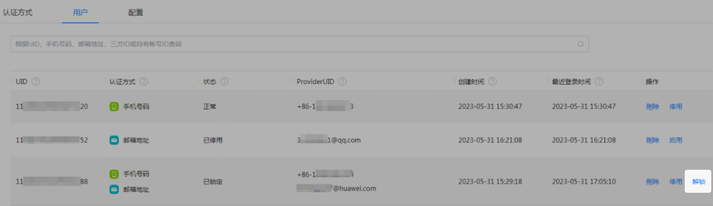
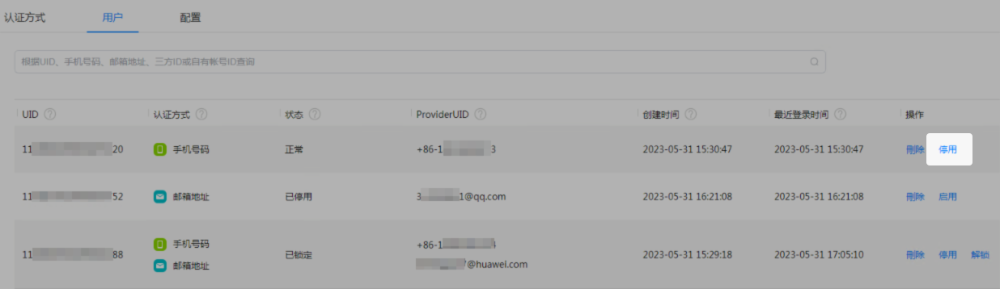
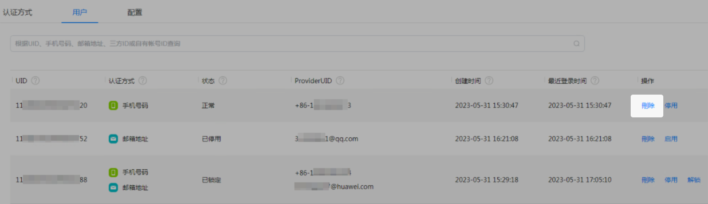

同一个项目下已经登录过的用户都会展现在“用户”页签。您可以在此管理用户，可对用户进行停用、启用、解锁和删除的操作。

#### 启用用户

您可以将已停用的用户进行重新启用，用户便可重新登录应用。

1. 在认证服务页面，点击“用户”页签，在搜索框中输入UID、手机号码、邮箱地址、三方ID或自有账号ID查询用户，在状态为“已停用”的用户的“操作”列点击“启用”。

   
2. 在系统弹出的对话框中点击“确定”，用户状态变更为“正常”。

#### 解锁用户

下面以“手机号码”认证方式为例进行说明。

用户使用“手机号码”的认证方式登录应用时，输入的密码或验证码次数达到了尝试次数的上限，该用户会被锁定即用户状态变更为“已锁定”。锁定期间，该用户将不能再以“手机号码”认证方式登录应用。如果用户需要立即解锁账号，您可以帮助用户进行解锁，用户的状态变更为“正常”。

如果用户使用“手机号码”认证方式登录时被锁定，该用户的其他认证方式（如邮箱账号）依然可以正常登录。

1. 在认证服务页面，点击“用户”页签，在搜索框中输入UID、手机号码、邮箱地址、三方ID或自有账号ID查询用户，在状态为“已锁定”的用户的“操作”列点击“解锁”。

   
2. 在系统弹出的对话框中点击“确定”，用户即可解锁，状态变更为“正常”。

#### 停用用户

您可以将暂时不需要登录的用户进行停用，停用后，用户需要重新启用后才可以登录应用。

1. 在认证服务页面，点击“用户”页签，在搜索框中输入UID、手机号码、邮箱地址、三方ID或自有账号ID查询用户，在需要停用用户的“操作”列点击“停用”。

   
2. 在系统弹出的对话框中点击“确定”，用户状态变更为“已停用”。

#### 删除用户

如果用户不需要继续使用您的应用，您可以在此将用户删除，删除后若想再次登录，需要重新认证登录。

1. 在认证服务页面，点击“用户”页签，在搜索框中输入UID、手机号码、邮箱地址、三方ID或自有账号ID查询用户，在需要删除用户的“操作”列点击“删除”。

   
2. 在系统弹出的对话框中点击“确定”，用户从列表中删除。
