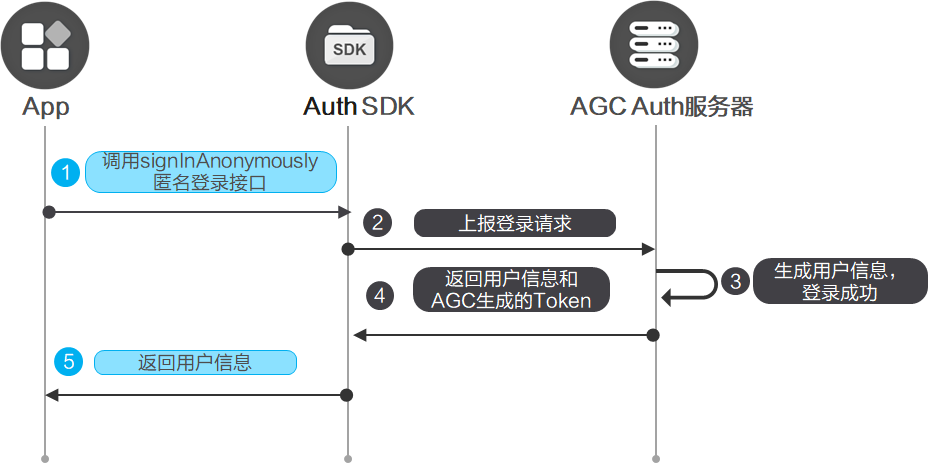

您可以在应用中集成匿名账号认证方式，让您的用户可以使用游客模式进行身份验证。

#### 前提条件

* 您需要在AppGallery Connect[开通认证服务](/docs/distribute/agc/agc-help-auth-preparation-0000002236496826/agc-help-auth-enable-service-0000002271422405)。
* 您需要先在您的应用中[集成SDK](/docs/distribute/agc/agc-help-auth-0000002236336998/agc-help-auth-integration-sdk-0000002236337006)。

#### 开发步骤



1. 在应用的登录界面，初始化[Auth](/docs/distribute/agc/agc-help-auth-api-0000002273777077/agc-help-auth-api-auth-0000002273777093)实例，获取AGC的用户信息，检查是否有已经登录的用户。如果有，则可以直接进入用户界面，否则显示登录界面。可通过[AuthUser.isAnonymous](/docs/distribute/agc/agc-help-auth-api-0000002273777077/agc-help-auth-api-authuser-0000002273781645#section15810340163512)判断是否是匿名登录用户。

   ```
   import auth from '@hw-agconnect/auth';

   auth.getCurrentUser().then(user=>{
     if(user){
       // 业务逻辑
     }
   });
   ```
2. 调用[Auth.signInAnonymously](/docs/distribute/agc/agc-help-auth-api-0000002273777077/agc-help-auth-api-auth-0000002273777093#section1394015509369)进行匿名登录，返回匿名用户信息。

   ```
   import auth from '@hw-agconnect/auth';
   import { BusinessError } from '@kit.BasicServicesKit';

   auth.signInAnonymously().then(user => {
     // 匿名登录成功
   }).catch((error: BusinessError) => {
     // 匿名登录失败
   });
   ```

#### 更多信息

* 您如果想让用户可以使用多个账号登录您的应用，可以[将多个账号进行关联](/docs/distribute/agc/agc-help-auth-login-0000002271496189/agc-help-auth-login-linkaccount-0000002236496838)。
* 当用户不需要使用应用，或者需要切换其他账号登录认证，可以先执行[登出](/docs/distribute/agc/agc-help-auth-0000002236336998/agc-help-auth-logout-0000002236337014)。
* 当用户需要注销当前用户，可以进行[销户](/docs/distribute/agc/agc-help-auth-0000002236336998/agc-help-auth-deregistration-0000002271496197)。
* 对于销户、修改密码、关联账号以及重置手机账号和邮箱账号等敏感操作，为了提高安全性，需要用户必须在5分钟内登录过才能执行。如果用户执行敏感操作时登录超过5分钟，需要[账号重认证](/docs/distribute/agc/agc-help-auth-0000002236336998/agc-help-auth-reauthenticate-0000002271416149)后再执行敏感操作。
* 您可以参考[异常处理](/docs/distribute/agc/agc-help-auth-0000002236336998/agc-help-auth-troubleshooting-0000002236337022)实现自己的异常处理机制，从而减少异常情况的发生。
* 您可以使用云函数触发器来接收用户注册、登录、销户等关键事件，从而[扩展认证服务的能力](/docs/distribute/agc/agc-help-auth-0000002236336998/agc-help-auth-extension-0000002237645842)。
* 您可以参考[管理用户](/docs/distribute/agc/agc-help-auth-0000002236336998/agc-help-auth-user-manage-0000002236496846)对用户进行解锁、停用等操作。
