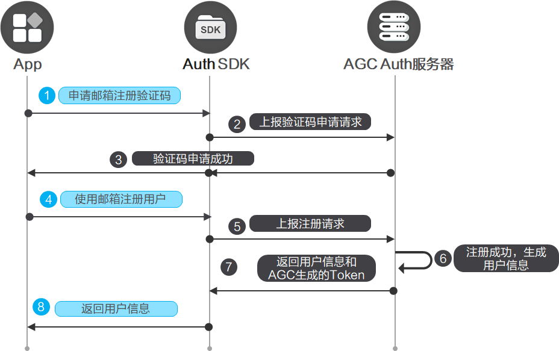
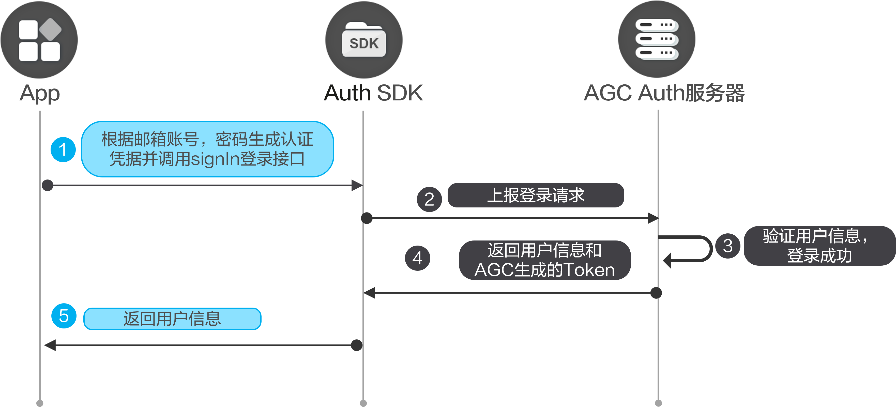
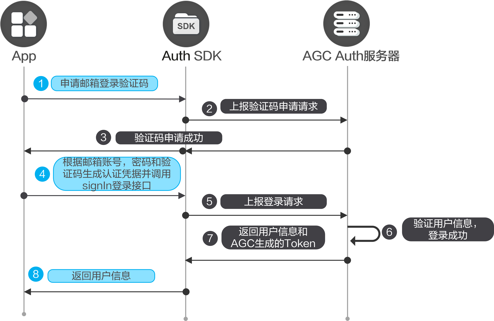

您可以在应用中集成邮箱账号认证方式，您的用户可以使用“邮箱地址+密码”或者“邮箱地址+验证码”的方式来登录您的应用。

#### 前提条件

* 您需要在AppGallery Connect[开通认证服务](https://developer.huawei.com/consumer/cn/doc/app/agc-help-auth-enable-service-0000002271422405)。
* 您需要先在您的应用中[集成SDK](https://developer.huawei.com/consumer/cn/doc/app/agc-help-auth-integration-sdk-0000002236337006)。

#### 注册



1. 在使用邮箱注册之前，需要先验证您的邮箱，确保该邮箱账户归您所有。

   调用[Auth.requestVerifyCode](https://developer.huawei.com/consumer/cn/doc/app/agc-help-auth-api-auth-0000002273777093#section9850751813)申请验证码。

   ```
   import auth from '@hw-agconnect/auth';
   import { VerifyCodeAction } from '@hw-agconnect/auth';
   import { BusinessError } from '@kit.BasicServicesKit';

   auth.requestVerifyCode({
     action: VerifyCodeAction.REGISTER_LOGIN,
     lang: 'zh_CN',
     sendInterval: 60,
     verifyCodeType: {
       email: 'xxxx@xxx.com',
       kind: 'email'
     }
   }).then(verifyCodeResult => {
     // 验证码申请成功
   }).catch((error: BusinessError) => {
     // 验证码申请失败
   });
   ```
2. 使用邮箱账号注册用户。

   调用[Auth.createUser](https://developer.huawei.com/consumer/cn/doc/app/agc-help-auth-api-auth-0000002273777093#section19861514132515)注册用户。注册成功后，系统会自动登录，无需再次调用登录接口。

   ```
   import auth from '@hw-agconnect/auth';
   import { BusinessError } from '@kit.BasicServicesKit';

   auth.createUser({
     "kind": 'email',
     "email": 'xxxx@xxx.com',
     "password": 'your password',
     "verifyCode": 'xxxxxx'
   }).then(result => {
     // 创建账号成功后，默认已登录
   }).catch((error: BusinessError) => {
   // 创建用户失败  })
   ```
3. 登录成功后可以调用[Auth.getCurrentUser](https://developer.huawei.com/consumer/cn/doc/app/agc-help-auth-api-auth-0000002273777093#section87068861218)获取用户账号数据。

   ```
   import auth from '@hw-agconnect/auth';

   auth.getCurrentUser();
   ```

#### 密码登录



1. 在应用的登录界面，初始化[Auth](https://developer.huawei.com/consumer/cn/doc/app/agc-help-auth-api-auth-0000002273777093)实例，获取AGC的用户信息，检查是否有已经登录的用户。如果有，则可以直接进入用户界面，否则显示登录界面。

   ```
   import auth from '@hw-agconnect/auth';

   auth.getCurrentUser().then(user=>{
     if(user){
       // 业务逻辑
     }});
   ```

2. 调用[Auth.signIn](https://developer.huawei.com/consumer/cn/doc/app/agc-help-auth-api-auth-0000002273777093#section136957141012)实现登录。

   ```
   import auth from '@hw-agconnect/auth';
   import { BusinessError } from '@kit.BasicServicesKit';

   auth.signIn({
     autoCreateUser: true,
     credentialInfo: {
       kind: 'email',
       password: 'your password',
       email: 'xxxx@xxx.com'
     }
   }).then(user => {
     // 登录成功
   }).catch((error: BusinessError) => {
     // 登录失败
   });
   ```

#### 验证码登录



1. 在应用的登录界面，初始化[Auth](https://developer.huawei.com/consumer/cn/doc/app/agc-help-auth-api-auth-0000002273777093)实例，获取AGC的用户信息，检查是否有已经登录的用户。如果有，则可以直接进入用户界面，否则显示登录界面。

   ```
   import auth from '@hw-agconnect/auth';

   auth.getCurrentUser().then(user=>{
     if(user){
       // 业务逻辑
     }
   });
   ```

2. 调用[Auth.requestVerifyCode](https://developer.huawei.com/consumer/cn/doc/app/agc-help-auth-api-auth-0000002273777093#section9850751813)申请登录验证码。

   ```
   import auth from '@hw-agconnect/auth';
   import { VerifyCodeAction } from '@hw-agconnect/auth';
   import { BusinessError } from '@kit.BasicServicesKit';

   auth.requestVerifyCode({
     action: VerifyCodeAction.REGISTER_LOGIN,
     lang: 'zh_CN',
     sendInterval: 60,
     verifyCodeType: {
       email: 'xxxx@xxx.com',
       kind: 'email'
     }
   }).then(verifyCodeResult => {
     // 验证码申请成功
   }).catch((error: BusinessError) => {
     // 验证码申请失败
   });
   ```

3. 调用[Auth.signIn](https://developer.huawei.com/consumer/cn/doc/app/agc-help-auth-api-auth-0000002273777093#section136957141012)实现登录。

   

   password参数可以不传，如果同时输入了密码和验证码，则会同时验证密码和验证码。

   ```
   import auth from '@hw-agconnect/auth';
   import { BusinessError } from '@kit.BasicServicesKit';

   auth.signIn({
     credentialInfo: {
       kind: 'email',
       password: 'your password',
       email: 'xxxx@xxx.com',
       verifyCode: 'xxxxxx'
     }
   }).then(user => {
     // 登录成功
   }).catch((error: BusinessError) => {
     // 登录失败
   });
   ```

#### 修改邮箱地址


修改邮箱地址时需要用户处于登录状态。

1. 调用[Auth.requestVerifyCode](https://developer.huawei.com/consumer/cn/doc/app/agc-help-auth-api-auth-0000002273777093#section9850751813)申请验证码。

   ```
   import auth from '@hw-agconnect/auth';
   import { VerifyCodeAction } from '@hw-agconnect/auth';
   import { BusinessError } from '@kit.BasicServicesKit';

   auth.requestVerifyCode({
     action: VerifyCodeAction.REGISTER_LOGIN,
     lang: 'zh_CN',
     sendInterval: 60,
     verifyCodeType: {
       email: 'xxxx@xxx.com',
       kind: 'email'
     }
   }).then(verifyCodeResult => {
     // 验证码申请成功
   }).catch((error: BusinessError) => {
   // 验证码申请失败
   });
   ```
2. 调用[AuthUser.updateEmail](https://developer.huawei.com/consumer/cn/doc/app/agc-help-auth-api-authuser-0000002273781645#section7264195173019)修改邮箱地址。

   ```
   import auth from '@hw-agconnect/auth';

   auth.getCurrentUser().then((user) => {
     if(user){
       user.updateEmail({
         email: 'xxxx@xxx.com',
         lang: 'zh_CN',
         verifyCode: 'xxxxxx'
       })
     }
   })
   ```


对于修改邮箱地址操作，要求用户必须在5分钟内登录过应用才能执行。若登录已超时，请参见[账号重认证](https://developer.huawei.com/consumer/cn/doc/app/agc-help-auth-reauthenticate-0000002271416149)先完成重认证。

#### 修改邮箱密码


修改邮箱密码时需要用户处于登录状态。

调用[AuthUser.updatePassword](https://developer.huawei.com/consumer/cn/doc/app/agc-help-auth-api-authuser-0000002273781645#section152730591310)修改密码。

```
import auth from '@hw-agconnect/auth';

auth.getCurrentUser().then((user) => {
  if(user){
    user.updatePassword({
      password: 'your password',
      verifyCode: 'xxxxxx',
      providerType: 'email'
    })
  }
})
```


对于修改邮箱密码操作，要求用户必须在5分钟内登录过应用才能执行。若登录已超时，请参见[账号重认证](https://developer.huawei.com/consumer/cn/doc/app/agc-help-auth-reauthenticate-0000002271416149)先完成重认证。

#### 重置密码


重置密码时用户可以不登录。

1. 调用[Auth.requestVerifyCode](https://developer.huawei.com/consumer/cn/doc/app/agc-help-auth-api-auth-0000002273777093#section9850751813)申请验证码。

   ```
   import auth from '@hw-agconnect/auth';
   import { VerifyCodeAction } from '@hw-agconnect/auth';
   import { BusinessError } from '@kit.BasicServicesKit';

   auth.requestVerifyCode({
     action: VerifyCodeAction.RESET_PASSWORD,
     lang: 'zh_CN',
     sendInterval: 60,
     verifyCodeType: {
       email: 'xxx@xxx.com',
       kind: 'email',
     }
   }).then(verifyCodeResult => {
     // 验证码申请成功
   }).catch((error: BusinessError) => {
   // 验证码申请失败
   });
   ```
2. 调用[Auth.resetPassword](https://developer.huawei.com/consumer/cn/doc/app/agc-help-auth-api-auth-0000002273777093#section184671244192916)重置密码。

   ```
   import auth from '@hw-agconnect/auth';

   auth.resetPassword({
     kind: 'email',
     password: 'your password',
     email: 'xxxx@xxx.com',
     verifyCode: 'xxxxxx'
   })
   ```

#### 更多信息

* 您如果想让用户可以使用多个账号登录您的应用，可以[将多个账号进行关联](https://developer.huawei.com/consumer/cn/doc/app/agc-help-auth-login-linkaccount-0000002236496838)。
* 当用户不需要使用应用，或者需要切换其他账号登录认证，可以先执行[登出](https://developer.huawei.com/consumer/cn/doc/app/agc-help-auth-logout-0000002236337014)。
* 当用户需要注销当前用户，可以进行[销户](https://developer.huawei.com/consumer/cn/doc/app/agc-help-auth-deregistration-0000002271496197)。
* 对于销户、修改密码、关联账号以及重置手机账号和邮箱账号等敏感操作，为了提高安全性，需要用户必须在5分钟内登录过才能执行。如果用户执行敏感操作时登录超过5分钟，需要[账号重认证](https://developer.huawei.com/consumer/cn/doc/app/agc-help-auth-reauthenticate-0000002271416149)后再执行敏感操作。
* 您可以参考[异常处理](https://developer.huawei.com/consumer/cn/doc/app/agc-help-auth-troubleshooting-0000002236337022)实现自己的异常处理机制，从而减少异常情况的发生。
* 您可以使用云函数触发器来接收用户注册、登录、销户等关键事件，从而[扩展认证服务的能力](https://developer.huawei.com/consumer/cn/doc/app/agc-help-auth-extension-0000002237645842)。
* 您可以参考[管理用户](https://developer.huawei.com/consumer/cn/doc/app/agc-help-auth-user-manage-0000002236496846)对用户进行解锁、停用等操作。
