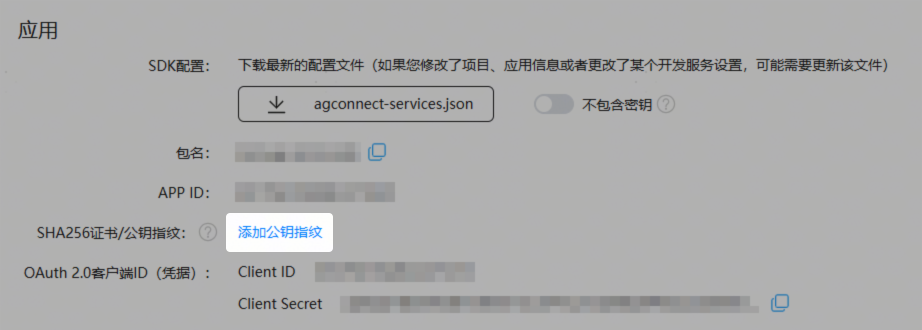
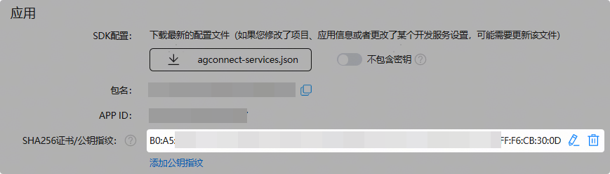
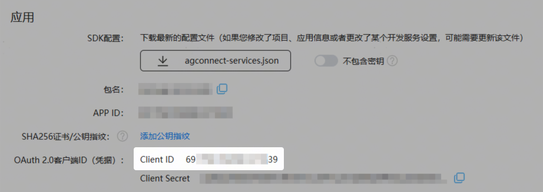
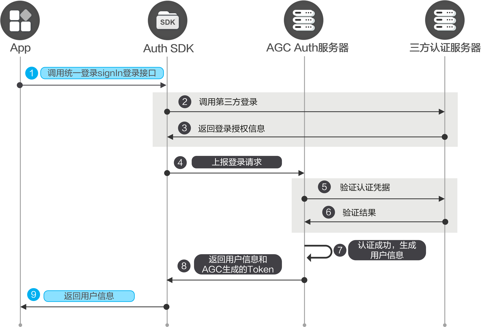

您可以在应用中集成华为账号认证方式，让您的用户可以使用自己的华为账号进行AppGallery Connect身份验证。

#### 前提条件

* 您需要在AppGallery Connect[开通认证服务](https://developer.huawei.com/consumer/cn/doc/app/agc-help-auth-enable-service-0000002271422405)和[申请华为账号权限](https://developer.huawei.com/consumer/cn/doc/harmonyos-guides/account-config-permissions)。
* 您需要先在您的应用中[集成SDK](https://developer.huawei.com/consumer/cn/doc/app/agc-help-auth-integration-sdk-0000002236337006)。

#### 配置应用签名公钥指纹

1. 登录[AppGallery Connect](https://developer.huawei.com/consumer/cn/service/josp/agc/index.html)，点击“开发与服务”。
2. 在项目列表中找到您的项目，在项目中点击您的HarmonyOS应用/元服务。
3. 在“项目设置 > 常规”页面的“应用”区域，点击“SHA256证书/公钥指纹”后的“添加公钥指纹”。

   
4. 在“添加SHA256公钥指纹”窗口，“添加方式”选择“选择指纹”，然后选择应用/元服务使用的证书对应的指纹，点击“确认”。

   

   * 调试阶段请选择应用/元服务使用的[调试证书](https://developer.huawei.com/consumer/cn/doc/app/agc-help-debug-cert-0000002283256797)指纹，发布阶段请选择应用/元服务使用的[发布证书](https://developer.huawei.com/consumer/cn/doc/app/agc-help-release-cert-0000002283336729)指纹。
   * 过期或废弃的证书不在此展示。

   
5. 指纹添加成功后，将展示在“SHA256证书/公钥指纹”栏。

   

   指纹最迟在25小时后生效。如您急需指纹生效，请执行下一步操作。

   
6. （可选）如果希望配置的公钥指纹快速生效，请在指纹成功配置10分钟后，通过改变应用/元服务工程“app.json5”文件中的“versionCode”字段的值触发指纹生效。例如，原先值为“1000000”，修改为“1000001”。

   

#### 配置Client ID

1. 登录[AppGallery Connect](https://developer.huawei.com/consumer/cn/service/josp/agc/index.html)，点击“开发与服务”。
2. 在项目列表中找到您的项目，在项目中选择目标应用，获取“项目设置 > 常规”页面“应用”区域的Client ID。

   
3. 在工程中“entry”模块的“module.json5”文件中，新增metadata，配置name为client\_id，value为上一步获取的Client ID的值。示例如下：

   ```
   "module": {
     "name": "xxx",
     "type": "entry",
     "description": "xxx",
     "mainElement": "xxx",
     "deviceTypes": [],
     "pages": "xxx",
     "abilities": [],
     "metadata": [ // 配置信息如下
       {
         "name": "client_id",
         "value": "xxx"
       }
     ]
   }
   ```

#### 开发步骤



调用[Auth.signIn](https://developer.huawei.com/consumer/cn/doc/app/agc-help-auth-api-auth-0000002273777093#section136957141012)，登录华为账号。

```
import auth from '@hw-agconnect/auth';
import { hilog } from '@kit.PerformanceAnalysisKit';
import { BusinessError } from '@kit.BasicServicesKit';

auth.signIn({
  autoCreateUser: true,
  "credentialInfo": {
    "kind": 'hwid'
  }
}).then(signInResult => {
    hilog.info(0x0000, 'testTag', '%{public}s',  `signInHwid success. result: \${signInResult.getUser().getUid()}`);
  })
  .catch((error: BusinessError) => {
    hilog.error(0x0000, 'testTag', '%{public}s', `signInHwid error, Code: \${error.code}, message: \${error.message}`);
  })
```

#### 更多信息

* 您如果想让用户可以使用多个账号登录您的应用，可以[将多个账号进行关联](https://developer.huawei.com/consumer/cn/doc/app/agc-help-auth-login-linkaccount-0000002236496838)。
* 当用户不需要使用应用，或者需要切换其他账号登录认证，可以先执行[登出](https://developer.huawei.com/consumer/cn/doc/app/agc-help-auth-logout-0000002236337014)。
* 当用户需要注销当前用户，可以进行[销户](https://developer.huawei.com/consumer/cn/doc/app/agc-help-auth-deregistration-0000002271496197)。
* 对于销户、修改密码、关联账号以及重置手机账号和邮箱账号等敏感操作，为了提高安全性，需要用户必须在5分钟内登录过才能执行。如果用户执行敏感操作时登录超过5分钟，需要[账号重认证](https://developer.huawei.com/consumer/cn/doc/app/agc-help-auth-reauthenticate-0000002271416149)后再执行敏感操作。
* 您可以参考[异常处理](https://developer.huawei.com/consumer/cn/doc/app/agc-help-auth-troubleshooting-0000002236337022)实现自己的异常处理机制，从而减少异常情况的发生。
* 您可以使用云函数触发器来接收用户注册、登录、销户等关键事件，从而[扩展认证服务的能力](https://developer.huawei.com/consumer/cn/doc/app/agc-help-auth-extension-0000002237645842)。
* 您可以参考[管理用户](https://developer.huawei.com/consumer/cn/doc/app/agc-help-auth-user-manage-0000002236496846)对用户进行解锁、停用等操作。
