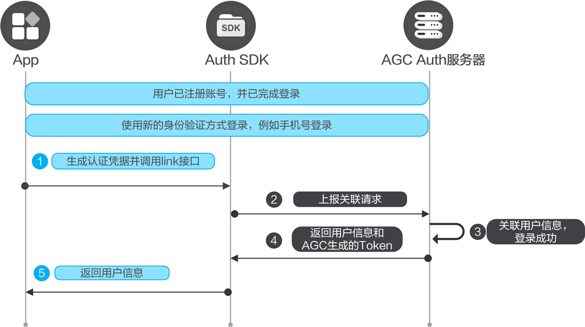

#### 前提条件

* 您需要在AppGallery Connect[开通认证服务](https://developer.huawei.com/consumer/cn/doc/app/agc-help-auth-enable-service-0000002271422405)。
* 您需要先在您的应用中[集成SDK](https://developer.huawei.com/consumer/cn/doc/app/agc-help-auth-integration-sdk-0000002236337006)。

#### 将身份验证提供方凭据与用户账号关联

您可以将身份验证提供方凭据关联至现有用户账号，允许用户使用多个身份验证提供方服务登录您的应用。无论用户使用哪个账号登录，均可通过同一AGC用户ID识别用户。例如，使用手机账号登录的用户可以关联邮箱账号，以后便可使用这两种方法中的任意一种登录。


* 目前关联账号功能支持的账号类型包括手机、邮箱和华为账号。
* 关联账号前，需要为应用增加对两个或多个身份验证提供方（可以包括匿名身份验证）的支持。
* 关联的认证方式只能有一个账号，例如手机账号关联邮箱账号，只能关联一个邮箱账号，不能关联多个。另外被关联的账号需要没有登录过应用，例如已经通过认证服务登录过的邮箱账号也无法进行关联。



1. 使用任意身份验证提供方让用户登录，如使用手机号的认证方式进行登录。
2. 调用[AuthUser.link](https://developer.huawei.com/consumer/cn/doc/app/agc-help-auth-api-authuser-0000002273781645#section27316362445)关联用户新的认证方式。关联成功后，即可以使用任意一个提供方的凭证来登录相同的AGC账号。
   * 手机方式。示例如下：

     ```
     import auth from '@hw-agconnect/auth';
     import { hilog } from '@kit.PerformanceAnalysisKit';
     import { BusinessError } from '@kit.BasicServicesKit';

     auth.getCurrentUser().then((user:AuthUser | null) => {
       user!.link({
         kind: 'phone',
         phoneNumber: '180****1485',
         countryCode: '86',
         verifyCode: 'xxxxxx'
       }).then(signInResult => {
         hilog.info(0x0000, 'testTag', '%{public}s',  `link success. result: \${signInResult.getUser().getUid()}`);
       }).catch((error: BusinessError) => {
         hilog.error(0x0000, 'testTag', '%{public}s', `link error, Code: \${error.code}, message: \${error.message}`);
       })
     })
     ```
   * 邮箱方式。示例如下：

     ```
     import auth from '@hw-agconnect/auth';
     import { hilog } from '@kit.PerformanceAnalysisKit';
     import { BusinessError } from '@kit.BasicServicesKit';

     auth.getCurrentUser().then((user:AuthUser | null) => {
       user!.link({
         kind: 'email',
         password: '****',
         email: 'xxxx@huawei.com',
         verifyCode: 'xxxxxx'
       }).then(signInResult => {
         hilog.info(0x0000, 'testTag', '%{public}s',  `link success. result: \${signInResult.getUser().getUid()}`);
       }).catch((error: BusinessError) => {
         hilog.error(0x0000, 'testTag', '%{public}s', `link error, Code: \${error.code}, message: \${error.message}`);
       })
     })
     ```
   * 华为账号方式。示例如下：

     ```
     import auth from '@hw-agconnect/auth';
     import { hilog } from '@kit.PerformanceAnalysisKit';
     import { BusinessError } from '@kit.BasicServicesKit';

     auth.getCurrentUser().then((user:AuthUser | null) => {
       user!.link({
         kind: 'hwid'
       }).then(signInResult => {
         hilog.info(0x0000, 'testTag', '%{public}s',  `link success. result: \${signInResult.getUser().getUid()}`);
       }).catch((error: BusinessError) => {
         hilog.error(0x0000, 'testTag', '%{public}s', `link error, Code: \${error.code}, message: \${error.message}`);
       })
     })
     ```
   * 自有账号方式。示例如下：

     ```
     import auth from '@hw-agconnect/auth';
     import { hilog } from '@kit.PerformanceAnalysisKit';
     import { BusinessError } from '@kit.BasicServicesKit';

     auth.getCurrentUser().then((user:AuthUser | null) => {
       user!.link({
         kind: 'selfBuild',
         accessToken: 'JWT Token'
       }).then(signInResult => {
         hilog.info(0x0000, 'testTag', '%{public}s',  `link success. result: \${signInResult.getUser().getUid()}`);
       }).catch((error: BusinessError) => {
         hilog.error(0x0000, 'testTag', '%{public}s', `link error, Code: \${error.code}, message: \${error.message}`);
       })
     })
     ```

#### 取消身份验证提供方凭据与用户账号的关联

您也可以取消身份验证提供方凭据与用户账号的关联，以便用户不再使用该身份验证提供方进行登录。

取消关联时，需提供要取消的身份验证提供方ID，然后调用[AuthUser.unlink](https://developer.huawei.com/consumer/cn/doc/app/agc-help-auth-api-authuser-0000002273781645#section12443118145319)接口进行取消。


当仅有一个身份验证提供方时不能进行取消关联操作。

目前[AuthUser.unlink](https://developer.huawei.com/consumer/cn/doc/app/agc-help-auth-api-authuser-0000002273781645#section12443118145319)接口的“ProviderType”入参支持 'email' 、 'phone' 或 'hwid' 。下面以取消手机账号关联为例。

```
import auth from '@hw-agconnect/auth';

auth.getCurrentUser().then(user => {
  user.unlink('phone');
});
```

#### 更多信息

* 当用户不需要使用应用，或者需要切换其他账号登录认证，可以先执行[登出](https://developer.huawei.com/consumer/cn/doc/app/agc-help-auth-logout-0000002236337014)。
* 当用户需要注销当前用户，可以进行[销户](https://developer.huawei.com/consumer/cn/doc/app/agc-help-auth-deregistration-0000002271496197)。
* 对于销户、修改密码、关联账号以及重置手机账号和邮箱账号等敏感操作，为了提高安全性，需要用户必须在5分钟内登录过才能执行。如果用户执行敏感操作时登录超过5分钟，需要[账号重认证](https://developer.huawei.com/consumer/cn/doc/app/agc-help-auth-reauthenticate-0000002271416149)后再执行敏感操作。
* 您可以参考[异常处理](https://developer.huawei.com/consumer/cn/doc/app/agc-help-auth-troubleshooting-0000002236337022)实现自己的异常处理机制，从而减少异常情况的发生。
* 您可以参考[管理用户](https://developer.huawei.com/consumer/cn/doc/app/agc-help-auth-user-manage-0000002236496846)对用户进行解锁、停用等操作。
