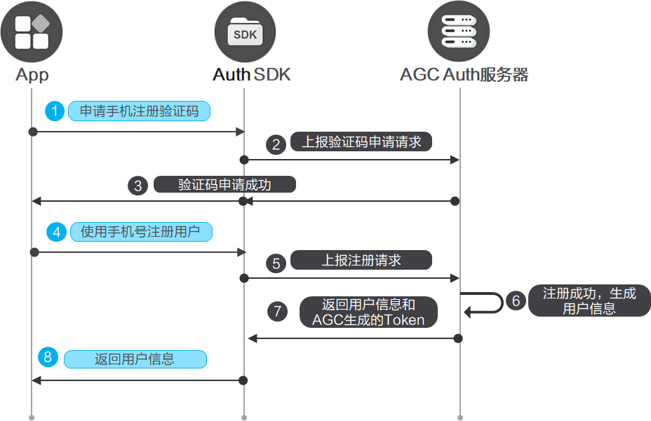
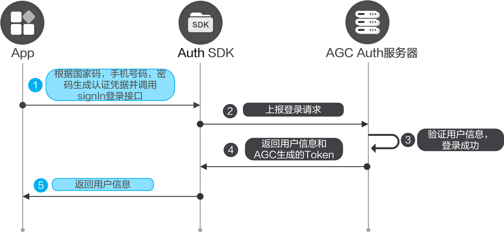
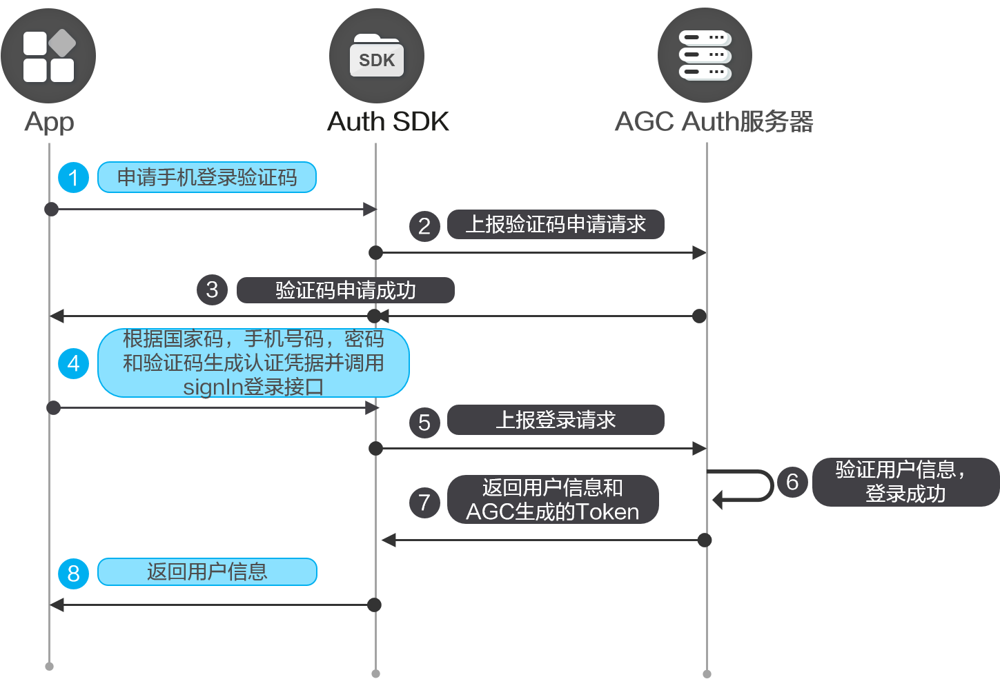

您可以在应用中集成手机账号认证方式，您的用户可以使用“手机号码+密码”或者“手机号码+验证码”的方式来登录您的应用。

#### 前提条件

* 您需要在AppGallery Connect[开通认证服务](/docs/distribute/agc/agc-help-auth-preparation-0000002236496826/agc-help-auth-enable-service-0000002271422405)。
* 您需要先在您的应用中[集成SDK](/docs/distribute/agc/agc-help-auth-0000002236336998/agc-help-auth-integration-sdk-0000002236337006)。

#### 注册



1. 申请手机号码注册的验证码。

   

   * 在使用手机号码注册之前，需要先验证您的手机，确保该手机归您所有。
   * 当前认证服务暂不支持向中国大陆推送手机验证码/通知短信。如果您项目的“数据处理位置”设置为“中国”且需要向中国大陆推送手机验证码/通知消息，请通过您的云函数或服务器接收验证码并发送短信。详情可参考[启用手机号码](/docs/distribute/agc/agc-help-auth-preparation-0000002236496826/agc-help-auth-enable-authentication-method-0000002383148278#section16830152153116)。

   调用[Auth.requestVerifyCode](/docs/distribute/agc/agc-help-auth-api-0000002273777077/agc-help-auth-api-auth-0000002273777093#section9850751813)申请验证码。

   ```
   import auth from '@hw-agconnect/auth';
   import { VerifyCodeAction } from '@hw-agconnect/auth';
   import { BusinessError } from '@kit.BasicServicesKit';

   auth.requestVerifyCode({
     action: VerifyCodeAction.REGISTER_LOGIN,
     lang: 'zh_CN',
     sendInterval: 60,
     verifyCodeType: {
       phoneNumber: '138********',
       countryCode: '86',
       kind: 'phone',
     }
   }).then(verifyCodeResult => {
     // 验证码申请成功

   }).catch((error: BusinessError) => {
     // 验证码申请失败

   })
   ```

2. 使用手机号码注册用户。

   调用[Auth.createUser](/docs/distribute/agc/agc-help-auth-api-0000002273777077/agc-help-auth-api-auth-0000002273777093#section19861514132515)注册用户。注册成功后，系统会自动登录，无需再次调用登录接口。

   ```
   import auth from '@hw-agconnect/auth';
   import { BusinessError } from '@kit.BasicServicesKit';

   auth.createUser({
     kind: 'phone',
     countryCode: '86',
     phoneNumber: '138********',
     password: 'your password',// 可以给用户设置初始密码，后续可以用密码来登录
     verifyCode: 'xxxxxx'
   }).then(result => {
     // 创建用户成功
   }).catch((error: BusinessError) => {
     // 创建用户失败
   })
   ```

3. 登录成功后可以调用[Auth.getCurrentUser](/docs/distribute/agc/agc-help-auth-api-0000002273777077/agc-help-auth-api-auth-0000002273777093#section87068861218)获取用户账号数据。

   ```
   import auth from '@hw-agconnect/auth';

   auth.getCurrentUser();
   ```

#### 密码登录



1. 在应用的登录界面，初始化[Auth](/docs/distribute/agc/agc-help-auth-api-0000002273777077/agc-help-auth-api-auth-0000002273777093)实例，获取AppGallery Connect的用户信息，检查是否有已经登录的用户。如果有，则可以直接进入用户界面，否则显示登录界面。

   ```
   import auth from '@hw-agconnect/auth';

   auth.getCurrentUser().then(user=>{
     if(user){
       //业务逻辑
     }
   });
   ```
2. 调用[Auth.signIn](/docs/distribute/agc/agc-help-auth-api-0000002273777077/agc-help-auth-api-auth-0000002273777093#section136957141012)实现登录。

   ```
   import auth from '@hw-agconnect/auth';
   import { BusinessError } from '@kit.BasicServicesKit';

   auth.signIn({
     credentialInfo: {
       kind: 'phone',
       phoneNumber: '138********',
       countryCode: '86',
       password: 'your password'
     }
   }).then(user => {
     // 登录成功
   }).catch((error: BusinessError) => {
     // 登录失败
   });
   ```

#### 验证码登录



1. 在应用的登录界面，初始化[Auth](/docs/distribute/agc/agc-help-auth-api-0000002273777077/agc-help-auth-api-auth-0000002273777093)实例，获取AGC的用户信息，检查是否有已经登录的用户。如果有，则可以直接进入用户界面，否则显示登录界面。

   ```
   import auth from '@hw-agconnect/auth';

   auth.getCurrentUser().then(user=>{
     if(user){
       // 业务逻辑
     }
   });
   ```

2. 调用[Auth.requestVerifyCode](/docs/distribute/agc/agc-help-auth-api-0000002273777077/agc-help-auth-api-auth-0000002273777093#section9850751813)申请手机登录验证码。

   

   当前认证服务暂不支持向中国大陆推送手机验证码/通知短信。如果您项目的“数据处理位置”设置为“中国”且需要向中国大陆推送手机验证码/通知消息，请通过您的云函数或服务器接收验证码并发送短信。详情可参考[启用手机号码](/docs/distribute/agc/agc-help-auth-preparation-0000002236496826/agc-help-auth-enable-authentication-method-0000002383148278#section16830152153116)。

   ```
   import auth from '@hw-agconnect/auth';
   import { VerifyCodeAction } from '@hw-agconnect/auth';
   import { BusinessError } from '@kit.BasicServicesKit';

   auth.requestVerifyCode({
     action: VerifyCodeAction.REGISTER_LOGIN,
     lang: 'zh_CN',
     sendInterval: 60,
     verifyCodeType: {
       phoneNumber: '138********',
       countryCode: '86',
       kind: 'phone'
     }
   }).then(verifyCodeResult => {
     // 验证码申请成功
   }).catch((error: BusinessError) => {
     // 验证码申请失败
   });
   ```

3. 调用[Auth.signIn](/docs/distribute/agc/agc-help-auth-api-0000002273777077/agc-help-auth-api-auth-0000002273777093#section136957141012)实现登录。

   ```
   import auth from '@hw-agconnect/auth';
   import { BusinessError } from '@kit.BasicServicesKit';

   auth.signIn({
     credentialInfo: {
       kind: 'phone',
       phoneNumber: '138********',
       countryCode: '86',
       verifyCode: 'xxxxxx'
     }
   }).then(user => {
     // 登录成功
   }).catch((error: BusinessError) => {
     // 登录失败
   });
   ```

#### 修改手机号码


* 修改手机号码需要用户处于登录状态。
* 当前认证服务暂不支持向中国大陆推送手机验证码/通知短信。如果您项目的“数据处理位置”设置为“中国”且需要向中国大陆推送手机验证码/通知消息，请通过您的云函数或服务器接收验证码并发送短信。详情可参考[启用手机号码](/docs/distribute/agc/agc-help-auth-preparation-0000002236496826/agc-help-auth-enable-authentication-method-0000002383148278#section16830152153116)。

1. 调用[Auth.requestVerifyCode](/docs/distribute/agc/agc-help-auth-api-0000002273777077/agc-help-auth-api-auth-0000002273777093#section9850751813)申请验证码。

   ```
   import auth from '@hw-agconnect/auth';
   import { VerifyCodeAction } from '@hw-agconnect/auth';
   import { BusinessError } from '@kit.BasicServicesKit';

   auth.requestVerifyCode({
     action: VerifyCodeAction.REGISTER_LOGIN,
     lang: 'zh_CN',
     sendInterval: 60,
     verifyCodeType: {
       phoneNumber: '138********',
       countryCode: '86',
       kind: "phone"
     }
   }).then(verifyCodeResult => {
     // 验证码申请成功
   }).catch((error: BusinessError) => {
     // 验证码申请失败
   });
   ```
2. 调用[AuthUser.updatePhone](/docs/distribute/agc/agc-help-auth-api-0000002273777077/agc-help-auth-api-authuser-0000002273781645#section11672161715314)修改手机号码。

   ```
   import auth from '@hw-agconnect/auth';

   auth.getCurrentUser().then((user) => {
     if(user){
       user.updatePhone({
         countryCode: '86',
         phoneNumber: '138********',
         verifyCode: 'xxxxxx',
         lang: 'zh_CN'
       })
     }
   })
   ```


对于修改手机号码操作，要求用户必须在5分钟内登录过应用才能执行。若登录已超时，请参见[账号重认证](/docs/distribute/agc/agc-help-auth-0000002236336998/agc-help-auth-reauthenticate-0000002271416149)先完成重认证。

#### 修改密码


修改密码时需要用户处于登录状态。

调用[AuthUser.updatePassword](/docs/distribute/agc/agc-help-auth-api-0000002273777077/agc-help-auth-api-authuser-0000002273781645#section152730591310)修改密码。

```
import auth from '@hw-agconnect/auth';

auth.getCurrentUser().then((user) => {
  if(user){
    user.updatePassword({
      password: 'your password',
      providerType: 'phone'
    })
  }
})
```


对于修改手机密码操作，要求用户必须在5分钟内登录过应用才能执行。若登录已超时，请参见[账号重认证](/docs/distribute/agc/agc-help-auth-0000002236336998/agc-help-auth-reauthenticate-0000002271416149)先完成重认证。

#### 重置密码


* 重置密码时用户可以不登录。
* 当前认证服务暂不支持向中国大陆推送手机验证码/通知短信。如果您项目的“数据处理位置”设置为“中国”且需要向中国大陆推送手机验证码/通知消息，请通过您的云函数或服务器接收验证码并发送短信。详情可参考[启用手机号码](/docs/distribute/agc/agc-help-auth-preparation-0000002236496826/agc-help-auth-enable-authentication-method-0000002383148278#section16830152153116)。

1. 调用[Auth.requestVerifyCode](/docs/distribute/agc/agc-help-auth-api-0000002273777077/agc-help-auth-api-auth-0000002273777093#section9850751813)申请验证码。

   ```
   import auth from '@hw-agconnect/auth';
   import { VerifyCodeAction } from '@hw-agconnect/auth';
   import { BusinessError } from '@kit.BasicServicesKit';

   auth.requestVerifyCode({
     action: VerifyCodeAction.RESET_PASSWORD,
     lang: 'zh_CN',
     sendInterval: 60,
     verifyCodeType: {
       phoneNumber: '138********',
       countryCode: '86',
       kind: 'phone'
     }
   }).then(verifyCodeResult => {
     // 验证码申请成功
   }).catch((error: BusinessError) => {
     // 验证码申请失败
   });
   ```
2. 调用[Auth.resetPassword](/docs/distribute/agc/agc-help-auth-api-0000002273777077/agc-help-auth-api-auth-0000002273777093#section184671244192916)重置密码。

   ```
   import auth from '@hw-agconnect/auth';

   auth.resetPassword({
     kind: 'phone',
     password: '123456',
     phoneNumber: '138********',
     countryCode: '86',
     verifyCode: 'xxxxxx'  })
   ```

#### 更多信息

* 您如果想让用户可以使用多个账号登录您的应用，可以[将多个账号进行关联](/docs/distribute/agc/agc-help-auth-login-0000002271496189/agc-help-auth-login-linkaccount-0000002236496838)。
* 当用户不需要使用应用，或者需要切换其他账号登录认证，可以先执行[登出](/docs/distribute/agc/agc-help-auth-0000002236336998/agc-help-auth-logout-0000002236337014)。
* 当用户需要注销当前用户，可以进行[销户](/docs/distribute/agc/agc-help-auth-0000002236336998/agc-help-auth-deregistration-0000002271496197)。
* 对于销户、修改密码、关联账号以及重置手机账号和邮箱账号等敏感操作，为了提高安全性，需要用户必须在5分钟内登录过才能执行。如果用户执行敏感操作时登录超过5分钟，需要[账号重认证](/docs/distribute/agc/agc-help-auth-0000002236336998/agc-help-auth-reauthenticate-0000002271416149)后再执行敏感操作。
* 您可以参考[异常处理](/docs/distribute/agc/agc-help-auth-0000002236336998/agc-help-auth-troubleshooting-0000002236337022)实现自己的异常处理机制，从而减少异常情况的发生。
* 您可以使用云函数触发器来接收用户注册、登录、销户等关键事件，从而[扩展认证服务的能力](/docs/distribute/agc/agc-help-auth-0000002236336998/agc-help-auth-extension-0000002237645842)。
* 您可以参考[管理用户](/docs/distribute/agc/agc-help-auth-0000002236336998/agc-help-auth-user-manage-0000002236496846)对用户进行解锁、停用等操作。
