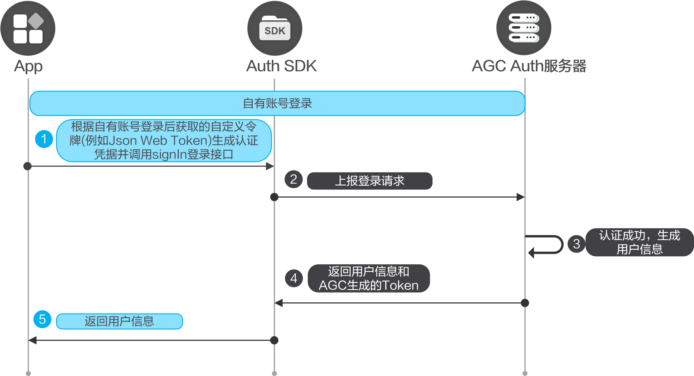

如果您已经自行构建了认证系统，您可以通过自有账号来对接认证服务，让您的用户可以使用自有账号进行AppGallery Connect身份验证。

#### 前提条件

* 您需要在AppGallery Connect[开通认证服务](/docs/distribute/agc/agc-help-auth-preparation-0000002236496826/agc-help-auth-enable-service-0000002271422405)。
* 您需要先在您的应用中[集成SDK](/docs/distribute/agc/agc-help-auth-0000002236336998/agc-help-auth-integration-sdk-0000002236337006)。

#### 开发步骤



1. 自有账号登录，并获取自有账号的用户授权信息。

   当用户登录开发者的服务器后，将其登录信息（例如用户名、头像信息等）发送给开发者自己的身份验证服务器，身份验证服务器对用户的身份进行验证，验证通过后，用于身份验证的服务器会产生一个自定义的令牌（例如Json Web Token），开发者将此令牌传递给AppGallery Connect。
2. 使用从自有账号获取的JWT信息生成credentialInfo，并调用[Auth.signIn](/docs/distribute/agc/agc-help-auth-api-0000002273777077/agc-help-auth-api-auth-0000002273777093#section136957141012)实现登录。

   ```
   import auth from '@hw-agconnect/auth';
   import { hilog } from '@kit.PerformanceAnalysisKit';
   import { BusinessError } from '@kit.BasicServicesKit';

   auth.signIn({
     'credentialInfo': {
       kind: 'selfBuild',
       accessToken: 'JWT Token'
     }
   }).then(signInResult => {
       hilog.info(0x0000, 'testTag', '%{public}s',  `signInselfBuild success. result: \${signInResult.getUser().getUid()}`);
     })
     .catch((error: BusinessError) => {
       hilog.error(0x0000, 'testTag', '%{public}s', `signInselfBuild error, Code: \${error.code}, message: \${error.message}`);
     })
   ```

#### 更多信息

* 您如果想让用户可以使用多个账号登录您的应用，可以[将多个账号进行关联](/docs/distribute/agc/agc-help-auth-login-0000002271496189/agc-help-auth-login-linkaccount-0000002236496838)。
* 当用户不需要使用应用，或者需要切换其他账号登录认证，可以先执行[登出](/docs/distribute/agc/agc-help-auth-0000002236336998/agc-help-auth-logout-0000002236337014)。
* 当用户需要注销当前用户，可以进行[销户](/docs/distribute/agc/agc-help-auth-0000002236336998/agc-help-auth-deregistration-0000002271496197)。
* 对于销户、修改密码、关联账号以及重置手机账号和邮箱账号等敏感操作，为了提高安全性，需要用户必须在5分钟内登录过才能执行。如果用户执行敏感操作时登录超过5分钟，需要[账号重认证](/docs/distribute/agc/agc-help-auth-0000002236336998/agc-help-auth-reauthenticate-0000002271416149)后再执行敏感操作。
* 您可以参考[异常处理](/docs/distribute/agc/agc-help-auth-0000002236336998/agc-help-auth-troubleshooting-0000002236337022)实现自己的异常处理机制，从而减少异常情况的发生。
* 您可以使用云函数触发器来接收用户注册、登录、销户等关键事件，从而[扩展认证服务的能力](/docs/distribute/agc/agc-help-auth-0000002236336998/agc-help-auth-extension-0000002237645842)。
* 您可以参考[管理用户](/docs/distribute/agc/agc-help-auth-0000002236336998/agc-help-auth-user-manage-0000002236496846)对用户进行解锁、停用等操作。
