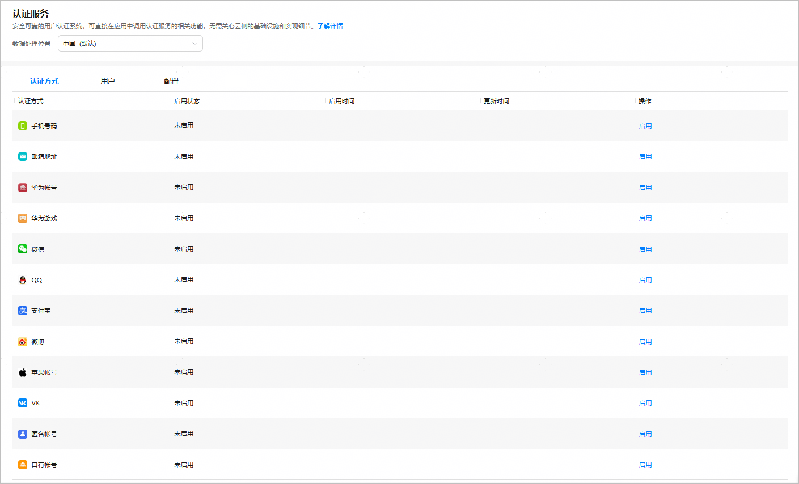
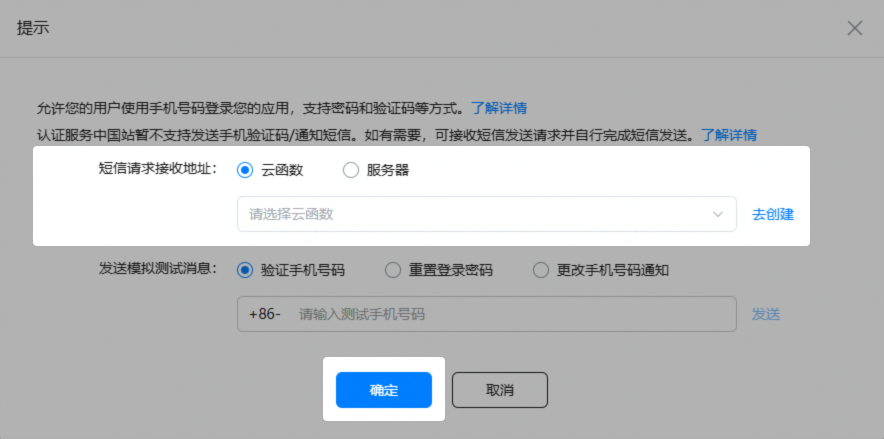
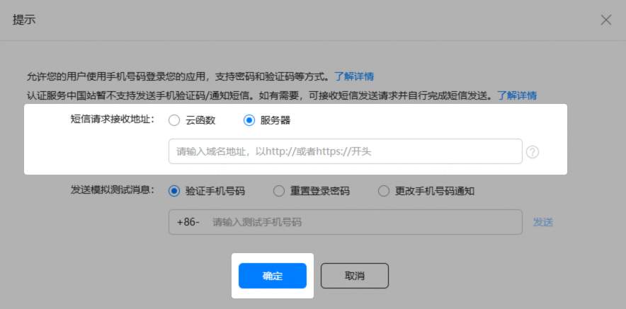
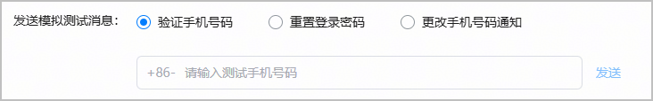
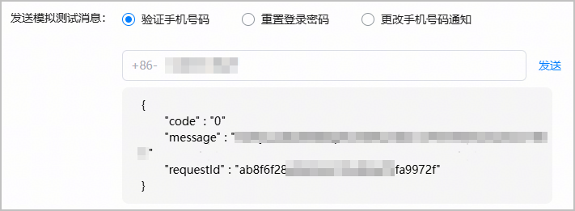
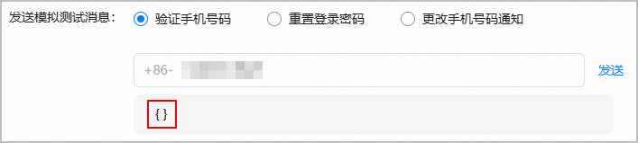
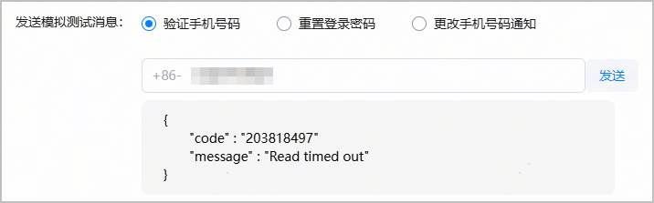
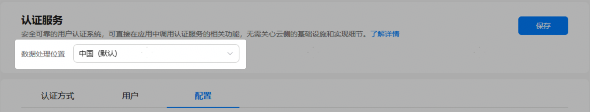
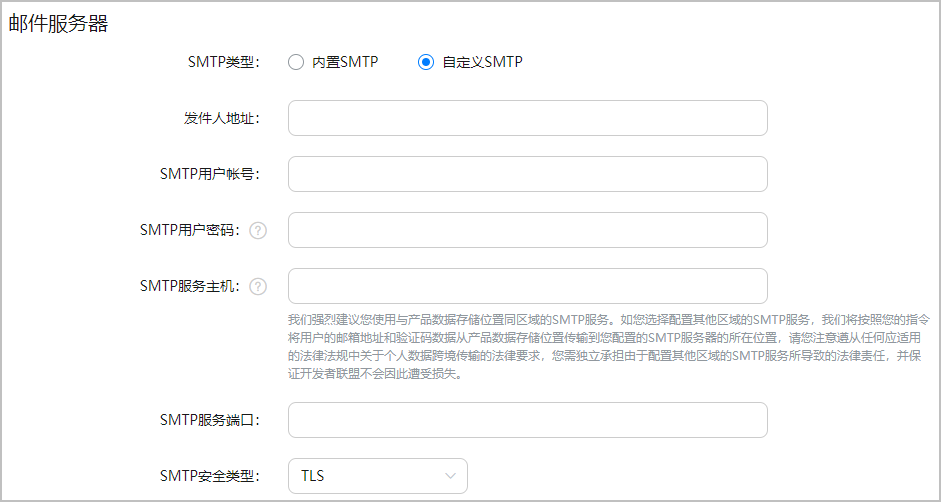
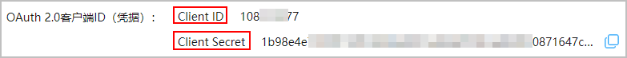

开通认证服务后，您可以进入“认证方式”页签，点击需要启用的认证方式所在行的“启用”。


* 当前平台支持的认证方式请参见[主要功能](https://developer.huawei.com/consumer/cn/doc/app/agc-help-auth-introduction-0000002271496181#section1910774920157)。
* 当您的应用需要支持多数据处理位置时，请在“数据处理位置”选择其他存储地后再分别进行配置。



#### 启用手机号码

为进一步保障短信业务的安全性与合规性，依照国家反诈工作部署及相关行业监管政策要求，国内短信签名需符合以下任一条件：企事业单位名、已上线App名称、已注册商标名，且均需完成运营商实名制报备，不再支持网站、公众号、小程序、电商店铺等其他签名来源。基于当前短信签名标准，如果您的项目“数据处理位置”设置为“中国”且启用了手机号码认证方式，为保障您业务的正常运行，**认证服务的验证/通知短信将不再由HUAWEI AppGallery Connect发送，需要您自行购买第三方短信服务。认证服务可对接您提供的短信发送接口，来进行后续短信的正常下发。**

#### [h2]配置短信请求接收地址

认证服务已不再支持向中国大陆推送手机验证码/通知短信。如果您的项目“数据处理位置”设置为“中国”站点，在向中国大陆手机号码推送手机验证码/通知短信之前，请务必配置“短信请求接收地址”。如果“数据处理位置”设置为非中国站点，您可以根据实际业务需求决定是否配置“短信请求接收地址”（即当存在向中国大陆手机号码推送手机验证码/通知短信的场景时，则需配置；反之，则无需配置）。

认证服务支持通过“云函数”和“服务器”两种方式对接第三方短信服务：

* 云函数（如果您没有自己的服务器，可选择此方式）

  

  仅当账号注册地为中国，且项目的“数据处理位置”设置为“中国”站点时，才支持通过云函数对接第三方短信服务。如果设置为非中国站点，“短信请求接收地址”处将不会显示“云函数”选项。

  

  “短信请求接收地址”选择“云函数”，系统将自动同步当前项目中已存在的云函数供您选择。配置完成后，点击“确定”。

  + 如果尚未创建云函数，您可以点击“去创建”，进入云函数服务界面[创建函数](https://developer.huawei.com/consumer/cn/doc/harmonyos-guides/cloudfoundation-create-and-config-function)。创建完成后，再返回此处进行设置。
  + 如果云函数数量较多，您可以通过输入关键词来模糊筛选云函数名称。

  云函数代码可参考如下示例实现（以Node.js语言为例）：

  ```
  let myHandler = function(event, context, callback, logger) {

    logger.info("--------Start-------");

    // 1、处理入参
    logger.info("event: ",event);
    // event格式如下：
    // event: { action: '1001', phoneNumber: '+86-xxx', productId: 'xxx', taskId: 'xxx', verifyCode: 'xxx' }

    // 2、调用短信提供方服务器地址进行短信发送

    // 3、返回成功或者具体的错误码
    res = {"code": 0, "message": "success", "requestId": "xxx"};

    callback(res);
  };

  module.exports.myHandler = myHandler;
  ```
* 服务器（如果您搭建了自己的服务器，可选择此方式）

  

  “短信请求接收地址”选择“服务器”，在文本框中输入您的服务器地址，须以“http://"或"https://"开头，且不可包含"@"字符。配置完成后，点击“确定”。

  认证服务将发送POST请求给您的服务器，消息格式如下：

  ```
  POST {{短信请求接收地址}}{
  "Request Headers": {
           "X-AGC-Timestamp":"1746585196948",  // 时间戳
           "X-AGC-Auth":"****",   // 签名信息
           "Content-Type":"application/json"
  },
  "Request Body": {
           "action":"1001", // 验证码行为。1001：注册登录； 1002：重置密码； 1003：修改手机号（此种情况下，verifyCode为空，仅发送一个短信通知）
           "phoneNumber":"+86-12345678910", // 手机号。格式为”+86-xxxxxxxxxxx”
           "productId":"1234****5678", // 项目ID
           "taskId":"023d579****b444bb3224ea125478545",  // 任务Id
           "verifyCode":"00**52"  // 验证码
  }
  }
  ```

  收到POST请求后，您需要按照如下步骤进行操作：

  1. 验证请求头中的“X-AGC-Auth”签名信息。
     1. 判断POST消息发送时间戳与服务端时间戳，相差时间不能超过3分钟。
     2. 使用“POST”+ URL（短信请求接收地址） + 时间戳 + Body（POST请求体）进行验签。

     完整示例代码如下：

     ```
     “TypeScript”
     import { Buffer } from 'buffer';
     import { createVerify } from 'crypto';
     import * as crypto from "node:crypto";

     // 认证服务地址
     const serverAddress: string = "https://developer.huawei.com/consumer/cn/service/josp/agc/auth/keys"
     // 获取认证服务的公钥。公钥获取一次即可，然后存放在本地静态常量中，以提升性能。
     let PUBLIC_KEY: string | null = null;

     /**
      * 验证签名是否合法
      *
      * @param xAGCAuth 请求头中的签名信息
      * @param xAGCTimestamp 请求头中的时间戳
      * @param thirdSmsUrl 短信请求接收地址
      * @param thirdSmsReq POST请求体
      */
     async function verifyAuth(xAGCAuth: string, xAGCTimestamp: string, thirdSmsUrl: string,
       thirdSmsReq: ThirdSmsReq): Promise<boolean> {
       // 1. 检查时间戳是否过期（不可超过三分钟），业务也可以把该时间调小，比如：1 * 60 * 1000L。
       const allowedTimeWindowMs: number = 3 * 60 * 1000;
       const currentTime = Date.now();

       const timestamp = parseInt(xAGCTimestamp, 10);
       if (isNaN(timestamp) || Math.abs(timestamp - currentTime) > allowedTimeWindowMs) {
         throw new Error("Timestamp expired or invalid");
       }

       // 2. 拼接待验签字符串（必须与签名方顺序保持一致）
       const parts = ["POST", thirdSmsUrl, xAGCTimestamp, JSON.stringify(thirdSmsReq)];
       const dataToVerify = parts.join("\n");

       if (PUBLIC_KEY === null) {
         PUBLIC_KEY = await getPublicKey()
       }
       return verifySignature(dataToVerify, xAGCAuth, PUBLIC_KEY);
     }

     /**
      * 验证签名
      *
      * @param data  待验签字符串
      * @param signature  请求头中的签名信息
      * @param publicKeyStr  认证服务的公钥
      */
     async function verifySignature(data: string, signature: string, publicKeyStr: string): Promise<boolean> {
       try {
         // 创建验签对象
         const verify = createVerify('RSA-SHA256');
         verify.update(data, 'utf8');

         // 验证签名
         return verify.verify(
           {
             key: publicKeyStr,
             padding: crypto.constants.RSA_PKCS1_PSS_PADDING,
             saltLength: crypto.constants.RSA_PSS_SALTLEN_DIGEST
           },
           Buffer.from(signature, 'base64')
         );
       } catch (error) {
         console.error('Signature verification failed:', error);
         return false;
       }
     }

     /**
      * 获取认证服务的公钥。
      * 该方法在您的代码中仅需调用一次。获取到公钥后，保存在本地的静态常量中即可，不需要每次都调用。
      *
      * @return 公钥
      */
     async function getPublicKey(): Promise<string | null> {
       if (PUBLIC_KEY !== null) {
         return PUBLIC_KEY;
       }

       try {
         const response = await fetch(serverAddress);
         if (!response.ok) {
           return null;
         }

         const result = await response.text();
         const jsonObject: string = JSON.parse(result);
         const key: string = Object.values(jsonObject)[0];
         const cleanedKey = key
           .replace('-----BEGIN CERTIFICATE-----', '-----BEGIN PUBLIC KEY-----')  // 重要：替换为公钥标记
           .replace('-----END CERTIFICATE-----', '-----END PUBLIC KEY-----')
           .trim();
         console.log(cleanedKey)

         PUBLIC_KEY = cleanedKey;
         return cleanedKey;
       } catch (e: any) {
         console.log(e.toString());
       }

       return '';
     }

     // POST请求体ThirdSmsReq
     interface ThirdSmsReq {
       action: string,       // 验证码行为。1001：注册登录； 1002：重置密码； 1003：修改手机号（此种情况下，verifyCode为空 ，仅发送一个短信通知）
       phoneNumber: string,  // 手机号。格式为”+86-xxxxxxxxxxx”
       productId: string,    // 项目ID
       taskId: string,       // 任务ID。无实际语义，问题定位使用
       verifyCode: string,   // 验证码
     }
     ```

     ```
     “Java”
     import com.alibaba.fastjson.JSON;
     import com.alibaba.fastjson.JSONObject;

     import org.apache.http.Consts;
     import org.apache.http.HttpStatus;
     import org.apache.http.client.methods.CloseableHttpResponse;
     import org.apache.http.client.methods.HttpGet;
     import org.apache.http.impl.client.CloseableHttpClient;
     import org.apache.http.impl.client.HttpClients;

     import java.io.BufferedReader;
     import java.io.InputStreamReader;
     import java.nio.charset.StandardCharsets;
     import java.security.KeyFactory;
     import java.security.NoSuchAlgorithmException;
     import java.security.PublicKey;
     import java.security.Signature;
     import java.security.spec.InvalidKeySpecException;
     import java.security.spec.X509EncodedKeySpec;
     import java.util.Base64;

     public class SmsSendService {
         // 获取认证服务的公钥。公钥获取一次即可，然后存放在本地静态常量中，提升性能。
         private static final String PUBLIC_KEY = getPublicKey();

         /**
          * 验证签名是否合法
          *
          * @param xAGCAuth 请求头中的签名信息
          * @param xAGCTimestamp 请求头中的时间戳
          * @param thirdSmsUrl 短信请求接收地址
          * @param thirdSmsReq POST请求体
          */
         public boolean verifyAuth(String xAGCAuth, String xAGCTimestamp, String thirdSmsUrl, ThirdSmsReq thirdSmsReq)
             throws Exception {
             // 1. 检查时间戳是否过期（不可超过三分钟），业务也可以把该时间调小，比如：1 * 60 * 1000L。
             long allowedTimeWindowMs = 3 * 60 * 1000L;
             long currentTime = System.currentTimeMillis();
             if (Math.abs(currentTime - Long.parseLong(xAGCTimestamp)) > allowedTimeWindowMs) {
                 throw new SecurityException("Timestamp expired or invalid");
             }

             // 2. 拼接待验签字符串（必须与签名方顺序保持一致）
             String dataToVerify = String.join("\n", "POST", thirdSmsUrl, xAGCTimestamp, JSON.toJSONString(thirdSmsReq));

             return verifySignature(dataToVerify, xAGCAuth, PUBLIC_KEY);
         }

         /**
          * 获取认证服务的公钥。
          * 该方法在您的代码中仅需调用一次。获取到公钥后，保存在本地的静态常量中即可，不需要每次都调用。
          *
          * @return 公钥
          */
         private static String getPublicKey() {
             HttpGet get = new HttpGet("https://developer.huawei.com/consumer/cn/service/josp/agc/auth/keys");
             try {
                 CloseableHttpClient httpClient = HttpClients.createDefault();
                 CloseableHttpResponse httpResponse = httpClient.execute(get);
                 int statusCode = httpResponse.getStatusLine().getStatusCode();
                 if (statusCode == HttpStatus.SC_OK) {
                     BufferedReader br =
                         new BufferedReader(new InputStreamReader(httpResponse.getEntity().getContent(), Consts.UTF_8));
                     String result = br.readLine();

                     JSONObject object = JSON.parseObject(result);
                     String key = (String) object.values().toArray()[0];

                     return key.replace("-----BEGIN CERTIFICATE-----", "").replace("-----END CERTIFICATE-----", "").trim();
                 }
             } catch (Exception e) {
                 e.printStackTrace();
             }
             return null;
         }

         // 验证签名
         private static boolean verifySignature(String data, String signature, String publicKey) throws Exception {
             byte[] e = Base64.getDecoder().decode(publicKey);
             Signature publicSignature = Signature.getInstance("SHA256WithRSA/PSS");
             publicSignature.initVerify(newPublicKey(e, "RSA"));
             publicSignature.update(data.getBytes(StandardCharsets.UTF_8));
             byte[] signatureBytes = Base64.getDecoder().decode(signature);
             return publicSignature.verify(signatureBytes);
         }

         /**
          * 还原公钥
          *
          * @param keyByte 公钥byte数组
          * @param algName 算法名称
          * @return 公钥
          * @throws
          */
         private static PublicKey newPublicKey(byte[] keyByte, String algName) throws Exception {
             try {
                 X509EncodedKeySpec x509KeySpec = new X509EncodedKeySpec(keyByte);
                 KeyFactory keyFactory = KeyFactory.getInstance(algName);
                 return keyFactory.generatePublic(x509KeySpec);
             } catch (NoSuchAlgorithmException | InvalidKeySpecException e) {
                 throw new Exception("Fail to create public key", e);
             }
         }
     }
     ```

     其中，POST请求体ThirdSmsReq定义如下：

     ```
     “TypeScript”
     // POST请求体ThirdSmsReq
     interface ThirdSmsReq {
       action: string,       // 验证码行为。1001：注册登录； 1002：重置密码； 1003：修改手机号（此种情况下，verifyCode为空 ，仅发送一个短信通知）
       phoneNumber: string,  // 手机号。格式为”+86-xxxxxxxxxxx”
       productId: string,    // 项目ID
       taskId: string,       // 任务ID。无实际语义，问题定位使用
       verifyCode: string,   // 验证码
     }
     ```

     ```
     “Java”
     public class ThirdSmsReq {
       private String action;       // 验证码行为。1001：注册登录； 1002：重置密码； 1003：修改手机号（此种情况下，verifyCode为空，仅发送一个短信通知）
       private String phoneNumber;  // 手机号。格式为”+86-xxxxxxxxxxx”
       private String productId;    // 项目ID
       private String taskId;       // 任务ID。无实际语义，问题定位使用
       private String verifyCode;   // 验证码
     }
     ```
  2. 处理POST请求。将入参里面的短信验证码“verifyCode”通过短信提供商提供的API接口进行短信发送。
  3. POST请求处理成功后，须按如下字段返回响应。

     ```
     {
       "code": "0",
       "message": "OK",
       "requestId": "xxx"
     }
     ```

     其中，code和message根据处理结果设置返回值。对于requestId，业务可以设置为短信发送接口返回的回执Id。或者业务自定义的traceId。如果业务不关注该字段，也可以直接设置为入参里面的taskId。
     + 如果业务处理成功，需要将code返回"0"，message信息自定义即可。
     + 如果业务处理失败，例如验签失败、时间戳时间和本地时间戳时间相隔太长、调用短信发送接口失败等，则code填写业务自定义的错误码，message填写业务自定义的错误原因。

#### [h2]发送验证码/通知模拟测试消息

为了便于您与第三方短信服务器进行对接和联调，认证服务提供了发送验证码/通知模拟测试消息功能。您可以手动触发以下几种测试消息：



* 验证手机号码

  选中“验证手机号码”，文本框中输入11位手机号码，点击“发送”。
* 重置登录密码

  选中“重置登录密码”，文本框中输入11位手机号码，点击“发送”。
* 更改手机号码通知

  选中“更改手机号码通知”，文本框中输入11位手机号码，点击“发送”。

发送模拟测试消息（以验证手机号码为例）后，下方将显示返回结果：

* 正确的响应结果类似下图所示。

  

* 如果响应结果为空，则表示您的接口实现未按照code、message、requestId结构体返回，或code、message、requestId均为空。

  
* 如果返回其他结果，请按照message提示进行相应处理。例如下图中，返回结果显示Read timed out，则表示超过10s仍未收到响应。

  

#### 启用邮箱地址

如果您启用了邮箱验证码认证，请进入“配置”页签配置邮箱服务器相关信息。


您默认配置的邮箱服务器是默认数据处理位置的配置，当您的应用需要支持多数据处理位置时，请在“数据处理位置”选择其余存储地后再分别进行配置。



您可以选择使用“内置SMTP”或者“自定义SMTP”。

* 使用“内置SMTP”时固定“发件人名称”为项目名称，“发件人地址”为auth-verifycode@mail.agconnect.link。
* 使用“自定义SMTP”时配置如下信息：
  + 发件人地址：邮件发送方的邮箱地址
  + SMTP用户账号和SMTP用户密码：登录发送邮件服务器所需的用户名和密码
  + SMTP服务主机：提供SMTP发件服务的主机名称，例如：QQ的企业发送邮件服务主机为smtp.exmail.qq.com
  + SMTP服务端口和SMTP安全类型：端口和安全类型存在对应关系，TLS对应465端口

  

#### 启用手机号码、邮箱以外的账号

下表所示认证方式在启用时需要在弹出框中配置应用所需的相关信息，相关认证方式和配置信息获取方式如下所示。

| 认证方式 | 获取信息 | 获取方式 |
| --- | --- | --- |
| 华为账号 | Client ID和Client Secret | 您可以登录[AppGallery Connect](https://developer.huawei.com/consumer/cn/service/josp/agc/index.html)，在“开发与服务 > 项目设置”页面，顶端切换到要查询的应用后，在“应用”区域即可找到应用的“OAuth 2.0客户端ID”信息。   |
| 自有账号 | 签名公钥 | [获取JWT](https://developer.huawei.com/consumer/cn/doc/app/agc-help-auth-login-self-0000002271496193#section16952720551) |
