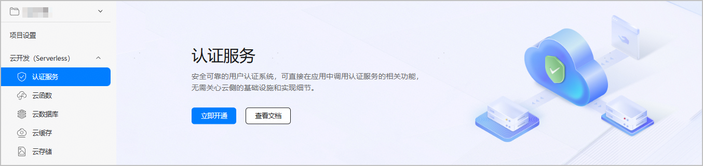

#### 前提条件

* 您已经在AppGallery Connect上创建项目，详细操作请参见[创建项目](https://developer.huawei.com/consumer/cn/doc/app/agc-help-create-project-0000002242804048)。
* 您已经在AppGallery Connect上创建应用，详细操作请参见[创建应用](https://developer.huawei.com/consumer/cn/doc/app/agc-help-create-app-0000002247955506)。

#### 开通认证服务

1. 登录[AppGallery Connect](https://developer.huawei.com/consumer/cn/service/josp/agc/index.html)，点击“开发与服务”。
2. 在项目列表中找到需要开通认证服务的项目。
3. 选择“云开发（Serverless）> 认证服务”，进入认证服务的页面。如果首次使用认证服务，请点击“立即开通”开通服务。

   
4. 在弹出的提示框内启用数据处理位置和设置默认数据处理位置，点击“确定”。

   

   如需了解数据处理位置更多设置场景和对数据处理位置进行管理，请参见[管理数据处理位置](https://developer.huawei.com/consumer/cn/doc/app/agc-help-data-location-0000002277923065)。
