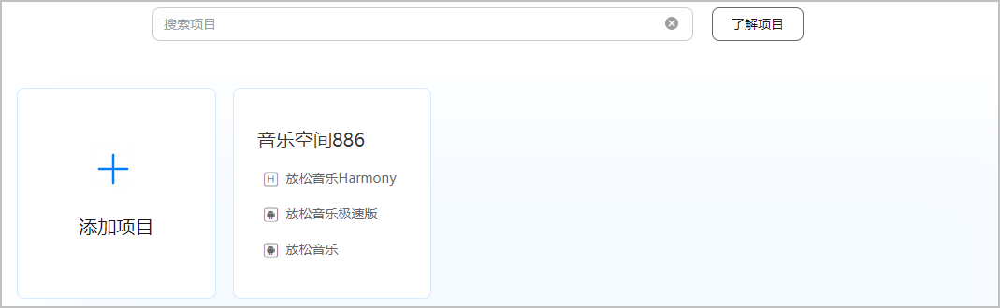
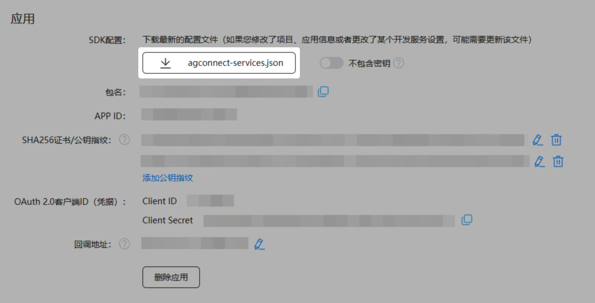

#### 获取agconnect-services.json文件

为了简化您的配置步骤，AppGallery Connect为您提供了应用配置信息，您只需要将配置信息添加到您的项目中。

1. 登录 [AppGallery Connect](https://developer.huawei.com/consumer/cn/service/josp/agc/index.html)，选择“开发与服务”。
2. 在项目列表中找到您的项目，在项目下的应用列表中选择您的应用。

   
3. 在“项目设置”页面下载配置文件“agconnect-services.json”。

   

   * “不包含密钥”开关默认关闭，配置文件中将会包含AppGallery Connect为应用分配的客户端密钥和API密钥信息，其中客户端密钥和API密钥均为密文。
   * 您也可以在下载JSON文件前打开“不包含密钥”开关，配置文件中将不包含密钥信息，客户端密钥和API密钥需要由您自行调用AGC SDK的接口手动配置。
   * 如果您的套餐升级到了付费档，为避免被冒用产生异常账单，建议您打开“不包含密钥”开关，将密钥存储在您自己的服务器，并妥善保管。

   
