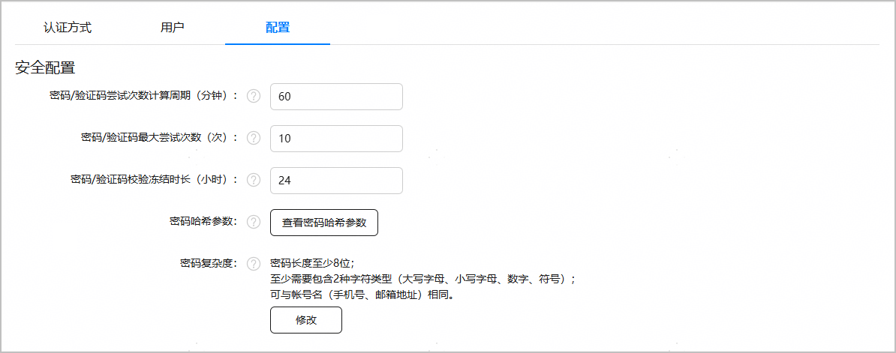

开通认证服务后，您可以根据需要进入“配置”页签进行用户账户的安全配置。

您默认配置的安全配置是默认数据处理位置的配置，当您的应用需要支持多数据处理位置时，请在“数据处理位置”选择其余存储地后再分别进行配置。

| 配置项 | 说明 |
| --- | --- |
| 密码/验证码尝试次数计算周期 | 密码/验证码失败次数的统计周期，周期结束后将重新统计失败次数。  默认值：60  单位：分钟  取值范围：1-1440之间的整数。 |
| 密码/验证码最大尝试次数 | 允许账号采用密码验证/验证码验证的最大尝试次数，达到上限会对账号进行冻结处理，冻结期间用户无法使用该账号进行密码验证/验证码验证。  默认值：10  取值范围：1-100之间的整数。 |
| 密码/验证码校验冻结时长 | 账号采用密码验证/验证码验证达到最大尝试次数后冻结的时长，冻结期间用户无法使用该账号进行密码验证/验证码验证。  默认值：24  单位：小时  取值范围：1-720之间的整数。 |
| 密码复杂度  注意：  密码复杂度描述允许用户使用的密码最低强度，更低强度的密码会让用户更容易记忆，但是会带来安全性的降低。  我们强烈建议您不要调低密码复杂度，以免为用户带来风险。除非您已经充分了解并愿意承担相关风险。 | 密码最短长度。  默认值：8  取值范围：6-1024之间的整数。 |
| 密码最少字符类型。  默认值：2  字符类型包括：  * 小写字母 * 大写字母 * 数字 * 特殊字符：`!@#$%^&\*()-\_=+\|[{}];:'",&lt;.>/&#63; 和空格 |
| 密码是否可以与账号名相同。  默认值：不可以  账号名包括：   * 手机号码 * 邮箱地址 |
