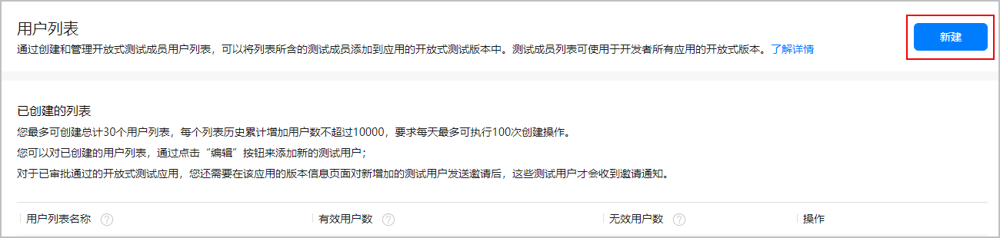
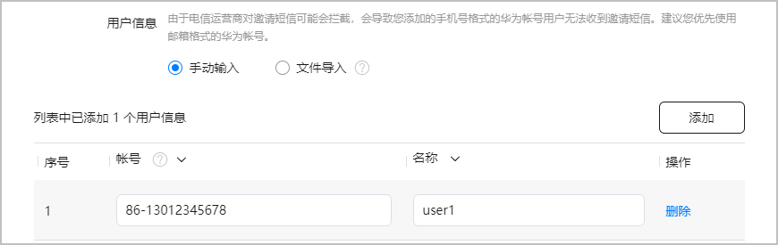
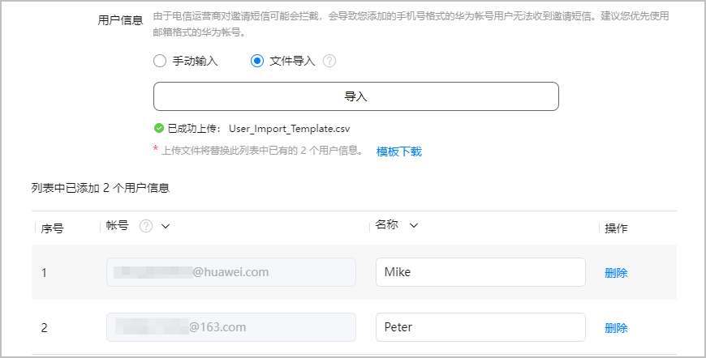
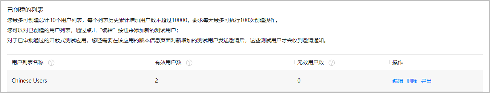

在对近场服务进行自有真机测试前，您需要先准备好参与测试的用户账号。

1. 登录[AppGallery Connect](https://developer.huawei.com/consumer/cn/service/josp/agc/index.html)， 点击“用户与访问”。
2. 左侧菜单栏选择“列表管理 > 用户列表”，进入“用户列表”页面，点击“新建”。

   
3. 在“创建测试用户列表”页面，填写相关信息，点击“确认”。

   | 参数 | 说明 |
   | --- | --- |
   | 列表名称 | 您可以对测试用户按一些维度进行分组，每组用户维护在一个列表中。例如把中国区域用户维护在一个列表中，列表名称取名为“Chinese Users”。  列表名称最多支持64个字符，不能包含特殊字符。 |
   | 列表存储位置 | 选择“中国”。 |
   | 用户信息 | 可通过两种方式维护：  * [手动输入](#ZH-CN_TOPIC_0000002423146550__zh-cn_topic_0000002408164665_zh-cn_topic_0000001976277810_zh-cn_topic_0000001542634933_li103010586541)：在界面上逐个添加用户信息。 * [文件导入](#ZH-CN_TOPIC_0000002423146550__zh-cn_topic_0000002408164665_zh-cn_topic_0000001976277810_zh-cn_topic_0000001542634933_li15921131225813)：下载模板，将用户信息维护至文件，导入文件。 |
   | 帐号 | 测试账号必须是已经注册的华为账号，且仅支持邮箱格式或手机号码格式。  * 邮箱账号只能包含字母、数字、下划线、@、. 字符，最多80个字符。 * 手机号码请按“国家码-手机号”格式输入。国家码不能包含国际冠码。例如，中国大陆的国家码请填写“86”，不要填写“0086”，正确示例：86-13012345678。 由于电信运营商可能会拦截邀请短信，会导致您添加的手机号格式的华为账号用户无法收到邀请短信。建议您优先使用邮箱格式的华为账号。 |

   * 手动输入

     点击“添加”，“帐号”输入测试用户的手机号码或者邮箱，“名称”输入测试用户的名称。

     
   * 文件导入

     点击“模板下载”获取模板文件“User\_Import\_Template.csv”，参考模板格式要求，填写完成后，点击“导入”，导入测试用户账号。

     
4. 新建完成后，用户列表中将展示创建的用户列表。如果添加的华为账号不是有效的华为账号，则会被自动识别为无效用户。

   
