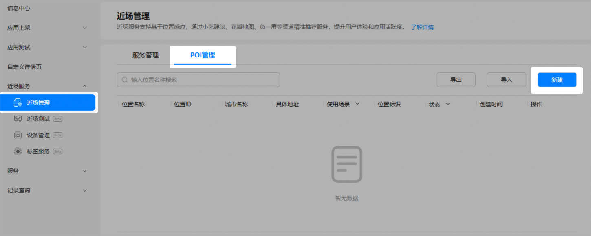
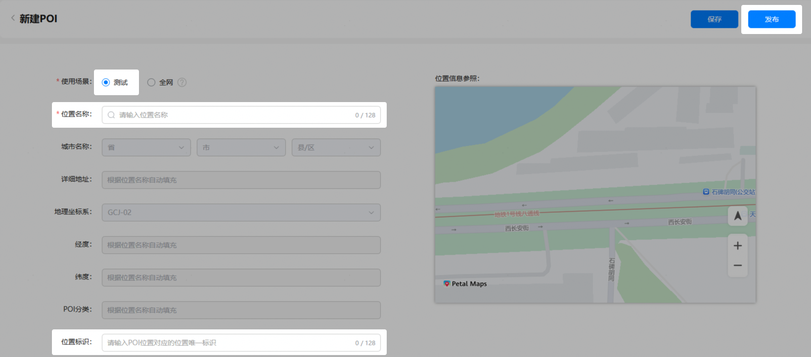
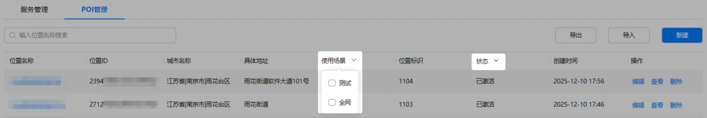

在您的全网态服务上线之前，您可以创建测试态POI来替代信标设备，并使用自有真机验证测试态服务的出卡效果。

#### 创建单个POI

1. 登录[AppGallery Connect](https://developer.huawei.com/consumer/cn/service/josp/agc/index.html)，点击“APP与元服务”。
2. 进入“HarmonyOS”页签，您可通过包名、应用名称、应用类型等信息进行筛选，然后在应用列表中点击您的应用/元服务名称。

   
3. 左侧菜单栏选择“近场服务 > 近场管理”，在近场管理主界面选择“POI管理”页签，然后点击“新建”。

   
4. 在“新建POI”页面，“使用场景”选择“测试”，“位置名称”处输入测试位置关键词，选择您需要的地点，并根据需要设置该POI位置的“位置标识”（需确保在App中全局唯一），然后点击“发布”。发布后，该POI为“已激活”状态，可以被近场服务关联使用。若点击“保存”，该POI为“草稿”状态，将无法被近场服务关联使用。

   

#### （可选）批量导出POI

当您需要检查已创建POI的点位信息是否正确时，为提高效率，可以使用近场服务的批量导出POI功能。您可以一次性导出所有POI，也可以通过POI的位置名称、使用场景、状态筛选出某些POI后进行导出。

1. 进入“POI管理”页面，根据需要筛选需要查看的POI。
   * 在搜索框中输入POI位置名称关键词进行模糊筛选。

     
   * 选择POI的使用场景或状态进行筛选。

     
2. 完成POI筛选后，点击“导出”。

   
3. 页面顶端显示“导出成功”时，表示POI数据已导出到本地。导出文件以“近场服务POI信息\_时间戳.xlsx”格式命名。
