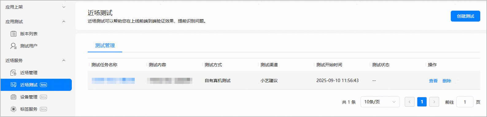
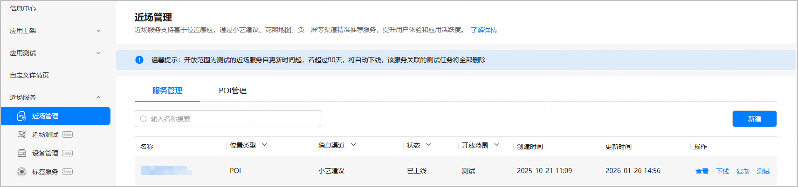
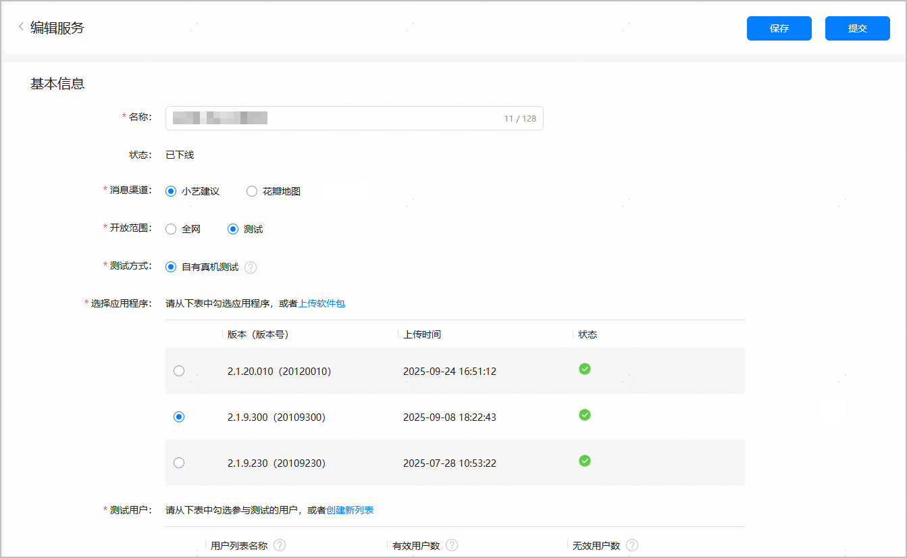
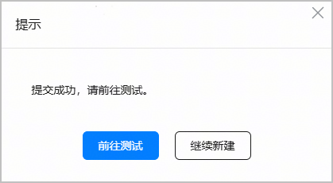
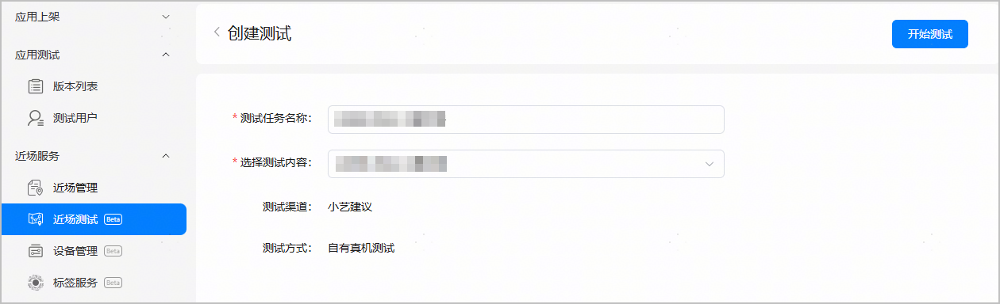
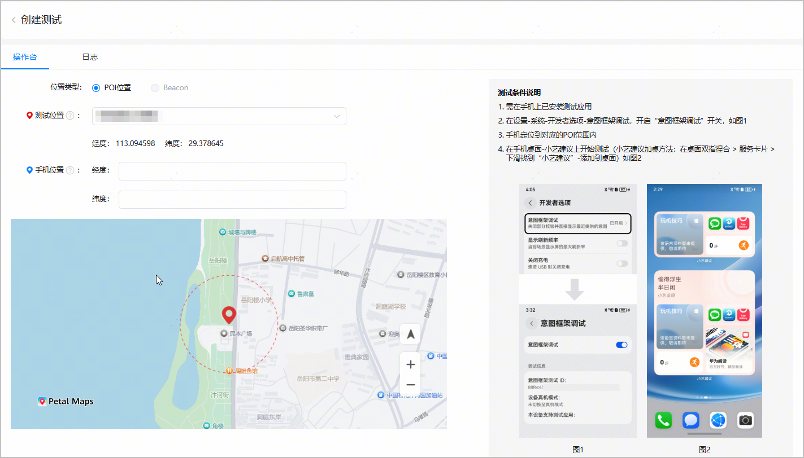

当您创建的测试态服务已过生效时段或需要调整POI点位、测试用户、卡片内容等时，您可以尝试修改测试态服务。

如果测试态服务有正在进行的测试任务，请先删除相关测试任务。在修改测试态服务之前，需先将其下线，然后进行编辑和提交。提交修改的测试态服务后，需重新创建测试任务并开始测试。

1. 如果测试态服务未开始测试，请忽略此步骤。

   如果测试态服务已开始测试，在左侧菜单栏选择“近场服务>近场测试”，进入近场测试主界面。在“测试管理”列表中点击要修改测试任务“操作”列的“删除”，将正在进行中的测试任务从列表中删除。

   
2. 在左侧菜单栏选择“近场服务>近场管理”，进入近场管理主界面。选择“服务管理”页签，在服务列表中点击要修改测试态服务“操作”列的“下线”。测试态服务下线后，才可对其进行修改。

   
3. 点击该测试态服务“操作”列的“编辑”，进入“编辑服务”页面。

   
4. 在“编辑服务”页面各配置区域进行修改，然后点击“提交”。

   
5. 在弹出框中点击“前往测试”，系统将跳转至“创建测试”页面 。

   
6. 根据实际需求编辑测试任务名称，并选择测试内容。然后点击页面右上角的“开始测试”，重新下发测试任务。

   
7. 以下操作台界面可辅助您查看POI地理围栏的范围，以及测试手机是否进入测试POI的200米感应范围内。

   
