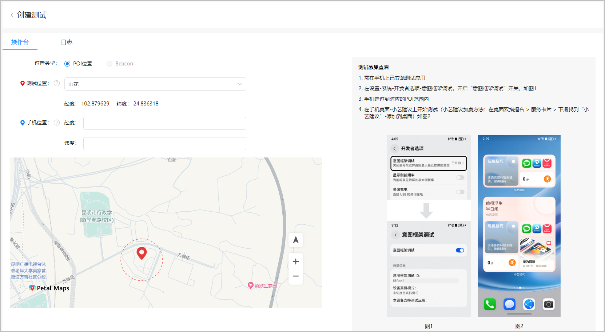
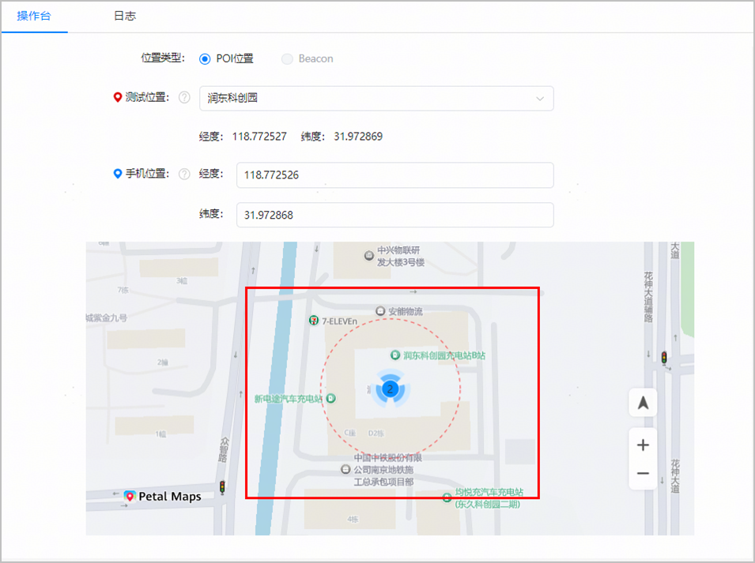
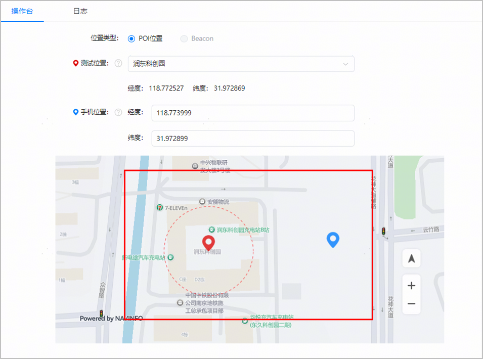

如下界面可辅助您查看POI地理围栏范围，以及测试手机是否进入测试POI的200米感应范围内。

当您在“测试位置”下拉框选择需要测试的POI位置后，红色虚线即表示POI的测试范围，距离POI点位大约200米范围内。

如果您确定测试手机已进入POI的200米感应范围内，即可[开始测试](https://developer.huawei.com/consumer/cn/doc/app/agc-help-beacon-starting-test-0000002456745309)。否则，请“手机位置”输入框中输入测试手机当前的经纬度信息，须精确到小数点后6位，以查看测试手机是否在POI的测试范围内。

其中，手机经纬度信息的获取方法，可打开https://lbs.amap.com/tools/picker链接，登录后输入关键词名称后点击“搜索”获取。“坐标获取结果”中逗号前的部分即为经度信息，逗号后的部分即为纬度信 息 。

* 蓝色图标表示手机位置。如果测试手机进入POI 测试范围内，则蓝色图标在红色虚线圆圈内。

  
* 如果测试手机不在POI测试范围内，蓝色图标将在红色虚线圆圈外。

  
