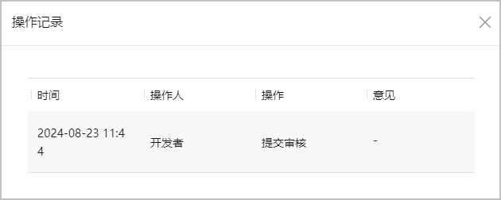
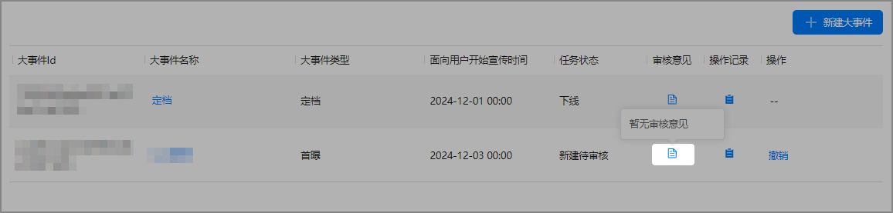

创建游戏大事件后，可以对已创建的游戏大事件进行查看、编辑等操作。游戏大事件列表“操作”列提供编辑、删除、撤销、下线等操作，“任务状态”列可以查看大事件当前的状态。

#### 查看游戏大事件信息

点击“大事件名称”列所需查看的大事件名称，查看当前游戏大事件的在线版本信息和编辑版本信息。

#### 下线游戏大事件

1. 在游戏大事件列表“操作”列点击“下线”。

   
2. 在下线确认弹框内填写下线理由，最多可输入128个字符。填写完成后点击“确认”，提交下线审核。

   

#### 查看操作记录

点击“操作记录”列查看当前游戏大事件的操作记录。

#### 查看审核意见

有两种方式可以查看审核意见：

* 鼠标悬停于“审核意见”列上，查看当前游戏大事件的审核意见。

  
* 点击“操作记录”列，查看当前游戏大事件的操作记录中对应操作“意见”列的审核意见。

  
