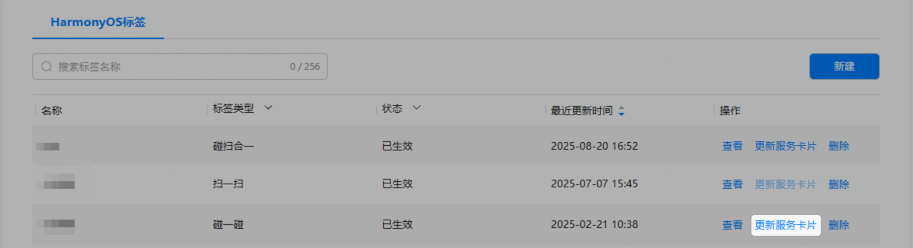
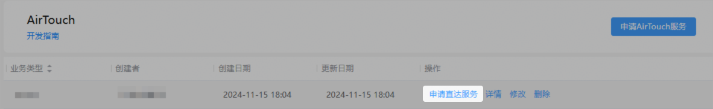
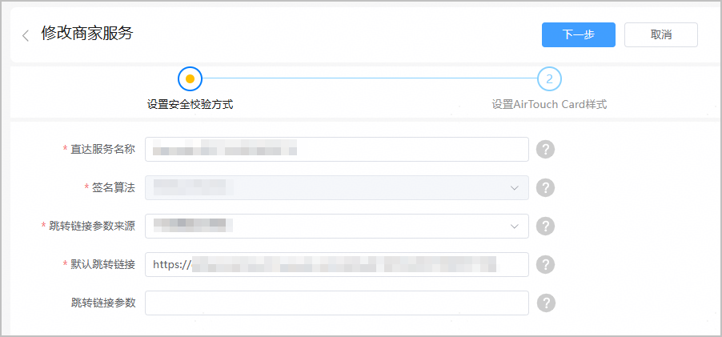
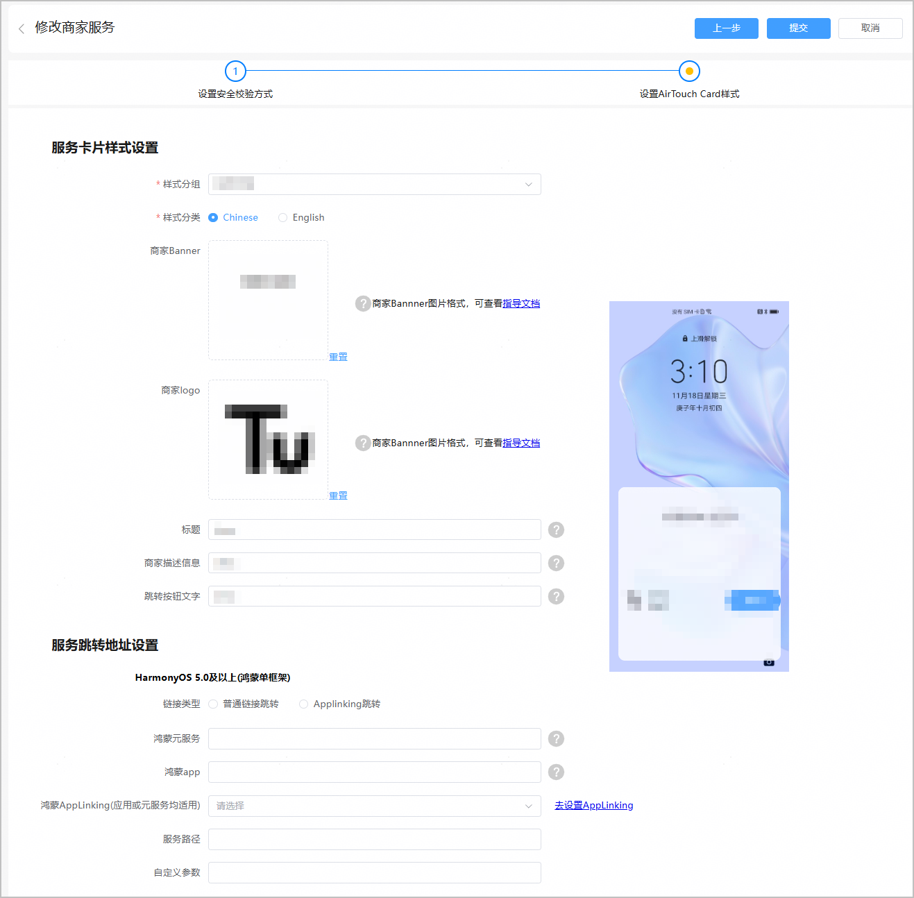

1. 在标签服务页面，点击“更新服务卡片”跳转到AirTouch服务页面。

   
2. 在AirTouch服务页面，点击“申请直达服务”进入“直达服务列表”页面。

   
3. 从“直达服务列表”中找到需要修改的服务，点击“修改”，进入“修改商家服务”页面。

   
4. 在“修改商家服务”页面，“设置安全校验方式”步骤直接点击“下一步”。

   
5. 设置AirTouch Card样式 ，并查看预览效果。

   

   **服务跳转地址设置**

   | 链接类型 | 配置项 | 填写说明 |
   | --- | --- | --- |
   | 普通链接跳转 | 鸿蒙元服务 | 输入元服务跳转地址，长度为0~256个字符。  地址为Want类型的json格式，示例如下：  \`````{"bundleName":"xxx","abilityName":"xxx","moduleName":"xxx","parameters":"\{"xxx":"xxx"}`"\}```` |
   | 鸿蒙app | 输入应用跳转地址，长度为0~256个字符。  地址为Want类型的json格式，示例如下：  \`````{"bundleName":"xxx","abilityName":"xxx","moduleName":"xxx","parameters":"\{"xxx":"xxx"}`"\}```` |
   | Applinking跳转 | 鸿蒙AppLinking(应用或元服务均适用) | 输入应用链接域名或元服务链接网址。 |
   | 服务路径 | 如果您需要实现碰一碰该标签，打开应用或元服务内指定页面，可以在此输入自定义域名路径，长度为0~256个字符。  例如：/path1/path2/path3 |
   | 自定义参数 | 如果您需要实现碰一碰该标签，打开应用或元服务内指定页面，可以在此输入自定义参数，长度为0~256个字符。  需要按key=value的键值对形式输入，多个键值对之间以“&”分隔。  例如：key1=value1&key2=value2&key3=value3 |
6. 完成服务卡片修改后，点击“提交”等待审核。审核通过后，即可碰一碰体验更新后的服务，无需再次烧录标签。
