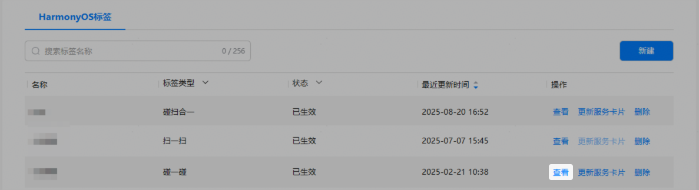
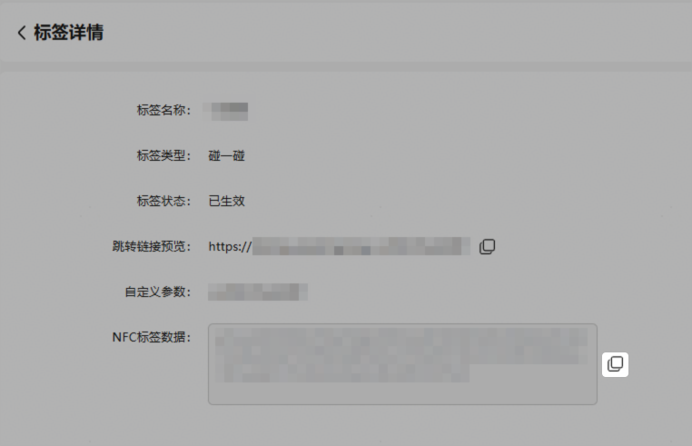
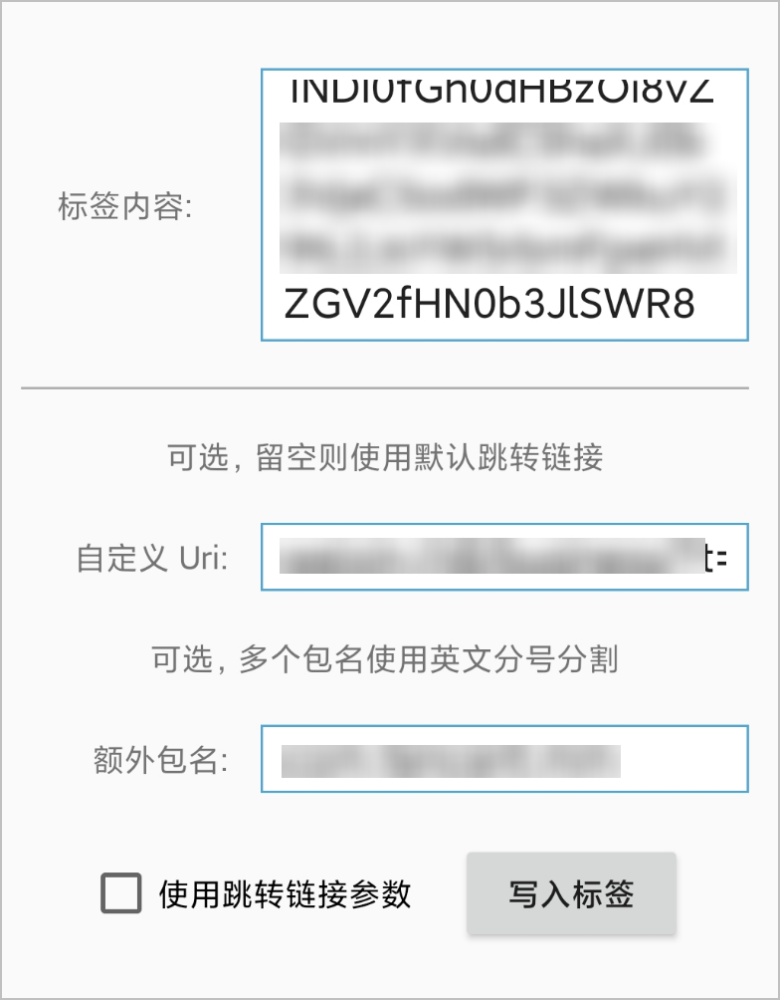

#### 获取NFC标签数据

1. 在标签服务的“HarmonyOS标签”列表中，对已生效的碰一碰标签点击“查看”。

   
2. 进入“标签详情”页面，点击，获取NFC标签数据。

   

#### 烧录NFC标签

为确保烧录质量，建议NFC芯片存储≥500字节，如NTAG215、NTAG216标签。

1. 申请获取标签烧录工具。

   发送申请邮件至agconnect@huawei.com获取。

   * 邮件主题：【碰一碰标签烧录工具申请】
   * 邮件内容：
     + Developer ID：
     + APP ID：
     + 开发者名称：
     + 应用/元服务名称：
     + 使用场景简述：

     

     Developer ID和APP ID的获取方法请参见[查看应用信息](/docs/distribute/agc/agc-help-app-0000002235710234/agc-help-view-app-info-0000002282674569)。
2. 安装烧录工具。

   准备一台Android手机，安装烧录工具。
3. 烧录NFC标签数据。
   1. 打开烧录工具，在对应位置填入内容。
      * 标签内容：填入NFC标签数据。
      * 自定义Uri、额外包名：若需兼容其他自定义软件包，可配置自定义Uri及额外包名。

      
   2. 将标签物料贴近手机NFC感应区域，点击“写入标签”，等待提示“已成功写入标签”即可使用HarmonyOS 5设备验证碰一碰体验。
