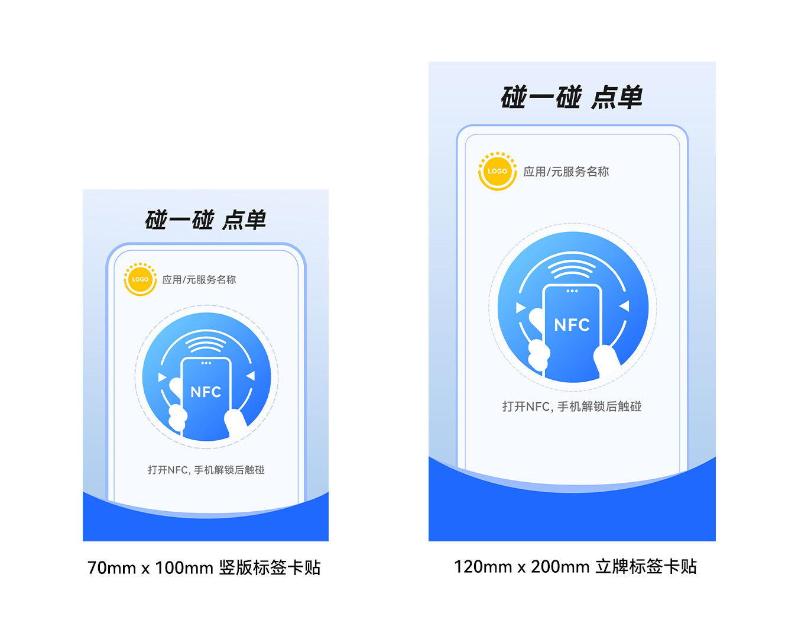

1. 准备NFC标签物料，建议如下。

   | 物料名称 | 版式 | 建议尺寸 | 芯片 |
   | --- | --- | --- | --- |
   | NFC标签 | 竖版标签卡贴 | 70mm\*100mm | NTAG215/216 |
   | 立牌标签卡贴 | 120mm\*200mm |
2. 开发者可结合场景，设计NFC标签物料，确保外形美观，摆放位置方便手机触碰。示例如下。

   
