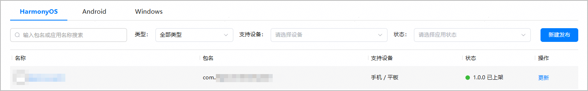
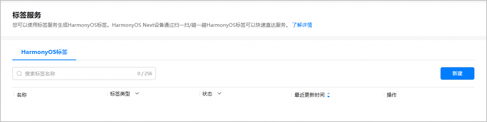
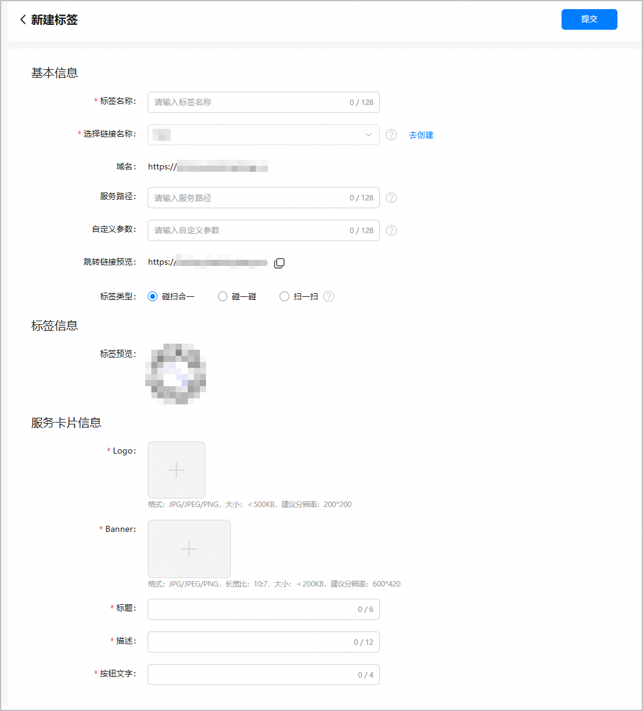
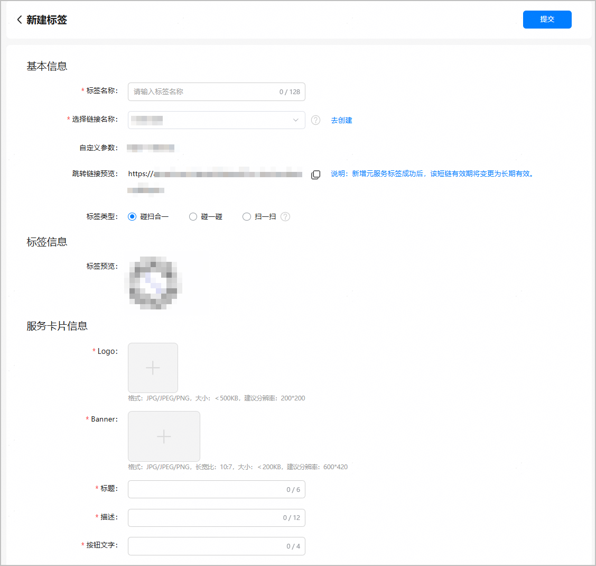
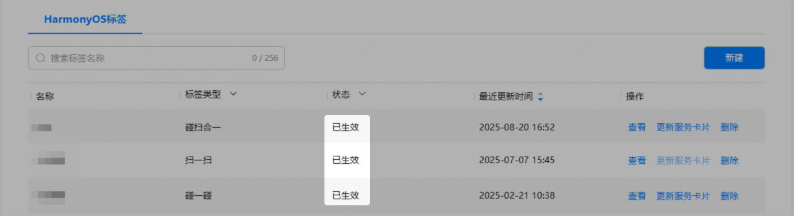

#### 前提条件

1. 您已开通[近场服务权限](/docs/distribute/agc/agc-help-location-sense-0000002305282449/agc-help-location-sense-apply-permission-0000002382902149#section1337155051819)。
2. 您的应用/元服务已成功[创建应用链接](/docs/distribute/agc/agc-help-by-harmonyoslabel-touch-scan-0000002444192029/agc-help-by-harmonyoslabel-touch-scan-createlink-0000002410592814#section82191942376)/[创建元服务链接](/docs/distribute/agc/agc-help-by-harmonyoslabel-touch-scan-0000002444192029/agc-help-by-harmonyoslabel-touch-scan-createlink-0000002410592814#section8416539123614)。

#### 创建应用标签

1. 登录[AppGallery Connect](https://developer.huawei.com/consumer/cn/service/josp/agc/index.html)，点击“APP与元服务”。
2. 进入“HarmonyOS”页签，您可通过包名、应用名称等信息进行筛选，然后在应用列表中点击您的应用名称。

   
3. 选择“分发 > 近场服务 > 标签服务”。
4. 在标签服务主界面，点击“新建”。

   
5. 进入“新建标签”页面，选择“碰扫合一”标签类型。

   

   | 模块 | 配置项 | 填写说明 |
   | --- | --- | --- |
   | 基本信息 | 标签名称 | 填写应用标签的名称，长度为0~128个字符。 |
   | 选择链接名称 | * 您可以选择在App Linking中已成功发布且关联本应用的应用链接。如果链接数量较多，您可以输入关键词进行模糊筛选。 * 如果您还没有成功发布应用链接，可点击页面的“去创建”跳转至“App Linking > 应用链接”页面，[创建应用链接](/docs/dev/app-dev/application-services/app-linking-kit-guide/app-linking-startupapp#在agc为应用创建关联的网址域 名)。 |
   | 域名 | 当您选中具体的应用链接名称后，系统会自动显示该链接的域名。 |
   | 服务路径 | 如果您需要实现碰一碰该标签，打开应用内指定页面，可以在此输入自定义域名路径，长度为0~256个字符。  例如：/path1/path2/path3 |
   | 自定义参数 | 如果您需要实现碰一碰该标签，打开应用内指定页面，可以在此输入自定义参数，长度为0~256个字符。  需要按key=value的键值对形式输入，多个键值对之间以“&”分隔。  例如：key1=value1&key2=value2&key3=value3 |
   | 跳转链接预览 | * 当您录入域名、服务路径、自定义参数时，系统会实时拼接完整的跳转链接，服务路径与自定义参数间以“?”相连。 * 您可以点击，复制完整的跳转链接。 |
   | 标签类型 | 请选择“碰扫合一”类型。 |
   | 标签信息 | 标签预览 | 当您选中具体的应用链接名称后，标签信息会自动显示该应用的Logo。 |
   | 服务卡片信息 | Logo | 选择作为卡片Logo的图片。  图片为JPG/JPEG/PNG格式，小于100KB，长宽比1:1（推荐尺寸为200\*200）。 |
   | Banner | 选择作为卡片Banner的图片。  图片为JPG/JPEG/PNG格式，小于150KB，长宽比10:7（推荐尺寸为600\*420）。 |
   | 标题 | 输入卡片标题，长度为0~6个字符。 |
   | 描述 | 输入卡片描述信息，长度为0~12个字符。 |
   | 按钮文字 | 输入卡片按钮上的文字，长度为0~4个字符。 |
6. 配置完成后，点击页面顶部的“提交”后等待审核。可在标签服务列表中查看已创建的标签状态。

   若审核通过，标签状态会由“审核中”变更为“已生效”；若审核未通过，标签状态会由“审核中”变更为“驳回”，请检查服务卡片配置是否完整、有效，重新点击“提交”等待审核。

   

#### 创建元服务标签

1. 登录[AppGallery Connect](https://developer.huawei.com/consumer/cn/service/josp/agc/index.html)，点击“快速开始”中的“元服务一站式平台”卡片。

   
2. 在左上角下拉列表选择要创建标签的元服务。

   
3. 左侧导航选择“基础服务 > 近场服务 > 标签服务”，进入标签服务主界面，点击页面右上角的“创建”。

   
4. 进入“新建标签”页面，选择“碰扫合一”标签类型。

   

   | 模块 | 配置项 | 填写说明 |
   | --- | --- | --- |
   | 基本信息 | 标签名称 | 填写元服务标签的名称，长度为0~128个字符。 |
   | 选择链接名称 | * 您可以选择在App Linking中已生效且关联本元服务的元服务链接。如果链接数量较多，您可以输入关键词进行模糊筛选。 * 如果您还没有成功发布元服务链接，可点击页面的“去创建”跳转至“基础服务 > 元服务链接”页面，[创建元服务链接](/docs/dev/atomic-dev/atomic-linking/atomic-applinking#section48651523147)。 |
   | 自定义参数 | 当您选中具体的元服务链接名称后，系统会自动显示您在创建元服务链接时[设置的自定义参数](/docs/dev/atomic-dev/atomic-linking/atomic-applinking#section125451919568)。  以key=value的键值对形式展示，多个键值对之间以“&”分隔。  例如：key1=value1&key2=value2&key3=value3 |
   | 跳转链接预览 | * 您可以点击，复制跳转链接。 * 新增元服务标签成功后，元服务链接的有效期将变更为长期有效。 |
   | 标签类型 | 请选择“碰扫合一”类型。 |
   | 标签信息 | 标签预览 | 当您选中具体的元服务链接名称后，标签信息会自动显示该元服务的Logo。 |
   | 服务卡片信息 | Logo | 选择作为卡片Logo的图片。  图片为JPG/JPEG/PNG格式，小于100KB，长宽比1:1（推荐尺寸为200\*200）。 |
   | Banner | 选择作为卡片Banner的图片。  图片为JPG/JPEG/PNG格式，小于150KB，长宽比10:7（推荐尺寸为600\*420）。 |
   | 标题 | 输入卡片标题，长度为0~6个字符。 |
   | 描述 | 输入卡片描述信息，长度为0~12个字符。 |
   | 按钮文字 | 输入卡片按钮上的文字，长度为0~4个字符。 |
5. 配置完成后，点击页面顶部的“提交”后等待审核。可在标签服务列表中查看已创建的标签状态。

   若审核通过，标签状态会由“审核中”变更为“已生效”；若审核未通过，标签状态会由“审核中”变更为“驳回”，请检查服务卡片配置是否完整、有效，重新点击“提交”等待审核。

   
