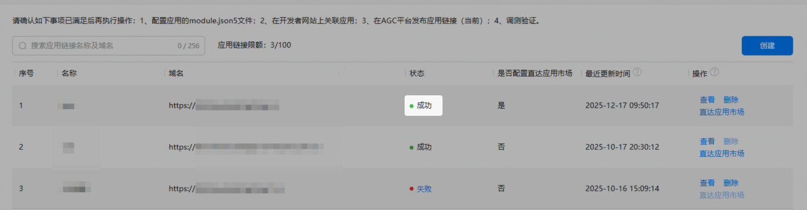

#### 创建应用链接

对于应用，在AGC[创建应用链接并配置网址域名](/docs/dev/app-dev/application-services/app-linking-kit-guide/app-linking-startupapp#在agc为应用创建关联的网址域 名)，确保域名发布状态为“成功”。

#### 创建元服务链接

对于元服务，在AGC为该元服务[创建元服务链接](/docs/dev/atomic-dev/atomic-linking/atomic-applinking#section48651523147)，并确保链接状态为“已生效”。

