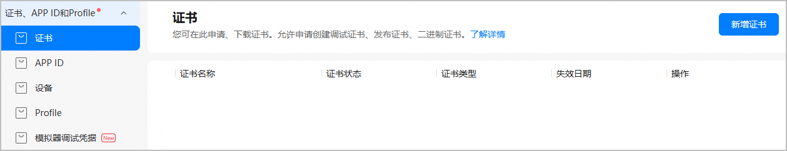
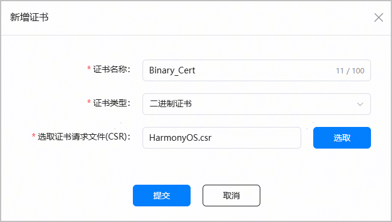
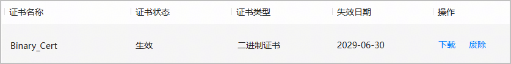

二进制程序需使用华为颁发的二进制证书签名，才能在鸿蒙PC上正常运行。

二进制证书仅支持企业开发者使用，且每个账号最多可申请3个二进制证书。

#### 申请开通权限

二进制证书目前为受限开放，如需体验可通过[在线工单系统](https://developer.huawei.com/consumer/cn/support/feedback/#/)与我们联系。

工单“问题分类”请选择“AppGallery Connect > 证书、APP ID和Profile > 证书”，并在“问题描述”中提供如下信息：

* 企业名称及开发者ID
* 应用名称及APP ID
* 应用的业务场景与用途
* 申请的证书类型：二进制证书

#### 准备工作

* 请准备好[证书请求文件](/docs/tools/coding-debug/ide-signing#section462703710326)。
* 请确保您的账号角色已[获取“访问发布类证书”权限](/docs/distribute/agc/agc-help-developid-0000002235870038/agc-help-manageaccount-0000002306610129#ZH-CN_TOPIC_0000002306610129__li626645853313)。

#### 操作步骤

1. 登录[AppGallery Connect](https://developer.huawei.com/consumer/cn/service/josp/agc/index.html)，选择“证书、APP ID和Profile”。
2. 在左侧导航栏选择“证书、APP ID和Profile > 证书”，进入“证书”页面，点击“新增证书”。

   
3. 在弹出的“新增证书”窗口填写要申请的证书信息，点击“提交”。

   

   | 参数 | 说明 |
   | --- | --- |
   | 证书名称 | 自定义证书名称，不超过100个字符。 |
   | 证书类型 | 选择“二进制证书”。 |
   | 选取证书请求文件（CSR） | 上传准备好的证书请求文件。 |
4. 证书申请成功后，“证书”页面展示证书名称等信息。点击“下载”，将生成的证书保存至本地，供后续发布签名使用。

   

   

   * 证书申请成功即为“生效”状态。若证书状态变为“失效”或“已吊销”，表示当前证书已不可用，您需要重新申请证书。
   * 证书一旦废除将不可恢复，请谨慎操作。
