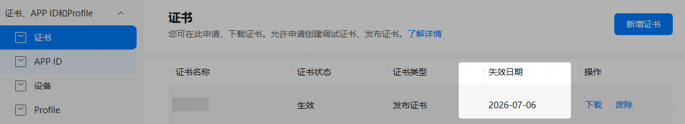
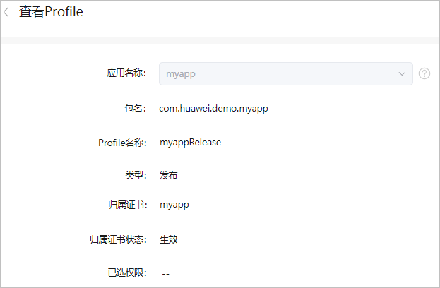
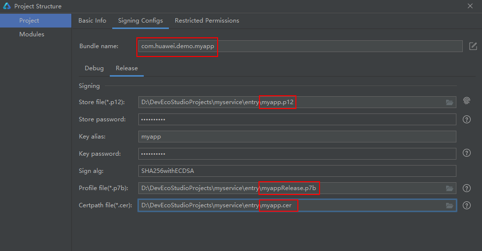
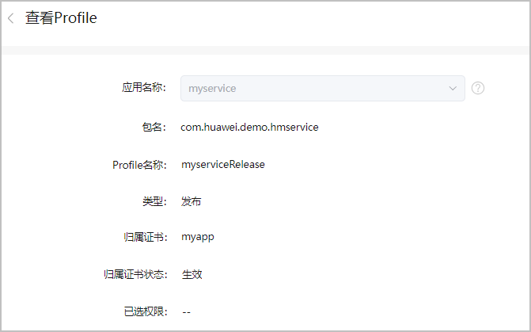
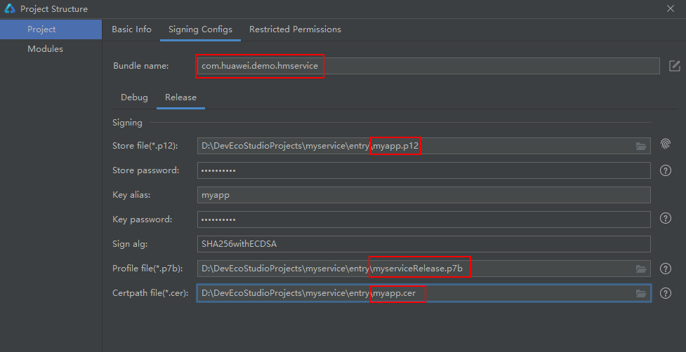

#### 为什么证书还存在有效期，证书到期有什么影响？

证书设置有效期是用于动态验证应用来源合法。目前实名认证开发者的调试证书有效期为1年，发布证书有效期为3年；未实名开发者的调试证书有效期为14天。

证书到期理论上不影响在架应用，但更新版本时若上传过期证书签名的软件包会失败，建议您及时更换证书。

#### 更换发布证书会导致应用更新版本失败吗？

更换证书不会导致应用更新失败，更换证书需同时更新Profile文件。如您的应用集成了华为开放能力（如华为账号服务），更换证书后，必须前往AppGallery Connect“项目设置 > 常规”页面配置新的证书指纹，以免影响华为开放能力鉴权。

#### 密钥文件丢失怎么办？更换密钥文件是否会导致存量用户在应用市场更新应用失败？

您需要妥善保管密钥文件（.p12）和密码，丢失后无法找回。如您不慎丢失，可以重新生成新的密钥文件（.p12）和证书请求文件(.csr)，基于新的证书请求文件生成新的证书文件（.cer），并基于现在应用生成新的Profile（.p7b），则存量用户就能正常更新应用。如果您重新创建应用，导致APP ID发生变化，则会影响存量用户应用的更新。

#### 如何查看证书有效期？如何更换证书？

* 查看证书有效期
  1. 登录[AppGallery Connect](https://developer.huawei.com/consumer/cn/service/josp/agc/index.html)，选择“证书、APP ID和Profile”。
  2. 在左侧导航栏选择“证书、APP ID和Profile > 证书”，即可查看证书失效日期。

     

     证书到期前3个月，AppGallery Connect也会给您发送邮件提醒。

     
* 更换证书
  1. 点击“废除”，删除当前证书。
  2. 申请[新的发布证书](/docs/distribute/agc/agc-help-cert-0000002270829389/agc-help-release-cert-0000002283336729)和[新的发布Profile](/docs/distribute/agc/agc-help-profile-0000002270709473/agc-help-release-profile-0000002248341090)。
  3. 在DevEco Studio中[配置新的签名信息](/docs/tools/coding-debug/ide-publish-app#section280162182818)，编译新的应用包。
  4. 在AppGallery Connect提交新的版本上架。

#### 证书数量达到上限，如何处理？

AGC各个类型的证书都存在数量限制。当数量达到上限时，您可选择以下任意一种方式处理：

* 废除对应类型下多余的证书。废除前请确保该证书未被任何应用使用。
* 当您存在多个应用时，可以让多个应用使用同一个证书。以发布证书为例，多个应用共用一个发布证书的方案如下：

  假设当前证书被应用myapp所占，应用信息如下：

  + 应用包名：com.huawei.demo.myapp
  + 签名库文件：myapp.p12
  + 证书文件名：myapp.cer
  + Profile文件名：myappRelease.p7b，关联的证书为myapp.cer

  

  在DevEco Studio中配置签名信息如下图所示。

  

  那么当需要发布新的应用myservice时，只需要申请新的Profile文件。申请新的Profile时，关联证书选择已有的证书即可。

  

  应用信息如下：

  + 应用包名：com.huawei.demo.hmservice
  + 签名库文件：myapp.p12
  + 证书文件名：myapp.cer
  + 新的Profile文件名：myserviceRelease.p7b，关联的证书为myapp.cer

  

  综上，如果需要发布多个应用，可以使用同一个证书，仅需要为每个应用申请新的Profile文件，其他文件均可以复用。
