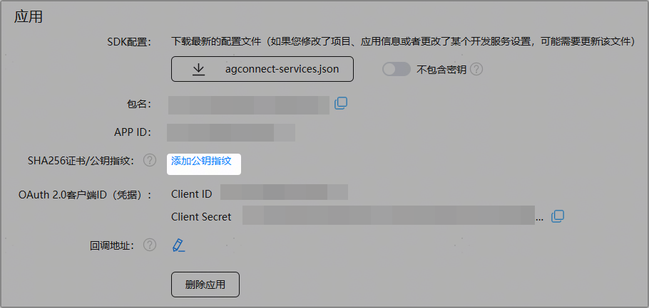
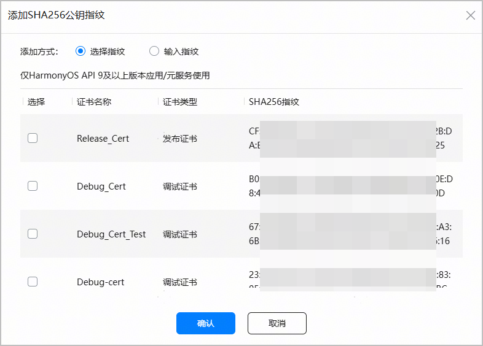
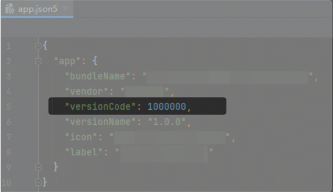
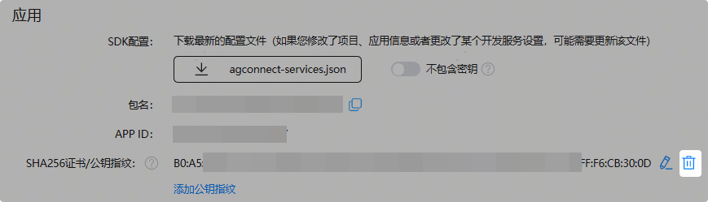
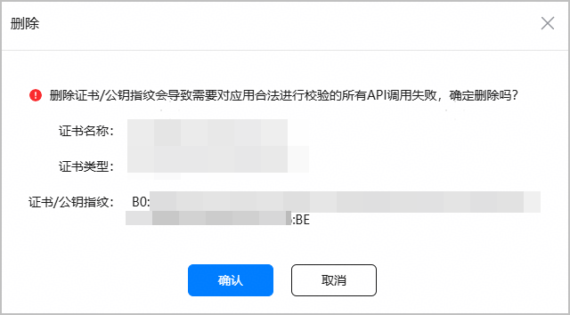

公钥指纹是应用签名证书（.cer文件）的摘要信息，用于校验应用的真实性。如您的应用当前集成的华为相关服务（如华为账号服务）依赖公钥指纹，您需要在应用调试或上架前将公钥指纹配置到AppGallery Connect。

调试和发布使用的签名证书不同，因此调试和发布前请分别基于使用的证书配置相应的公钥指纹。

#### 添加公钥指纹

AppGallery Connect可为签名证书自动生成对应的公钥摘要信息并计算出对应的SHA256指纹，您直接在AppGallery Connect获取与配置即可。每个HarmonyOS应用/元服务最多支持添加50个公钥指纹。

1. 登录[AppGallery Connect](https://developer.huawei.com/consumer/cn/service/josp/agc/index.html#/)，点击“开发与服务”。
2. 在项目列表中找到您的项目，在项目中点击您的HarmonyOS应用/元服务。
3. 在“项目设置 > 常规”页面的“应用”区域，点击“SHA256证书/公钥指纹”后的“添加公钥指纹”。

   
4. 在“添加SHA256公钥指纹”窗口，“添加方式”选择“选择指纹”，然后选择应用/元服务使用的证书对应的指纹，点击“确认”。

   

   * 调试阶段请选择应用/元服务使用的[调试证书](https://developer.huawei.com/consumer/cn/doc/app/agc-help-debug-cert-0000002283256797)指纹，发布阶段请选择应用/元服务使用的[发布证书](https://developer.huawei.com/consumer/cn/doc/app/agc-help-release-cert-0000002283336729)指纹。
   * 过期或废弃的证书不在此展示。

   
5. 指纹添加成功后，将展示在“SHA256证书/公钥指纹”栏。

   

   指纹最迟在25小时后生效。如您急需指纹生效，请执行下一步操作。

   
6. （可选）如果希望配置的公钥指纹快速生效，请在指纹成功配置10分钟后，通过改变应用/元服务工程“app.json5”文件中的“versionCode”字段的值触发指纹生效。例如，原先值为“1000000”，修改为“1000001”。

   

#### （可选）删除公钥指纹

您可将不需要的指纹删除。

删除指纹会导致需要对应用合法进行校验的所有API调用失败，请谨慎操作。

1. 登录[AppGallery Connect](https://developer.huawei.com/consumer/cn/service/josp/agc/index.html#/)，点击“开发与服务”。
2. 在项目列表中找到您的项目，在项目中点击您的HarmonyOS应用/元服务。
3. 在“项目设置 > 常规”页面的“应用”区域，找到“SHA256证书/公钥指纹”栏中需删除的公钥指纹，点击。

   
4. 弹出确认提示框，核对指纹信息无误后，点击“确认”。

   
