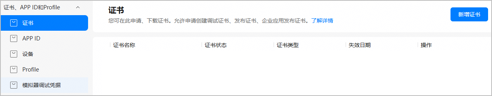
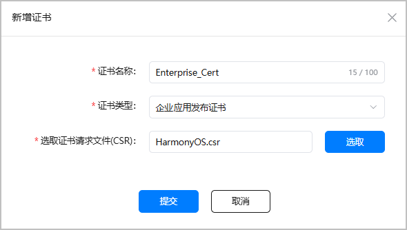
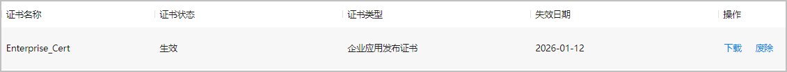

企业应用指为解决和支持企业内部各种业务需求而设计的软件工具和技术解决方案。 企业应用无需上架华为应用市场，可通过企业MDM应用以及离线安装器分发安装。

当前企业应用仅支持在鸿蒙电脑擎云系列设备上分发。

在发布企业应用时，您需要使用企业应用发布证书和企业应用发布Profile手动签名后，才能编译构建正式发布包。请参考本文档申请并下载企业应用发布证书。

#### 申请开通权限

您需满足如下条件，才可申请企业应用发布证书和发布Profile：

1. [注册华为开发者账号](https://developer.huawei.com/consumer/cn/doc/start/registration-and-verification-0000001053628148)并[完成企业开发者实名认证](https://developer.huawei.com/consumer/cn/doc/start/ht-edrna-0000001154848578)
2. 申请开通权限，方法如下：
   * 申请邮箱地址：agconnect@huawei.com。
   * 邮件标题：[申请企业应用发布证书和发布Profile]-[应用名称]-[应用包名]-[APP ID]-[Developer ID]，Developer ID等查询方法可参见[查看应用信息](https://developer.huawei.com/consumer/cn/doc/app/agc-help-view-app-info-0000002282674569)。
   * 邮件正文：请说明申请原因，并复制以下内容至邮件正文：

     “我已明确知悉：企业应用无需上架华为应用市场，只可通过企业MDM应用以及离线安装器分发安装，仅支持鸿蒙电脑擎云系列设备。”

#### 准备工作

* 请准备好[证书请求文件](https://developer.huawei.com/consumer/cn/doc/harmonyos-guides/ide-signing#section462703710326)。
* 请确保您的账号角色已[获取“访问发布类证书”权限](https://developer.huawei.com/consumer/cn/doc/app/agc-help-manageaccount-0000002306610129#ZH-CN_TOPIC_0000002306610129__li626645853313)。

#### 操作步骤

申请企业应用发布证书步骤如下：

每个账号仅可申请1个企业应用发布证书。

1. 登录[AppGallery Connect](https://developer.huawei.com/consumer/cn/service/josp/agc/index.html)，选择“证书、APP ID和Profile”。
2. 在左侧导航栏选择“证书、APP ID和Profile > 证书”，进入“证书”页面，点击“新增证书”。

   
3. 在弹出的“新增证书”窗口填写要申请的证书信息，点击“提交”。

   

   | 参数 | 说明 |
   | --- | --- |
   | 证书名称 | 自定义证书名称，不超过100个字符。 |
   | 证书类型 | 选择“企业应用发布证书”。 |
   | 选取证书请求文件（CSR） | 上传准备好的证书请求文件。 |
4. 证书申请成功后，“证书”页面展示证书名称等信息。点击“下载”，将生成的证书保存至本地，供后续发布签名使用。

   

   

   * 证书申请成功即为“生效”状态。若证书状态变为“失效”或“已吊销”，表示当前证书已不可用，且通过此证书申请的Profile也会全部失效或吊销。您需要重新申请证书与Profile。
   * 证书一旦废除将不可恢复，且通过此证书申请的Profile也会全部失效，请谨慎操作。
