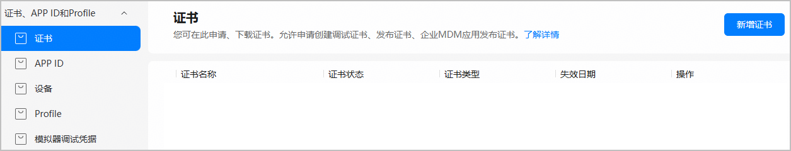
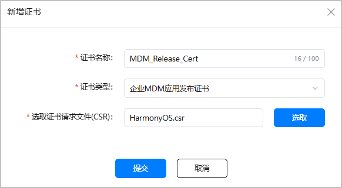
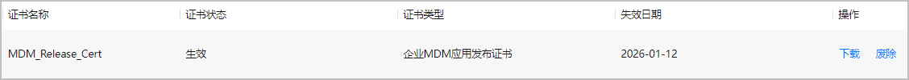

MDM（Mobile Device Management，移动设备管理）是一种企业级的IT应用解决方案，用于管理并保护公司设备上的数据和应用程序。MDM可以通过集中管理、远程配置和监控来保障设备和数据的安全性和稳定性。它广泛应用于企业和政府机构，以确保员工和客户使用的设备和数据受到保护，实现企业高效管理、安全使用设备。

在发布企业MDM应用时，您需要使用企业MDM应用发布证书和企业MDM应用发布Profile手动签名后，才能编译构建正式发布包。请参考本文档申请并下载企业MDM应用发布证书。

#### 申请开通权限

您需满足如下条件，才可申请企业MDM应用发布证书和发布Profile：

1. [注册华为开发者账号](https://developer.huawei.com/consumer/cn/doc/start/registration-and-verification-0000001053628148)并[完成企业开发者实名认证](https://developer.huawei.com/consumer/cn/doc/start/ht-edrna-0000001154848578)
2. 申请成为企业MDM应用开发者
3. 申请将应用加入企业MDM应用受邀名单

权限2和3可向华为运营人员申请开通。在收到您的申请后，华为运营人员将在1-3个工作日内为您安排对接人员。申请方法如下：

* 申请邮箱地址：agconnect@huawei.com。
* 邮件标题：[申请企业MDM应用发布证书和发布Profile]-[应用名称]-[应用包名]-[APP ID]-[Developer ID]，Developer ID等查询方法可参见[查看应用信息](https://developer.huawei.com/consumer/cn/doc/app/agc-help-view-app-info-0000002282674569)。
* 邮件正文：请说明申请原因。

#### 准备工作

* 请准备好[证书请求文件](https://developer.huawei.com/consumer/cn/doc/harmonyos-guides/ide-signing#section462703710326)。
* 请确保您的账号角色已[获取“访问发布类证书”权限](https://developer.huawei.com/consumer/cn/doc/app/agc-help-manageaccount-0000002306610129#ZH-CN_TOPIC_0000002306610129__li626645853313)。

#### 操作步骤

申请企业MDM应用发布证书步骤如下：

每个账号最多申请1个企业MDM应用发布证书。

1. 登录[AppGallery Connect](https://developer.huawei.com/consumer/cn/service/josp/agc/index.html)，选择“证书、APP ID和Profile”。
2. 在左侧导航栏选择“证书、APP ID和Profile > 证书”，进入“证书”页面，点击“新增证书”。

   
3. 在弹出的“新增证书”窗口填写要申请的证书信息，点击“提交”。

   

   | 参数 | 说明 |
   | --- | --- |
   | 证书名称 | 自定义证书名称，不超过100个字符。 |
   | 证书类型 | 选择“企业MDM应用发布证书”。 |
   | 选取证书请求文件（CSR） | 上传准备好的证书请求文件。 |
4. 证书申请成功后，“证书”页面展示证书名称等信息。点击“下载”，将生成的证书保存至本地，供后续发布签名使用。

   

   

   * 证书申请成功即为“生效”状态。若证书状态变为“失效”或“已吊销”，表示当前证书已不可用，且通过此证书申请的Profile也会全部失效或吊销。您需要重新申请证书与Profile。
   * 证书一旦废除将不可恢复，且通过此证书申请的Profile也会全部失效，请谨慎操作。
