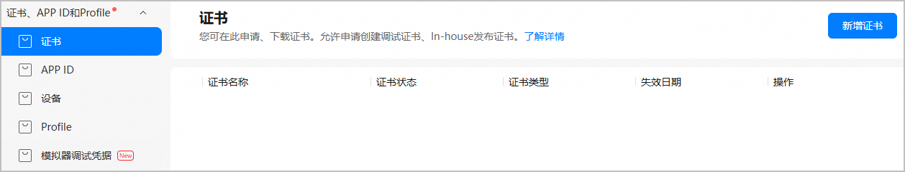
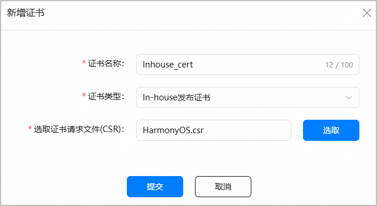
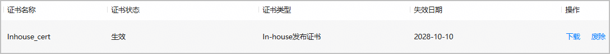

在发布In-house应用时，您需要使用In-house发布证书和In-house发布Profile手动签名后，才能编译构建正式发布包。请参考本文档申请并下载In-house发布证书。

每个账号仅可申请1个In-house发布证书。

#### 前提条件

* 您已准备好[证书请求文件](https://developer.huawei.com/consumer/cn/doc/harmonyos-guides/ide-signing#section462703710326)。
* 账号已完成[In-house分发资格申请并审核通过](https://developer.huawei.com/consumer/cn/doc/app/agc-help-inhouse-0000002281532696#section6267104872410)。
* 您的账号角色已[获取“访问发布类证书”权限](https://developer.huawei.com/consumer/cn/doc/app/agc-help-manageaccount-0000002306610129#ZH-CN_TOPIC_0000002306610129__li626645853313)。

#### 操作步骤

1. 登录[AppGallery Connect](https://developer.huawei.com/consumer/cn/service/josp/agc/index.html)，选择“证书、APP ID和Profile”。
2. 在左侧导航栏选择“证书、APP ID和Profile > 证书”，进入“证书”页面，点击“新增证书”。

   
3. 在弹出的“新增证书”窗口填写要申请的证书信息，点击“提交”。

   

   | 参数 | 说明 |
   | --- | --- |
   | 证书名称 | 自定义证书名称，不超过100个字符。 |
   | 证书类型 | 选择“In-house发布证书”。 |
   | 选取证书请求文件（CSR） | 上传准备好的证书请求文件。 |
4. 证书申请成功后，“证书”页面展示证书名称等信息。点击“下载”，将生成的证书保存至本地，供后续发布签名使用。

   

   

   * 证书申请成功即为“生效”状态。若证书状态变为“失效”或“已吊销”，表示当前证书已不可用，且通过此证书申请的Profile也会全部失效或吊销。您需要重新申请证书与Profile。
   * 证书一旦废除将不可恢复，且通过此证书申请的Profile也会全部失效，请谨慎操作。
