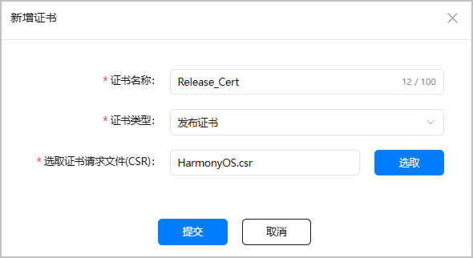
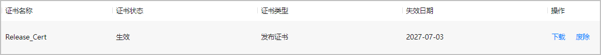

在发布阶段，您需要使用发布证书和发布Profile重新手动签名后，才能编译构建正式发布包。请参考本文档申请并下载发布证书，手动签名的完整操作请参考[配置签名信息](/docs/tools/coding-debug/ide-publish-app#section280162182818)。

每个账号最多可申请3个发布证书。

#### 前提条件

* 您已准备好[证书请求文件](/docs/tools/coding-debug/ide-signing#section462703710326)。
* 您的账号角色已[获取“访问发布类证书”权限](/docs/distribute/agc/agc-help-developid-0000002235870038/agc-help-manageaccount-0000002306610129#ZH-CN_TOPIC_0000002306610129__li626645853313)。

#### 操作步骤

1. 登录[AppGallery Connect](https://developer.huawei.com/consumer/cn/service/josp/agc/index.html)，选择“证书、APP ID和Profile”。
2. 在左侧导航栏选择“证书、APP ID和Profile > 证书”，进入“证书”页面，点击“新增证书”。

   
3. 在弹出的“新增证书”窗口填写要申请的证书信息，点击“提交”。

   

   | 参数 | 说明 |
   | --- | --- |
   | 证书名称 | 自定义证书名称，不超过100个字符。 |
   | 证书类型 | 选择“发布证书”。 |
   | 选取证书请求文件（CSR） | 上传准备好的证书请求文件。 |
4. 证书申请成功后，“证书”页面展示证书名称等信息。点击“下载”，将生成的证书保存至本地，供后续发布签名使用。

   

   

   * 证书申请成功即为“生效”状态。目前实名认证开发者的发布证书有效期为3年。证书到期目前暂不影响在架应用，但更新版本时若上传过期证书签名的软件包会失败，建议您及时更换证书与Profile。
   * 在发布阶段，如果您更新发布证书，则需要[同步更新发布Profile](/docs/distribute/agc/agc-help-profile-0000002270709473/agc-help-release-profile-0000002248341090)。
   * 若证书状态变为“失效”或“已吊销”，表示当前证书已不可用，且通过此证书申请的Profile也会全部失效或吊销。您需要重新申请证书与Profile。
   * 证书一旦废除将不可恢复，且通过此证书申请的Profile也会全部失效，请谨慎操作。废除证书目前暂不影响在架应用。
   * 更新版本时您需要使用同一个CSR文件生成的证书，并使用新证书更新Profile文件。
5. （可选）如您之前使用调试证书配置过公钥指纹，上架前需要将调试证书指纹更新为发布证书指纹，具体操作请参见[配置公钥指纹](/docs/distribute/agc/agc-help-cert-0000002270829389/agc-help-cert-fingerprint-0000002278002933)。
