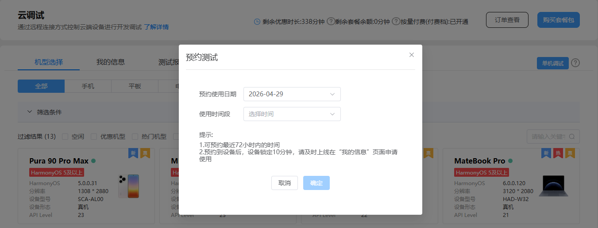

#### 应用调试

您选择设备并从本地上传应用后，应用将被自动安装至真机设备，您即可对应用进行调试，帮助您提前发现问题。

#### 预约测试

如果某款设备的在线资源比较紧张，可能会导致您无法申请到该设备。为此，云调试增加了预约测试功能，通过该功能，您可以提前选择想要调试的设备，并预设此款设备的调试日期和使用时段。预约完成后，当预约的设备在预约时段空闲时，设备会被锁定10分钟，请您及时上线，并在“我的信息”页面申请使用。

