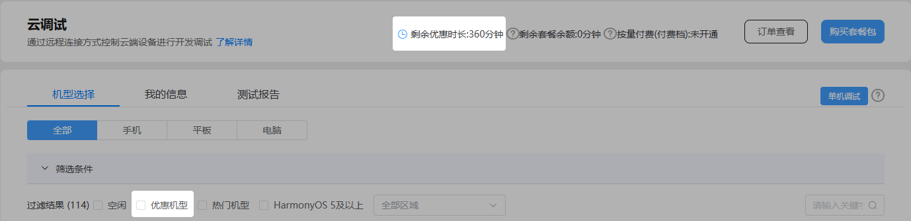

#### 云调试是否收费？收费策略是什么？

云调试为华为第三方应用提供在线真机调试解决方案，每天以账号为维度针对部分机型提供360分钟的优惠时长，适用于“优惠机型”的远程测试和应用调试，帮助您及时发现问题并解决问题，从而提升应用质量。

超出优惠时长上限后，您可以订购付费套餐或升级到按量付费档，详见[计费说明](https://developer.huawei.com/consumer/cn/doc/app/agc-help-clouddebug-price-0000002255019568)。

#### 一个账号可以同时使用多部手机吗？

单机调试场景下，每次调试仅支持申请1部手机，同一账号最多可同时占用2部手机。

#### 为什么调试期间调试设备出现了黑屏？

可能原因有如下两种：

* 长时间未操作手机，致使手机进入休眠状态。

  可尝试点击手机下方的电源键恢复画面。
* 进入账号登录界面。

  由于隐私安全的限制，登录界面不会显示内容。您可以通过点击“获取控件树”按钮启动辅助控件绘制功能来完成账号登录。详情请参见[使用获取控件树按钮完成登录](https://developer.huawei.com/consumer/cn/doc/app/agc-help-clouddebug-debugapp-0000002289629821#section1851413117162)。

#### 云调试上的真机可以横竖屏切换吗？

当云调试在支持横屏的页面接收到横竖屏切换指令（例如顺时针旋转或逆时针旋转）时，会正常进行横竖屏切换，并且支持您在横屏状态下操作手机。您也可以在调试页面手动对支持横竖屏切换的HarmonyOS 5及以上应用进行横竖屏切换。

#### 上传应用后提示“应用非Release版本，请上传Release版本应用”是什么原因？

请检查上传的应用包是否是debug版本，当前不支持上传debug版本的应用包。

检查步骤：

1. 打开DevEco Studio，在**“**File > Project Structure > Project > Signing Configs**”**窗口中检查配置的证书类型。须确保配置的是发布证书，而非调试证书。
2. 在代码编辑界面，点击右上角图标，在弹出框中查看“Build Mode”配置。如果配置为“debug”，则构建的为debug版本应用包；如果配置为“release”，则构建的为release版本应用包。须确保将“Build Mode”配置为“release”。

   

#### 使用云调试选择设备后，提示“因安全限制，该页面禁止操作”是什么原因？

通常是因为您准备调试的应用包含了高风险系统权限（如设备管理员、无障碍服务等），或者您尝试操作云调试真机的“设置”界面。这些行为可能会影响设备的正常交互及其他用户的后续使用。为了保障所有开发者的体验和平台资源的公平使用，我们目前不支持可能锁定屏幕或干扰设备正常操作的调试任务。

建议您优先在真机或模拟器中测试此类功能。如果确实需要使用云调试，请确保应用具备有效的自主退出机制。

#### 使用云调试选择设备后，提示“您无权访问该服务，请联系管理员AppGallery Connect客服”是什么原因？

通常是因为您上传的应用在运行时锁定了云调试设备的屏幕或所有应用，导致其他用户无法正常使用该设备。常见的触发原因包括：

* 应用申请了过高的系统权限（如设备管理员、无障碍服务等）。
* 应用在前台显示了无法关闭的“防沉迷”或“家长控制”锁屏界面。
* 应用逻辑错误，未能提供有效的退出或解锁机制。
* 应用属于病毒类等危险App。

云调试是共享资源，单个应用独占设备会破坏测试环境的公平性，因此平台禁止此类行为。

#### 使用云调试时如何查看手机的基本信息？

为了方便用户查看正在使用的手机信息，云调试在单机调试界面提供了手机信息查看功能。您只需将鼠标悬停在设备图框顶部的按钮上，即可查看手机相关信息。

#### 云调试线上提供哪些设备？

目前线上提供HarmonyOS 5及以上系统的直屏手机、折叠屏手机、平板和PC电脑设备。

#### 如何查看调试日志？

HarmonyOS 5及以上系统的设备展示为“HiLog”页签，详情请参见[查看和导出日志](https://developer.huawei.com/consumer/cn/doc/app/agc-help-clouddebug-viewlog-0000002289629825)。

#### 无法进入到设备调试页面怎么办？

请您确认账号内优惠时长、套餐余额是否充足，是否开启了按量付费。

#### 申请调试设备时支持通过CPU筛选设备吗？

不支持。

#### 使用云调试预约调试功能时，最多支持预约几台设备？

两台。

#### 云调试怎么开具发票？开具发票周期是多久？

点击云调试服务页面右上角的“订单查看”。然后在左侧菜单栏中选择“费用 > 发票管理”，进入发票管理页面对已购订单申请开票即可。

开具发票周期为华为财务工作人员收到发票申请或您确认结算金额后的30个自然日内。
