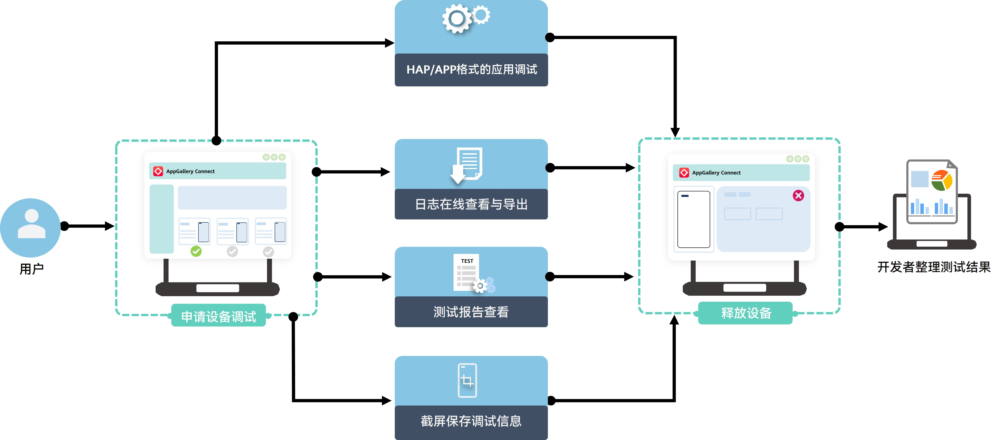

云调试致力于为您提供高效的云端设备调试解决方案，解决您设备机型不足、设备管理困难及bug无法复现等问题，降低您的采购及管理成本。云调试提供不同型号的机型，让您可随时随地直观了解应用在不同机型上的运行表现。

#### 主要功能

云调试远程操作流畅无卡顿，操作体验简洁人性化，支持的调试功能包括：

| 主要功能 | 功能描述 |
| --- | --- |
| HAP/APP应用调试 | 支持对HAP/APP格式的应用进行调试，既可在PC上操作，也可手机扫码后在您的手机上调试。 |
| 日志查看和导出 | 支持在线查看和导出完整的系统日志和应用日志，进行错误定位。 |
| 测试报告查看 | 测试过程回顾，方便您对测试历史的查看。 |
| 截屏功能 | 测试过程截屏，保留测试过程的关键界面信息，分析测试结果的还原度。 |

#### 工作原理

通过云调试服务远程连接设备，上传并安装应用后，既可以通过鼠标在PC的设备投屏画面上直接操作设备，也可以通过手机扫码在手机浏览器的设备投屏画面上操作设备。在调试过程中，您可以获取设备运行期间的系统日志和应用日志，从而帮助您定位问题，实现远程调测应用的目的。

