#### 计费方式说明

自2022年5月23日起，您在使用云调试服务时，可以使用账号内的优惠调试时长免费调试特定设备，还可以通过购买付费套餐和开通升级付费档按量收费两种方式付费享受更全面的云调试服务。

| 计费方式 | 说明 |
| --- | --- |
| 优惠时长 | 当您成功注册华为开发者账号后，华为会以账号为维度每日零点为您提供一定的优惠时长，您账号下的所有项目共用该优惠时长。优惠时长仅适用于优惠机型，可享受优惠时长的机型会在其图标旁边展示“惠”标识。  关于云调试服务的优惠时长额度，请参见[套餐价格](#section922853442512)。  说明：  使用优惠时长调试时，单次调试时间不得超过20分钟。当20分钟调试时长即将用尽时，您可以根据实际调试情况决定是否继续调试。继续调试时，如果优惠时长有剩余，可继续使用优惠时长，否则需付费使用。 |
| [付费套餐](#section1554613186493) | 您可以为某个项目购买云调试套餐包，套餐包在套餐配额内为您提供了更加优惠的使用价格。套餐包的时长可用来支付非优惠机型的调试，或支付优惠机型在优惠时长用尽后继续调试。  仅支持订购付费套餐的项目使用，您账号中的其他项目不能共享付费套餐内的调试额度。  关于云调试服务的付费套餐，请参见[套餐价格](#section922853442512)。 |
| [按量付费](#section12857373426) | 您可以将云调试服务升级到付费档，以启用按量付费。启用按量付费后，当优惠时长和套餐余额都用尽时，系统会根据实际使用时长从您的账户余额中扣除相应费用。  若您的账户已欠费，则不能以按量付费方式继续调试，您可为账户[充值](https://developer.huawei.com/consumer/cn/doc/app/agc-help-topup-0000002277191065)。  关于云调试服务的按量付费价格，请参见[套餐价格](#section922853442512)。  注意：  升级到按量付费档后，如您的账户内有优惠券，每月将优先使用优惠券抵扣费用。费用超出优惠券额度时，则需要您付费使用。如需查看账户内的优惠券详情，请参见[管理优惠券](https://developer.huawei.com/consumer/cn/doc/app/agc-help-coupon-0000002242112062)。  您超出套餐额度的费用将自动从您的账户余额中扣除，请保证您的账户余额充足。为防止您的账户余额不足而导致扣款失败，您可以[设置账户余额不足提醒](https://developer.huawei.com/consumer/cn/doc/app/agc-help-set-balance-notify-0000002247531780)。 |

#### 计费优先级说明

系统按照优惠时长＞付费套餐＞按量付费的优先顺序计费：

* 如果您选择优惠设备进行调试，系统将优先扣减优惠时长；当您的优惠时长用完，系统会扣减付费套餐余额；套餐余额用尽后按需扣减账户余额。
* 如果您选择非优惠设备进行调试，系统无法使用优惠时长，而是直接扣减套餐余额；当套餐余额用尽后，系统将按需扣减账户余额。
* 在调试过程中，若当前计费方式的时长即将用完，系统会请您选择是否使用其他可用的（有余额的）计费方式完成调试。只有您确认需要继续调试后，系统才会变更扣减方式。若没有其他可用的（有余额的）计费方式，或您不确认需要继续调试，系统将在当前计费方式的时长用尽时自动断开链接。为避免中断您的调试，建议您可以选择升级到按量付费档或及时订购付费套餐。

#### 套餐价格

| 计费方式 | 配额 | 有效期 | 价格（CNY） | 说明 |
| --- | --- | --- | --- | --- |
| 优惠时长 | 360分钟/天 | 每天（次日零点自动恢复） | 0 | 当您同时使用多台设备进行调试时，时长额度累加计算。 |
| 套餐余额 | 600分钟 | 1年 | 480 | 套餐余额目前仅支持中国大陆地区购买。 |
| 6000分钟 | 1年 | 3600 |
| 按量付费 | - | - | 1元/分钟 | 按实际使用量收费 |

#### 购买流程

#### [h2]订购付费套餐包

项目付费套餐在套餐配额内为您提供了更加优惠的使用价格。您可以参考以下步骤订购项目付费套餐：

1. 登录[AppGallery Connect](https://developer.huawei.com/consumer/cn/service/josp/agc/index.html)，选择“开发与服务”。
2. 选择想要订购付费套餐的项目后，在左侧导航栏选择“质量 > 云调试”。
3. 点击页面上方的“购买套餐包”。

   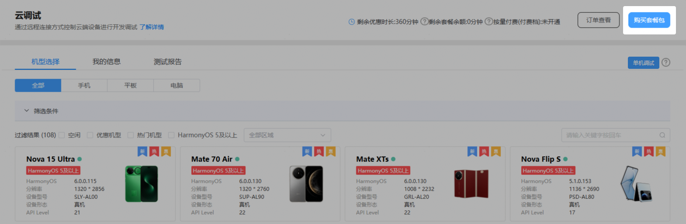
4. 在“购买”界面中，“售卖方式”选择“一次性资源包”，并选择所需规格、套餐配额和有效期，配置“购买数量”后，点击“购买”。

   

   * 实际套餐配额以实际页面展示为准。
   * 购买的套餐包，只能在当前项目下使用，其他项目无法使用该套餐包。
   * 如您尚未维护过账户付费信息，系统会提示您，请您根据提示前往联盟付费服务完善付费信息。

   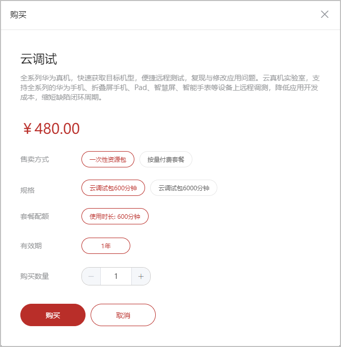
5. 在服务支付界面，您可以选择账户余额支付或第三方支付，确认金额后点击“确认并支付”。

   

   如您尚未签署华为AppGallery Connect付费服务协议或签署的协议非最新版本，请您阅读并勾选服务支付页面底部的选框，完成协议签署后才能订购付费服务。

   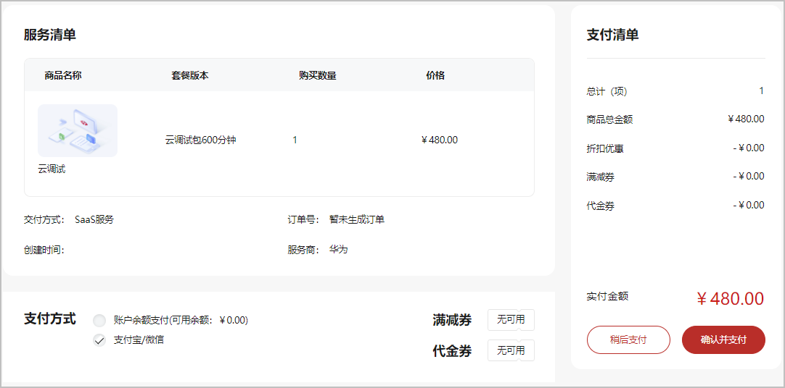
6. 如您当前因余额不足或其他原因无法立即支付，可以点击“稍后支付”。后续可进入“订单管理”页面选择该订单完成支付，具体请参见[管理订单](https://developer.huawei.com/consumer/cn/doc/app/agc-help-order-0000002277191077)。

   也可以进入云调试服务主界面，点击右上角的“订单查看”，进入“订单管理”页面完成支付。

   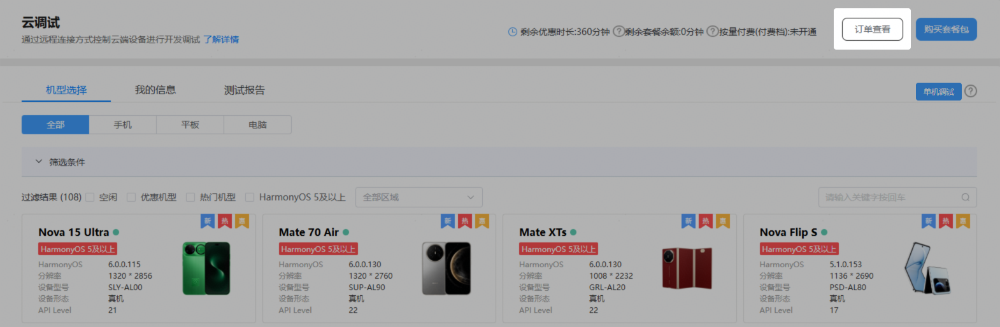
7. 支付完成后您即可使用套餐内的配额，如需查看项目配额，请点击“项目设置 > 项目配额”查看配额。

   

   * 套餐包一经使用，不支持退款，且不支持账户余额支付的套餐包退款。
   * 如果您想要退订未使用过的套餐包，可以发送邮件联系华为方：请将开发者名称、Developer ID、申请背景发送至agconnect@huawei.com，华为方将在1-3个工作日内为您安排对接人员。

   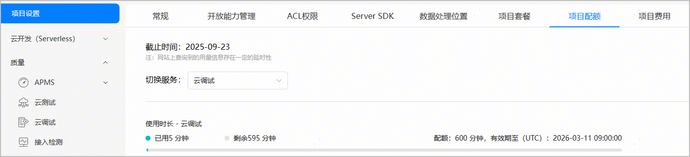

   您还可以选择“质量 > 云调试”返回云调试页面，在页面顶端查看剩余优惠时长和剩余套餐余额。

   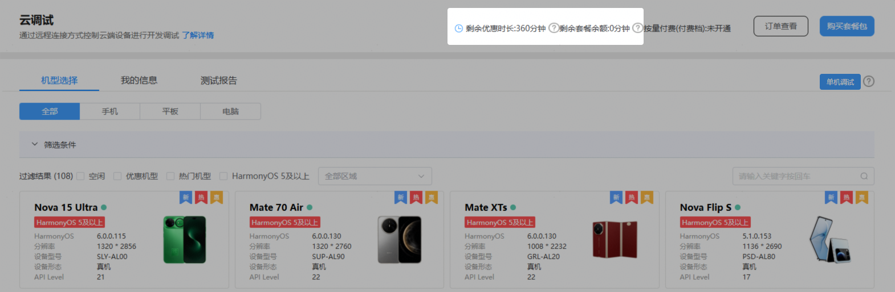
8. 如需开具发票，请点击云调试服务页面右上角的“订单查看”。然后在左侧菜单栏中选择“费用 > 发票管理”，进入发票管理页面对已购订单申请开票。开具发票周期为华为财务工作人员收到发票申请或您确认结算金额后的30个自然日内。

   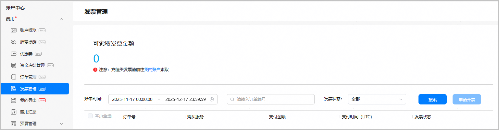

#### [h2]升级付费档

在想要使用云调试服务的项目下，您可以选择“项目设置 > 项目套餐 > 升级到付费档”将您的项目套餐升级到付费档，也可点击云调试主界面的“购买套餐包”在弹窗中快捷开通。升级到付费档后，当您账号内的优惠时长和套餐余额均用尽时，系统将根据您的超额调试时间按量计费。

若您的账户已欠费，则不能以按量付费方式继续调试，您需要为账户[充值](https://developer.huawei.com/consumer/cn/doc/app/agc-help-topup-0000002277191065)。

* 如果您的账户是欠费状态，您将无法使用云调试服务。
* 充值后状态变更可能会有一定延迟，请您耐心等待后刷新重试。
* 如您尚未维护账户付费信息，系统会提示您，请您根据提示前往联盟付费服务处完善付费信息。
* 如您尚未签署华为AppGallery Connect付费服务协议或签署的协议非最新版本，请您阅读并勾选“确认升级”页面底部的选框，完成协议签署后才能升级到付费档。

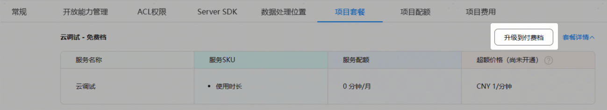

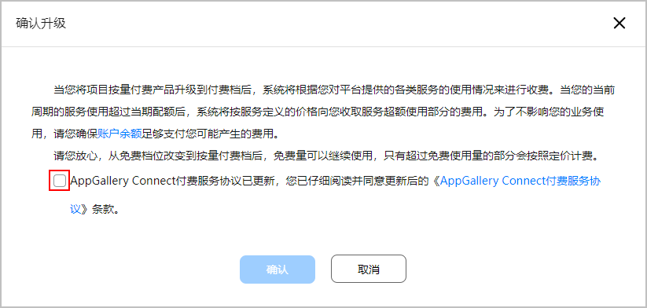

您还可以在云调试服务主界面，点击“购买套餐包”，在“购买”弹出框中选择“按量付费套餐”，然后点击“开通”升级到付费档。

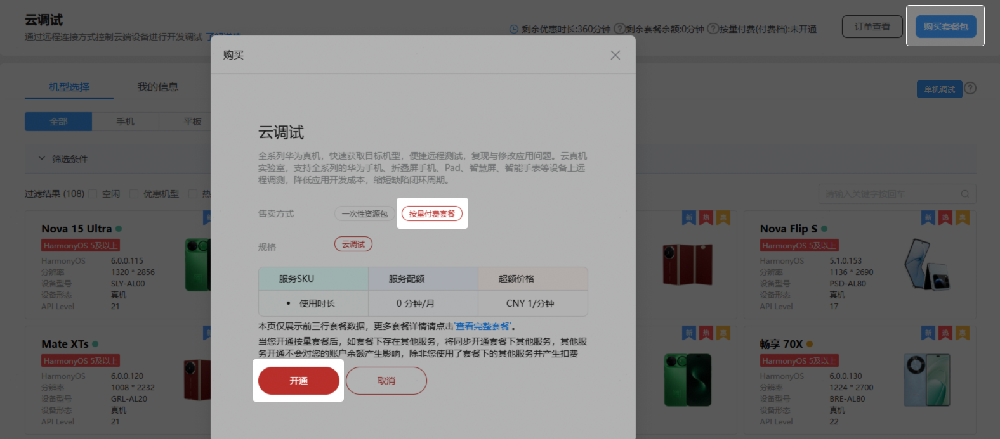

升级成功后，您可以在当前页面查看开通结果。

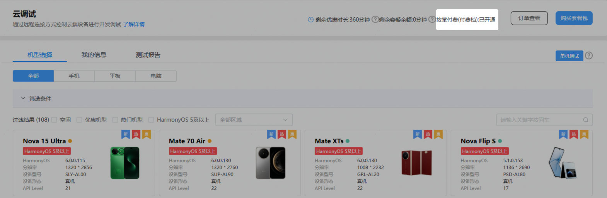

#### 费用查询

您可在“项目设置 > 项目费用”下查询当前项目的月总消费以及账户的欠费情况。如您的账户已欠费，请您尽快充值，以免影响使用，您可参考[充值](https://developer.huawei.com/consumer/cn/doc/app/agc-help-topup-0000002277191065)为账户充值。

* 当您的账号欠费时，如果您的付费套餐内仍有余额，在余额用尽前，您仍可正常使用云调试服务。
* 当您的账号欠费且付费套餐内无套餐余额可用时：
  + 付费机型：您将无法使用付费设备进行云调试。
  + 优惠机型：当优惠时长用完时，您将无法继续使用优惠机型。
* 充值后状态变更可能会有一定延迟，请您耐心等待后刷新重试。

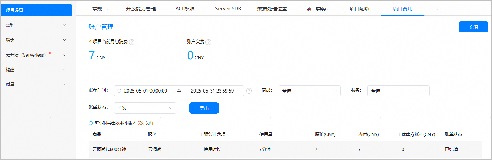
