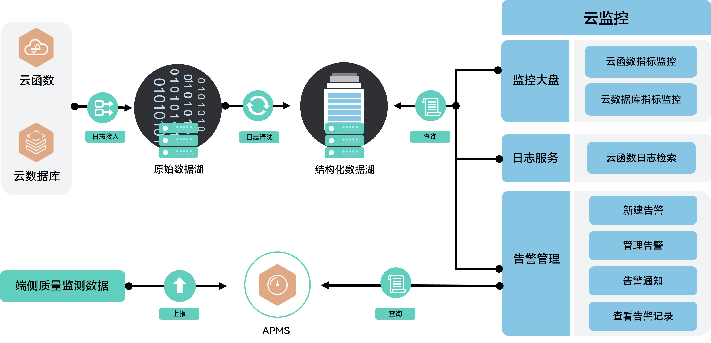

云监控提供了一站式的开放型监控解决方案，适用于监控云函数、云数据库等服务的关键指标。它具备日志检索和分析能力，可针对特定监控指标设置警报，为优化统计指标（如云函数-平均时延、云函数-成功率等）提供支持。使用云监控无需编写代码，即可实时查看可视化数据报告，帮助您即时发现云函数、云数据库使用中的问题，从而持续改进服务质量和提升用户体验。

#### 主要功能

| 主要功能 | 功能描述 |
| --- | --- |
| 指标监控 | 提供了按照业务规则进行云函数、云数据库监控指标的统计和计算方法，可自动生成监控指标的可视化数据报告，帮助您快速了解应用在哪些方面可优化改进。 |
| 日志服务 | 支持添加多个过滤器查询日志，并以直方图和表格形式为您展示服务运行过程中产生的日志数量和详细的日志分析数据。 |
| 告警管理 | 为您提供云函数、云数据库、APMS服务监控数据的告警能力，您可以通过设置告警规则来定义监控项的阈值，并在监控项满足告警条件时发送告警通知。 |

#### 工作原理

云监控能够将云函数业务日志和接入日志接入到原始数据湖中。数据经过加工和清洗后，会被写入到结构化数据湖，并从中解析出云函数和云数据库的监控指标数据。通过可视化图表展示这些监控数据，同时，日志服务支持对业务日志和接入日志的实时检索和分析，帮助您全面了解云函数的运行状态和性能。此外，云监控还提供针对云函数、云数据库及APMS服务监控数据的告警功能。您可以通过设置告警规则来定义监控项的阈值，并在监控项达到告警条件时接收到告警通知。对重要监控项设置告警规则后，您可在第一时间了解异常情况，及时应对故障。

#### 如何收费

免费。
