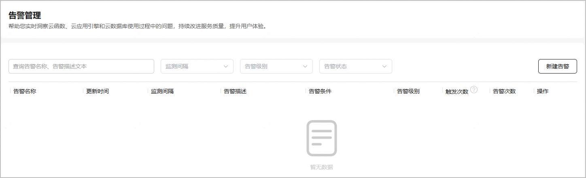
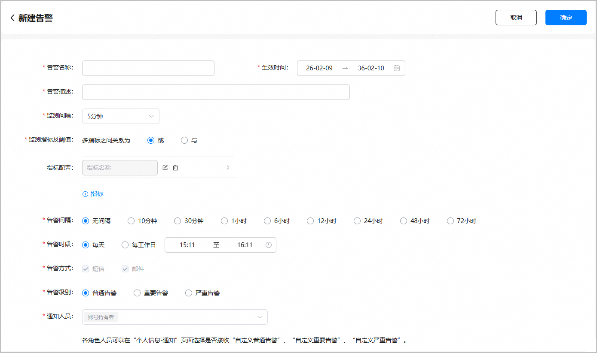
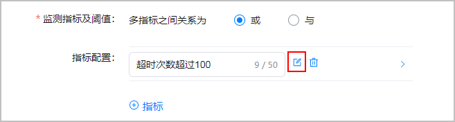
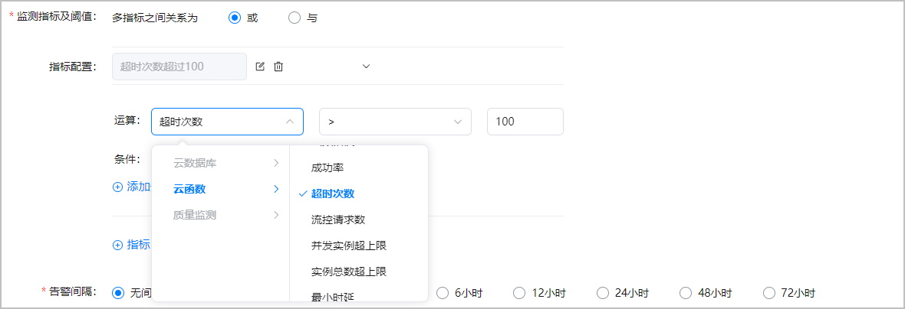
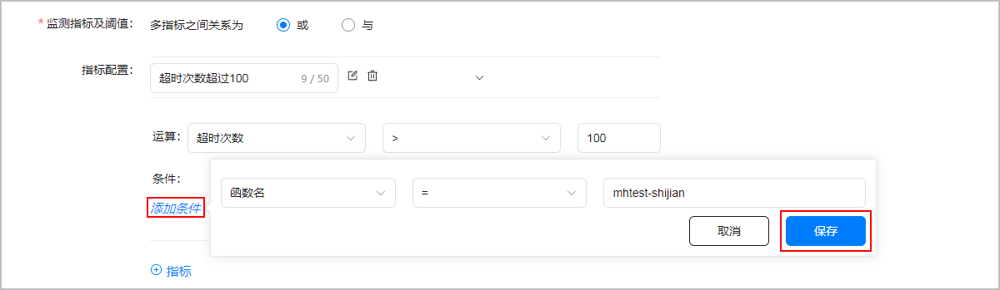
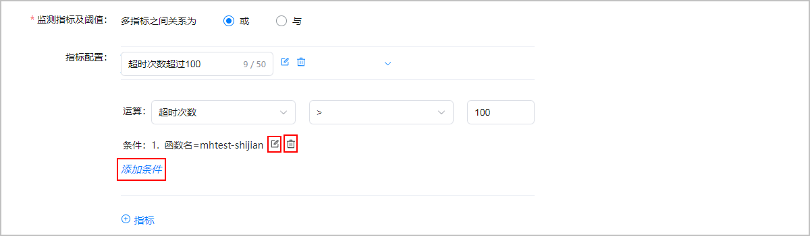

1. 登录[AppGallery Connect](https://developer.huawei.com/consumer/cn/service/josp/agc/index.html)，点击“开发与服务”。
2. 在项目列表中选择您的项目。
3. 在左侧导航栏选择“质量 > 云监控 > 告警管理”，进入告警管理主界面，点击“新建告警”。

   
4. 进入“新建告警”页面，配置告警参数。

   

   当前最多支持创建10条告警任务。

   | 参数 | 说明 |
   | --- | --- |
   | 告警名称 | 告警任务的名称。长度不超过64个字符。 |
   | 生效时间 | 告警任务的有效时段，超出时段范围后告警任务不再执行。 |
   | 告警描述 | 告警任务的说明。例如可以描述下该告警监控的指标和条件，方便您后续查询该告警。长度不超过128个字符。 |
   | 监测间隔 | 告警轮询监测的时间粒度，即告警任务执行过程中每隔多久查询一次告警指标。若指标达到阈值会生成告警记录，并触发告警通知发送动作，该值影响监测的灵敏度。  取值范围：  * 5分钟 * 10分钟 * 15分钟 * 30分钟 * 1小时 * 6小时 * 12小时 * 24小时 |
   | 监测指标及阈值 | “多指标之间关系为”表示配置多个监测指标时的告警规则。  取值范围：  * 或（OR）：任一指标达到阈值即触发告警。 * 与（AND）：所有指标都达到阈值才触发告警。 |
   | 指标配置 | 告警规则的名称及阈值，包含指标名称配置以及该指标的条件、运算符、阈值配置。例如，您可以配置监控云函数“成功率”指标的告警，当指标条件“函数名”等于“myhandlerxxxx”且“成功率”小于50%时发送告警。请参考[指标配置方法](#ZH-CN_TOPIC_0000002275142325__zh-cn_topic_0000001411180073_p141685914599)进行配置。  说明：  每条告警任务最多支持配置10个监测指标。 |
   | 告警间隔 | 发送一次告警通知后，在多长时间内不再重复发送该告警通知，即使指标达到阈值条件。  取值范围：  * 无间隔 * 10分钟 * 30分钟 * 1小时 * 6小时 * 12小时 * 24小时 * 48小时 * 72小时 说明：  某些告警指标达到告警阈值后会持续一段时间，在这段时间内每隔一个监测间隔都会触发告警通知。若您不想在这段时间内频繁收到告警通知，您可以设置告警间隔，在告警间隔内您将不会收到告警通知。 |
   | 告警时段 | 告警监测的开始和结束时间，即您允许系统在哪些时间区段向您发送告警通知，告警时段之外的时间不会发送告警通知。  取值范围：  * 每天：周一至周日。 * 每工作日：周一至周五。 说明：  不在告警时段内时，即使所有指标达到阈值也不会发送告警通知，但会保留标有“告警时段受限”的告警记录。 |
   | 告警方式 | 发送告警通知的方式。当前支持的通知方式：  * 短信 * 邮件 |
   | 告警级别 | 根据告警的严重程度不同，分为：普通告警、重要告警、严重告警。  选择不同的告警级别，系统将根据相应的告警通知模板发送告警通知。告警通知模板由系统通知模块管理，模板详情请参考[告警通知](/docs/distribute/agc/agc-help-cloudmonitor-alarm-0000002236492408/agc-help-cloudmonitor-alarm-notice-0000002240103334)。 |
   | 通知人员 | 当告警发生时，系统会根据告警级别将告警通知发送给不同角色的账号。  目前告警级别与可接收告警通知的账号角色对应关系如下：  * 普通告警：账号持有者、APP管理员、运营、开发、客服 * 重要告警：账号持有者、管理员、APP管理员、运营、开发、客服 * 严重告警：账号持有者、管理员、APP管理员、运营、开发、法务 下拉框中选择账号角色，支持全选。“账号持有者”角色默认勾选，且不可取消勾选。 |

   

   详细的指标配置方法如下：

   1. 点击“指标配置”右侧输入框的，文本框从置灰状态变为可编辑状态，在文本框中输入监测指标的名称（长度不超过50个字符）。

      
   2. 点击“指标配置”右侧的，展开指标配置项。
   3. 点击“运算”右侧的下拉框，选择监测指标，并配置运算符（=、>、>=、&lt;、&lt;=）和阈值。

      

      若您需要配置多个监测指标，不同监测指标归属的服务需要保持一致，例如选择了云函数服务的某个监测指标后，再添加其它监测指标时，只有云函数服务的监测指标可选，其它服务的监测指标将置灰不支持勾选。

      

      当前支持配置云函数、云数据库、APMS服务的监测指标，指标说明如下：

      | 服务名 | 指标名称 | 指标说明 |
      | --- | --- | --- |
      | 云函数 | 实例限制数 | 当前账号的按量实例上限，可理解为同一时刻最多能同时使用的实例数。默认值为300。  对应监控大盘云函数的实例指标：按量实例上限。 |
      | 实例数 | 调用函数时，函数计算系统根据当前实际接收到的请求数而自动扩缩容的函数实例个数。  对应监控大盘云函数的实例指标：按量实例数。 |
      | 自动更新实例数 | 可以动态更新的最小实例数，从而提高预留函数实例的利用率。  对应监控大盘云函数的实例指标：动态更新最小实例数。 |
      | cpu使用率 | 在调用函数时，函数的CPU使用率。  对应监控大盘云函数的实例指标：平均CPU使用情况。 |
      | 单实例请求数 | 单个实例一段时间内接受请求的平均数量。总请求量/实例个数。  对应监控大盘云函数的实例指标：平均单实例请求数 |
      | 调用次数 | 调用函数的总请求次数。 |
      | 服务端错误 | 调用InvokeFunction接口访问服务中的函数且返回HTTP Status为5xx的请求次数，以及系统因为服务端错误而执行失败的异步调用请求次数。 |
      | 客户端错误 | 调用InvokeFunction接口访问服务中的函数且返回HTTP Status为4xx的请求次数，以及系统因为客户端错误而执行失败的异步调用请求次数。 |
      | 函数错误 | 调用服务中的函数时，由于内存溢出和函数执行时间超时等导致的错误次数。 |
      | 成功率 | 单位时间内函数计算处理完成的请求数/单位时间内函数计算接收的总请求数。 |
      | 超时次数 | 函数执行时间超过函数最大Timeout时间次数。 |
      | 流控请求数 | 超出函数承载最大请求数而被拒绝的请求数量。 |
      | 并发实例超上限 | 调用函数时，由于函数并发实例超上限导致函数执行失败，且返回429状态码的总调用次数。 |
      | 实例总数超上限 | 调用函数时，由于实例总数超上限导致函数执行失败，且返回503状态码的总调用次数。 |
      | 最小时延 | 在调用函数时，函数执行请求从抵达函数计算系统开始到离开函数计算系统所消耗的时间，且包含平台消耗的时间。 |
      | 最大时延 | 在调用函数时，函数执行请求从抵达函数计算系统开始到离开函数计算系统所消耗的时间，且包含平台消耗的时间。 |
      | 冷启动时间 | 函数下载、启动函数实例容器、运行时初始化、代码初始化等环节总时长。 |
      | 云数据库 | 用户查询成功次数 | 监测间隔时间范围内用户查询成功次数。 |
      | 用户写入成功次数 | 监测间隔时间范围内用户写入成功次数。 |
      | 用户删除成功次数 | 监测间隔时间范围内用户删除成功次数。 |
      | 用户事务成功次数 | 监测间隔时间范围内用户事务成功次数。 |
      | 安全规则命中数 | 监测间隔时间范围内用户触发的安全规则命中次数总和。 |
      | 用户连接数 | 监测间隔时间范围内的用户连接数最大值。 |
      | 订阅关系数 | 监测间隔时间范围内的用户订阅关系数最大值。 |
      | 日活跃度 | 过去24h的活跃用户数（前一小时开始向前24h）。 |
      | 质量监测 | JS Error崩溃次数 | 监测间隔时间范围内应用发生JS Error崩溃问题的次数。 |
      | Cpp Crash崩溃次数 | 监测间隔时间范围内应用发生Cpp Crash崩溃问题的次数。 |
      | Oom崩溃次数 | 监测间隔时间范围内应用发生Oom崩溃问题的次数。 |
      | Process Kill崩溃次数 | 监测间隔时间范围内应用发生Process Kill崩溃问题的次数。 |
      | App Freeze崩溃次数 | 监测间隔时间范围内应用发生App Freeze崩溃问题的次数。 |
      | JS Error崩溃率 | 监测间隔时间范围内应用发生JS Error崩溃次数/应用启动次数。 |
      | Cpp Crash崩溃率 | 监测间隔时间范围内应用发生Cpp Crash崩溃次数/应用启动次数。 |
      | Oom崩溃率 | 监测间隔时间范围内应用发生Oom崩溃次数/应用启动次数。 |
      | Process Kill崩溃率 | 监测间隔时间范围内应用发生Process Kill崩溃次数/应用启动次数。 |
      | App Freeze崩溃率 | 监测间隔时间范围内应用发生App Freeze崩溃次数/应用启动次数。 |
      | JS Error崩溃设备数 | 监测间隔时间范围内应用发生JS Error崩溃问题影响到的设备数。 |
      | Cpp Crash崩溃设备数 | 监测间隔时间范围内应用发生Cpp Crash崩溃问题影响到的设备数。 |
      | Oom崩溃设备数 | 监测间隔时间范围内应用发生Oom崩溃问题影响到的设备数。 |
      | Process Kill崩溃设备数 | 监测间隔时间范围内应用发生Process Kill崩溃问题影响到的设备数。 |
      | App Freeze崩溃设备数 | 监测间隔时间范围内应用发生App Freeze崩溃问题影响到的设备数。 |
      | JS Error崩溃设备占比 | 监测间隔时间范围内应用发生JS Error崩溃问题影响到的设备数占启动应用设备总数的比例。 |
      | Cpp Crash崩溃设备占比 | 监测间隔时间范围内应用发生Cpp Crash崩溃问题影响到的设备数占启动应用设备总数的比例。 |
      | Oom崩溃设备占比 | 监测间隔时间范围内应用发生Oom崩溃问题影响到的设备数占启动应用设备总数的比例。 |
      | Process Kill崩溃设备占比 | 监测间隔时间范围内应用发生Process Kill崩溃问题影响到的设备数占启动应用的设备总数的比例。 |
      | App Freeze崩溃设备占比 | 监测间隔时间范围内应用发生App Freeze崩溃问题影响到的设备数占启动应用设备总数的比例。 |
   4. 点击“添加条件”，在弹出的下拉框中选择条件名称和比较运算符，并在文本框中输入条件值。配置完成后点击“保存”。

      当前仅支持对云函数监控指标设置条件，若您选择云数据库、APMS服务的监控指标，可跳过本步骤。

      

      不允许对同一个条件名进行重复配置。

      | 服务名 | 条件名称 | 条件说明 |
      | --- | --- | --- |
      | 云函数 | 版本 | 首次创建的函数，版本默认为"$latest"，开发者可以基于$latest版本发布函数，发布的函数版本从1开始递增。 |
      | 函数名 | 云函数服务中已创建的函数名称。 |

      

      可通过点击“添加条件”添加多个指标条件，也可以点击“条件”右侧的编辑条件和删除条件。

      
   5. （可选）若需要配置多个监测指标，点击“ 指标”，重复步骤[a](#ZH-CN_TOPIC_0000002275142325__zh-cn_topic_0000001411180073_li1557918201110)-[d](#ZH-CN_TOPIC_0000002275142325__zh-cn_topic_0000001411180073_li1159719487312)即可。您也可以点击“指标配置”右侧的删除指标。
5. 配置完成后，点击右上角的“确定”，新建的告警将展示在告警列表中。
