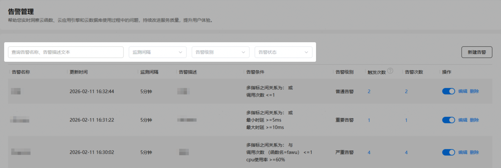
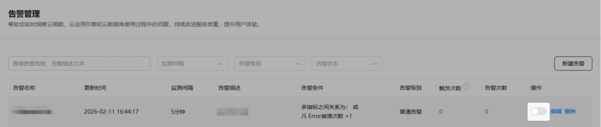
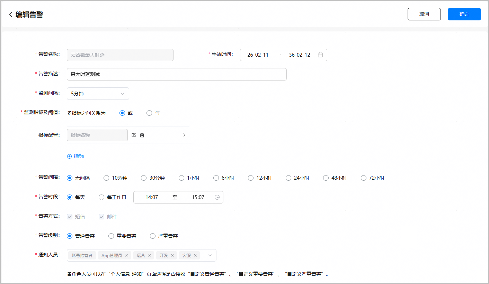
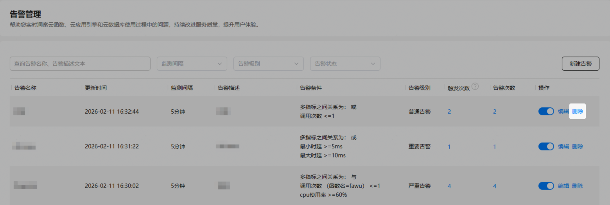
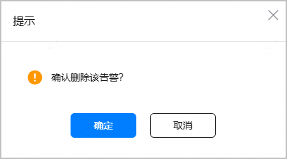

创建告警后，您可以在告警管理主界面查询告警、修改告警状态，以及对告警进行编辑、删除等操作。

#### 查询告警

在告警管理主界面，您可以在文本框中输入“告警名称”或“告警描述”并按下Enter键来筛选告警，或者在“监测间隔”、“告警等级”、“告警状态”下拉框中选择告警的监测间隔、级别、启用状态来过滤查询告警。

| 字段 | 说明 |
| --- | --- |
| 告警名称 | 创建告警时配置的告警名称。 |
| 更新时间 | 最近一次修改告警的时间。 |
| 监测间隔 | 告警轮询监测的时间粒度，即每隔多久查询一次告警指标。 |
| 告警描述 | 告警任务的说明。 |
| 告警条件 | 多指标之间的运算关系（或、与）与指标配置合集。 |
| 告警级别 | 根据告警的严重程度不同，分为：普通告警、重要告警、严重告警。 |
| 触发次数 | 告警任务查询到监测指标达到阈值的次数。 |
| 告警次数 | 监测指标达到阈值且在告警时段内成功上报的告警次数。 |

#### 启用与关闭告警

创建告警后，您可以在告警管理主页面的告警列表中，通过点击每条告警右侧“操作”列的来启用或关闭告警。

* 成功创建告警后，该告警默认为关闭状态。
* 关闭告警后，系统将停止执行该告警的规则监测及发送告警通知操作。如需重新监测，可重新设置开关，启用该告警。

#### 编辑告警

1. 登录[AppGallery Connect](https://developer.huawei.com/consumer/cn/service/josp/agc/index.html)，点击“开发与服务”。
2. 在项目列表中选择您的项目。
3. 在左侧导航栏选择“质量 > 云监控 > 告警管理”，进入“告警管理”主界面。
4. 在告警列表中，点击待编辑告警右侧“操作”列的“编辑”。

   
5. 进入“编辑告警”页面，您可以修改除“告警名称”和“告警方式”以外的其它配置项。完成修改后，点击右上角的“确定”保存修改即可。

   | 参数 | 说明 |
   | --- | --- |
   | 告警名称 | 告警任务的名称。不支持修改。 |
   | 生效时间 | 告警任务的有效时段，超出时段范围后告警任务不再执行。 |
   | 告警描述 | 告警任务的说明。例如可以描述下该告警监控的指标和条件，方便您后续查询该告警。长度不超过128个字符。 |
   | 监测间隔 | 告警轮询监测的时间粒度，即告警任务执行过程中每隔多久查询一次告警指标。若指标达到阈值会生成告警记录，并触发告警通知发送动作，该值影响监测的灵敏度。  取值范围：  * 5分钟 * 10分钟 * 15分钟 * 30分钟 * 1小时 * 6小时 * 12小时 * 24小时 |
   | 监测指标及阈值 | “多指标之间关系为”表示配置多个监测指标时的告警规则。  取值范围：  * 或（OR）：任一指标达到阈值即触发告警。 * 与（AND）：所有指标都达到阈值才触发告警。 |
   | 指标配置 | 告警规则的名称及阈值，包含指标名称配置以及该指标的条件、运算符（等于、大于、小于）及阈值配置。例如，您可以配置监控云函数“成功率”指标的告警，当指标条件“函数名”等于“myhandlerxxxx”且“成功率”小于50%时发送告警。  说明：  每条告警支持最多配置10个监测指标。 |
   | 告警间隔 | 发送一次告警通知后，在多长时间内不再重复发送该告警通知，即使指标达到阈值条件。  取值范围：  * 无间隔 * 10分钟 * 30分钟 * 1小时 * 6小时 * 12小时 * 24小时 * 48小时 * 72小时 说明：  某些告警指标达到告警阈值后会持续一段时间，在这段时间内每隔一个监测间隔都会触发告警通知。若您不想在这段时间内频繁收到告警通知，您可以设置告警间隔，在告警间隔内您将不会收到告警通知。 |
   | 告警时段 | 告警监测的开始和结束时间，即您允许系统在哪些时间区段向您发送告警通知，告警时段之外的时间不会发送告警通知。  取值范围：  * 每天：周一至周日。 * 每工作日：周一至周五。 说明：  不在告警时段内时，即使所有指标达到阈值也不会发送告警通知，但会保留标有“告警时段受限”的告警记录。 |
   | 告警方式 | 发送告警通知的方式。当前支持“短信”和“邮件”两种方式，不支持修改。 |
   | 告警级别 | 根据告警的严重程度不同，分为：普通告警、重要告警、严重告警。 |
   | 通知人员 | 当告警发生时，系统会根据告警级别将告警通知发送给不同角色的账号。  目前告警级别与可接收告警通知的账号角色对应关系如下：  * 普通告警：账号持有者、APP管理员、运营、开发、客服 * 重要告警：账号持有者、管理员、APP管理员、运营、开发、客服 * 严重告警：账号持有者、管理员、APP管理员、运营、开发、法务 下拉框中选择账号角色，支持全选。“账号持有者”角色默认勾选，且不可取消勾选。 |

   

#### 删除告警

1. 登录[AppGallery Connect](https://developer.huawei.com/consumer/cn/service/josp/agc/index.html)，点击“开发与服务”。
2. 在项目列表中选择您的项目。
3. 选择“质量 > 云监控 > 告警管理”，进入“告警管理”主界面。
4. 在告警列表中，点击待删除告警右侧“操作”列的“删除”。

   
5. 系统弹出提示框，询问您是否确认删除该告警，确认无误后，点击“确定”，即可删除告警。

   
