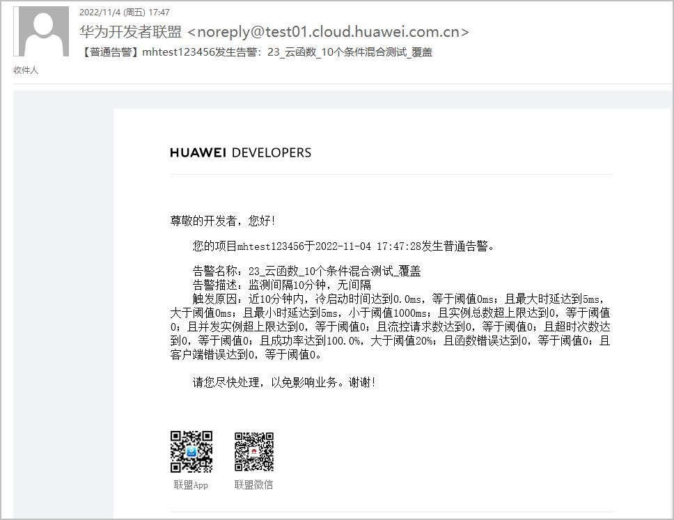
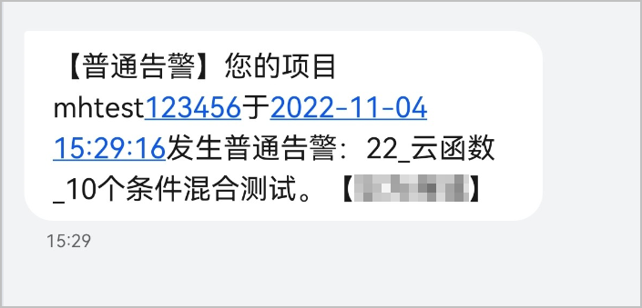
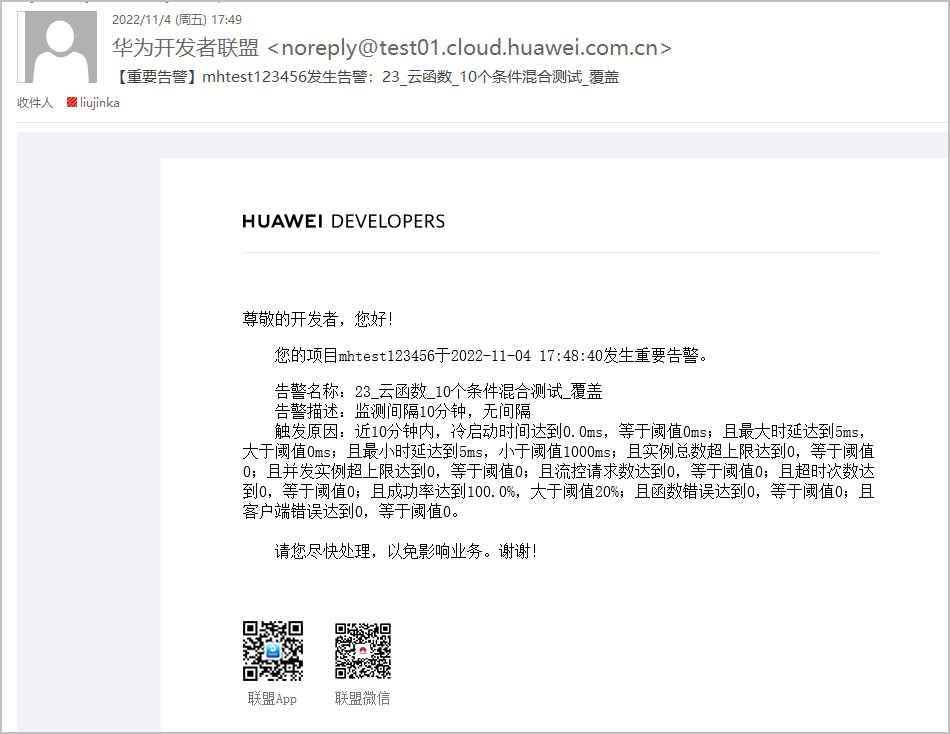
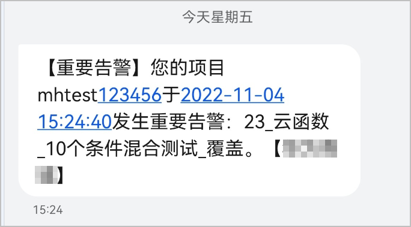
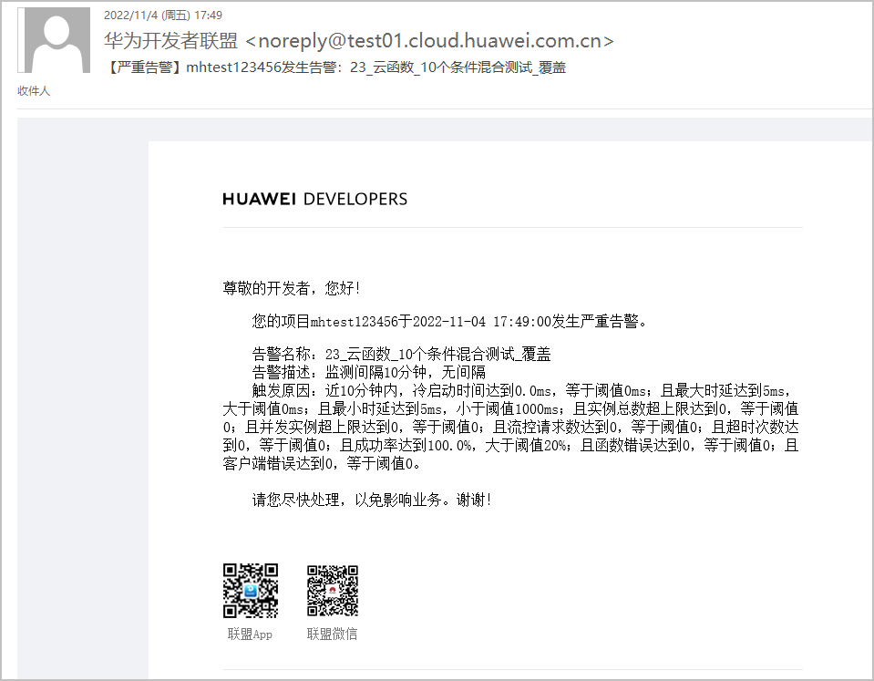
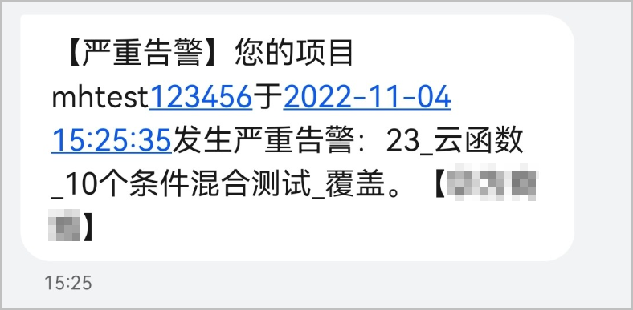

由于告警级别不同，系统发送告警通知时的接收人角色不同，故三种级别的告警通知信息会有所不同。

* 当前支持的告警通知方式有：MAIL（邮件）、SMS（短信），新建告警时默认全部选中。
* 当告警发生时，系统将根据您配置的告警级别匹配对应的模板向对应的账号角色发送告警通知。

#### 普通告警通知

发生普通告警时，您将收到类似如下样式的告警通知：

#### [h2]邮件

#### [h2]短信

#### 重要告警通知

发生重要告警时，您将收到类似如下样式的告警通知：

#### [h2]邮件

#### [h2]短信

#### 严重告警通知

发生严重告警时，您将收到类似如下样式的告警通知：

#### [h2]邮件

#### [h2]短信

