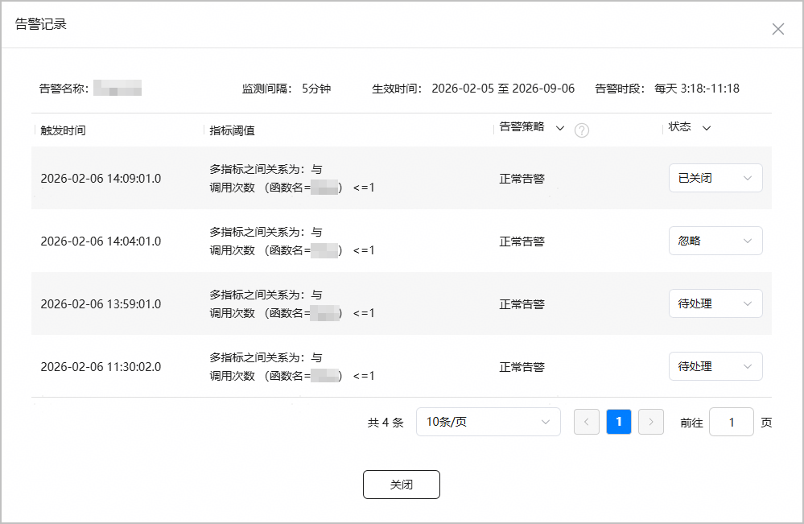
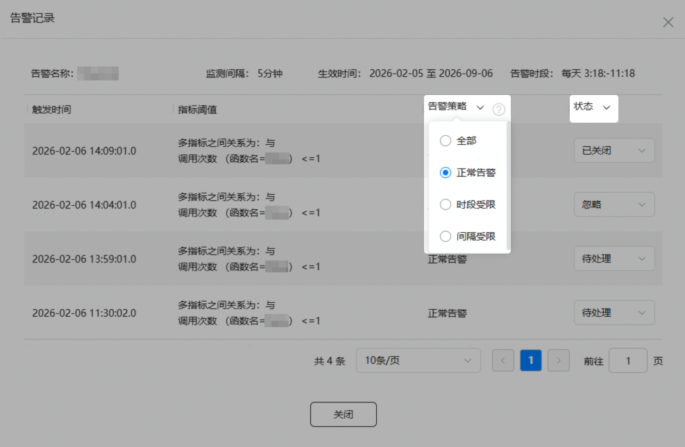

1. 登录[AppGallery Connect](https://developer.huawei.com/consumer/cn/service/josp/agc/index.html)，点击“开发与服务”。
2. 在项目列表中选择您的项目。
3. 在左侧导航栏选择“质量 > 云监控 > 告警管理”，进入“告警管理”主页面。
4. 您可在文本框中输入“告警名称”/“告警描述”并按下Enter键筛选某一告警，也可点击“监测间隔”、“告警等级”、“告警状态”下拉框选择告警的监测间隔、级别、启用状态来过滤查询某一告警。

   
5. 过滤出预查看告警记录的告警后，点击该告警的“触发次数”或者“告警次数”进入告警记录表。告警数据比较多时，可设置每页展示的告警条数，也可以翻页查看。

   

   告警记录保存时间最长30天，触发时间超过30天的记录将被自动清理。

   | 字段 | 说明 |
   | --- | --- |
   | 触发时间 | 上报告警的时间。 |
   | 指标阈值 | 创建告警时配置的指标名称、运算符、阈值以及条件。 |
   | 告警策略 | 系统判断是否上报告警的策略。  * 正常告警：触发时间在告警生效时间和告警时段内，且满足告警间隔的告警。 * 时段受限：触发时间不在告警监测的开始和结束时间范围内的告警。 * 间隔受限：触发时间距离上一次告警时间的间隔小于告警间隔的告警。 |
   | 状态 | 当前支持三种告警状态：  * 待处理：导致告警上报的异常，还未确认或者清除。 * 忽略：导致告警上报的异常，不影响系统主要功能使用或为误报。 * 已关闭：导致告警上报的异常，已被清除。 说明：  仅分配了“管理员”、“APP管理员”、“运营”、“开发”或“客服”角色的账号才可以进行告警状态标记。 |

   
6. 在告警记录页面，您可将鼠标悬停在“告警策略”或“状态”字段上，点击后在下拉框中选择您关注的告警策略或告警状态，以便进一步处理告警。

   
