云监控提供的日志服务功能可呈现和查询云函数的业务日志和接入日志两种日志类型，具体说明如下表所示。

| 日志类型 | 说明 |
| --- | --- |
| 业务日志 | 即run日志，由开发者根据业务需要调用云函数提供的日志接口生成，主要记录系统的运行状况或业务执行流程中的一些关键信息，包括异常的状态、动作、关键事件等。 |
| 接入日志 | 即access日志，由云函数平台生成，主要记录客户端访问服务端的所有请求信息。针对特定情况下的问题定位，若基于业务日志不能定位到错误请求源头，您可查询接入日志，根据错误码（userCode）等关键信息找到调用异常的接口记录，再根据traceId查询具体的业务日志记录，从而快速地定位报错原因并解决问题。 |

#### 前提条件

若要查看云函数服务的业务日志或者接入日志，您首先需要[创建函数](/docs/dev/app-dev/application-services/cloud-foundation-kit-guide/cloudfoundation-function-service/cloudfoundation-develop-cloud-function/cloudfoundation-create-and-config-function)。

#### 查看云函数业务日志

1. 登录[AppGallery Connect](https://developer.huawei.com/consumer/cn/service/josp/agc/index.html)，点击“开发与服务”。
2. 在项目列表中选择您的项目。
3. 左侧导航栏选择“质量 > 云监控 > 日志服务”，进入“日志服务”主页面。
4. 在页面左上角，日志类型选择“业务日志”，下拉框选择“云函数”，即可查看云函数服务的业务日志。您可根据需要添加过滤条件、设置查询的时间范围，筛选出符合条件的日志信息，并可通过点击“查询”获取最新的业务日志。

   

   默认情况下，选择日志类型和服务名称后，系统会自动执行一次查询操作。时间选择框默认时间跨度为最近7天，查询结果按照分钟级时间从最新开始展示。

   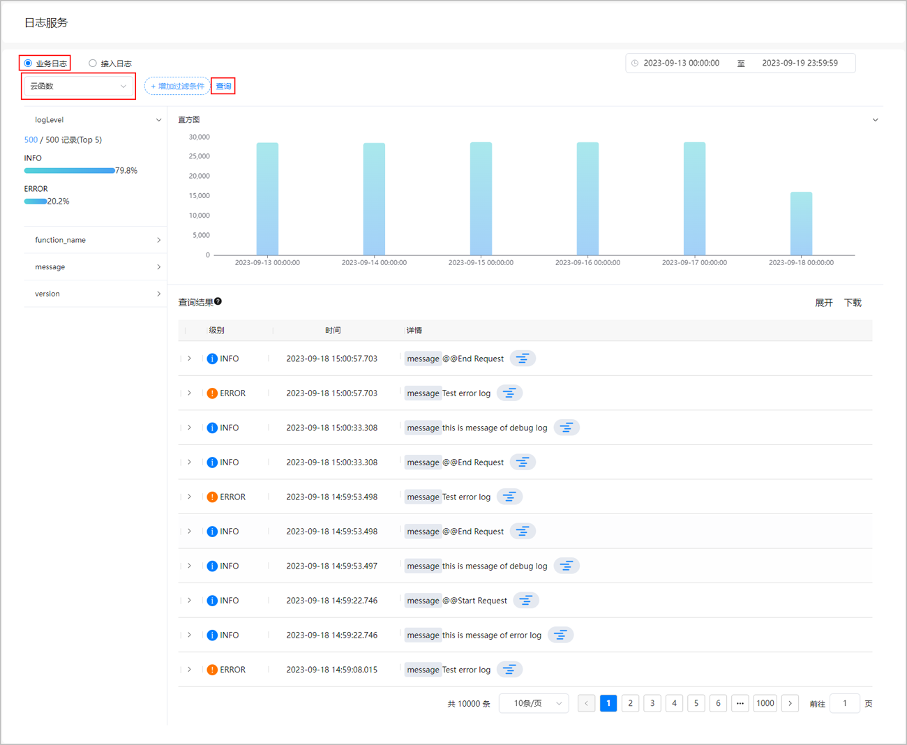

   在该页面您可以执行以下操作：

   * 点击“增加过滤条件”，可添加traceId（调用ID）、logLevel（日志级别）、function\_name（函数名）、message（日志内容）或version（函数版本）过滤器，对所有业务日志进行过滤查询。

     

     + 支持添加多个过滤条件。
     + 增加过滤条件时，支持“等于”、“属于”、“不等于”和“不属于”四种运算符。
       - 选择“等于”或“不等于”运算符时只能输入一个条件值进行精确匹配。
       - 选择“属于”或“不属于”运算符时可以输入一个或多个条件值进行精确匹配。当输入多个条件值时，与其中任意一个条件值匹配成功，则显示满足该条件的日志。

     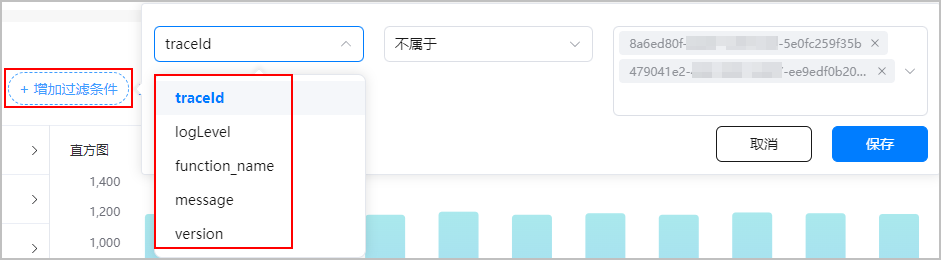

     点击“保存”后，添加的过滤条件处于启用状态，“查询结果”区域将展示指定时间范围内符合条件的日志信息。鼠标滑动至过滤器上，可对其进行禁用、删除和编辑操作，并且禁用后可再次启用。

     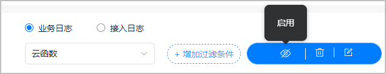
   * 点击时间选择框，您可以在窗口左侧选择预定时间段，例如最近1小时，也可以自定义时间范围筛选日志。

     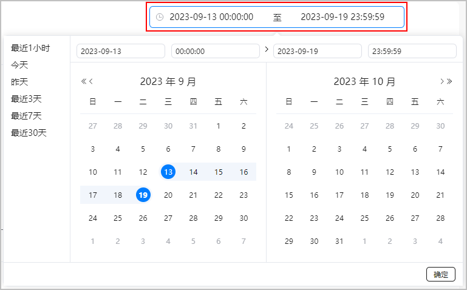
   * 点击“直方图”区域任一处，可展开或收起直方图，主要展示查询到的业务日志在时间上的分布情况。
   * 点击“查询结果”区域右侧的“展开”，日志表格将展开显示每条日志的详细信息，包含日志级别、日志内容、函数调用时间等。您也可点击“复制至剪贴板”以JSON格式复制您关心的某条日志内容，方便您筛选关键信息。

     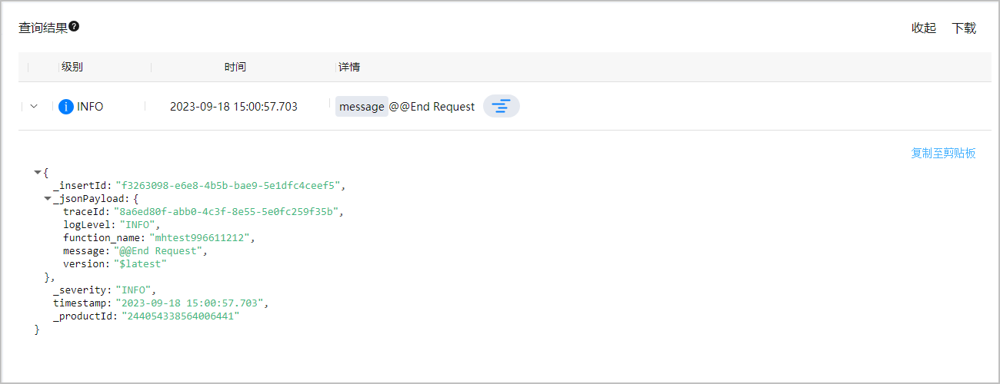
   * 点击“查询结果”区域右侧的“下载”，可将日志以txt格式导出到本地查看。
   * 点击日志末尾的，相当于添加了traceId过滤器，可过滤出该traceId的所有日志。若想去除过滤，鼠标放置在页面顶端该traceId过滤器上，将其禁用或者删除即可。

     
5. （可选）点击直方图区域某处展开直方图，将鼠标悬浮在直方图某一蓝色数据块上时，您可查看到该数据块代表的时间范围和日志命中次数。

   

   若选择的时间范围跨度不同，系统返回的日志数据块细化粒度也不同。下文以7天时间跨度来说明通过直方图查看日志分布的方法。

   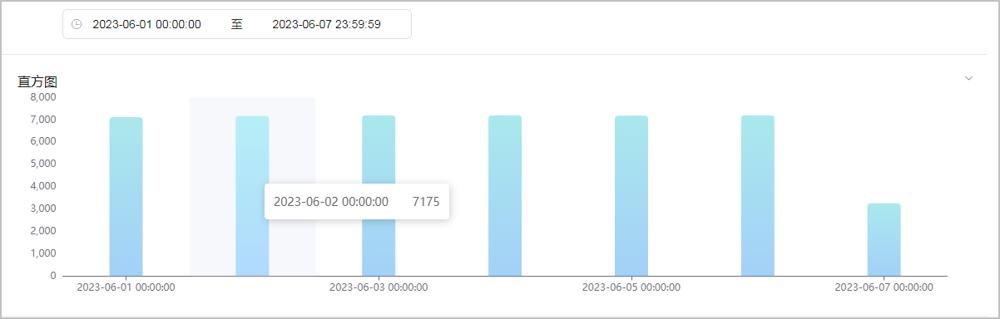

   点击某一天的数据块，例如2023-06-02 00:00:00，系统返回这一天0点-3点的日志分布，您也可通过时间选择框修改小时跨度而细化展示这一天每小时的日志命中数。同时在“查询结果”区域会同步展示指定时间范围内的日志查询结果。

   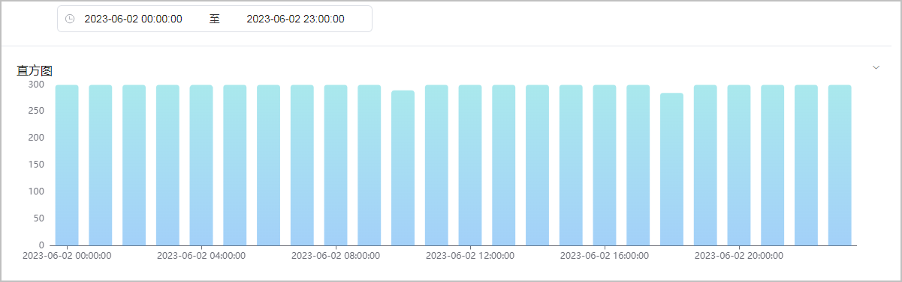

   点击某一小时的蓝色数据块，例如2023-06-02 08:00:00，系统返回这一天8点00分-9点00分的日志分布。

   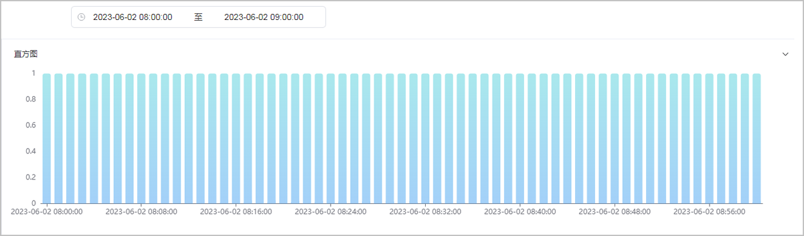

#### 查看云函数接入日志

1. 登录[AppGallery Connect](https://developer.huawei.com/consumer/cn/service/josp/agc/index.html)，点击“开发与服务”。
2. 在项目列表中选择您的项目。
3. 左侧导航栏选择“质量 > 云监控 > 日志服务”，进入“日志服务”主页面。
4. 日志类型选择“接入日志”，下拉框自动填充为“云函数”。您可根据需要添加过滤条件、设置查询的时间范围，筛选出符合条件的日志信息，并可通过点击“查询”获取最新的接入日志。

   

   默认情况下，选择日志类型后，系统会自动执行一次查询操作。时间选择框默认时间跨度为最近7天，查询结果按照分钟级时间从最新开始展示。

   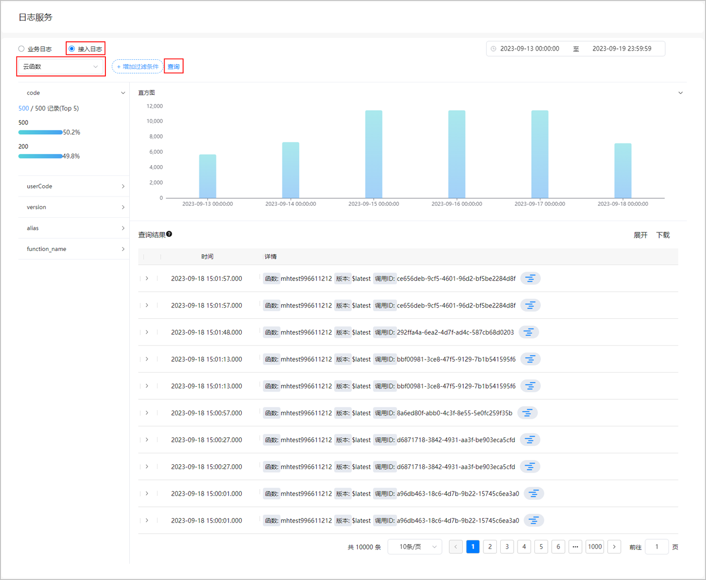

   在该页面您可以执行以下操作：

   * 点击“增加过滤条件”，可根据需要设置过滤器，对所有接入日志进行筛选。当前支持的过滤条件全集如下表所示。

     

     + 支持添加多个过滤条件。
     + 增加过滤条件时，支持“等于”、“属于”、“不等于”和“不属于”四种运算符。
       - 选择“等于”或“不等于”运算符时只能输入一个条件值进行精确匹配。
       - 选择“属于”或“不属于”运算符时可以输入一个或多个条件值进行精确匹配。当输入多个条件值时，与其中任意一个条件值匹配成功，则显示满足该条件的日志。

     | 字段名称 | 字段含义 | 字段示例 | 备注 |
     | --- | --- | --- | --- |
     | code | 调用函数返回的HTTP状态码。 | 200 | - |
     | userCode | 用户自定义的HTTP状态码。 | 200 | - |
     | version | 函数版本。 | 1 | - |
     | alias | 函数别名。 | final | 可能为空。 |
     | function\_name | 函数名称。 | mhtest-shijian | - |
     | trace\_id | 调用ID。 | 79fc85ce-5c63-4751-84b8-e16957d6c7c4 | - |

     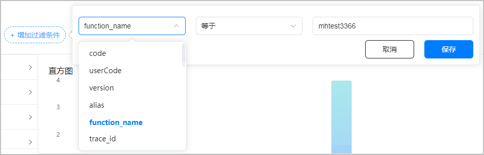

     点击“保存”后，添加的过滤条件处于启用状态，“查询结果”区域将展示指定时间范围内符合条件的日志信息。鼠标滑动至过滤器上，可对其进行禁用、删除和编辑操作，并且禁用后可再次启用。

     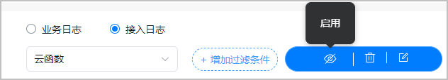
   * 点击时间选择框，您可以在窗口左侧选择预定时间段，例如最近1小时，也可以自定义时间范围筛选日志。

     
   * 点击“直方图”区域任一处，可展开或收起直方图，主要展示查询到的接入日志在时间上的分布情况。
   * 点击“查询结果”区域右侧的“展开”，日志表格将展开显示每条日志的详细信息，包含函数调用时间、HTTP请求方法名、调用函数返回的HTTP状态码等。

     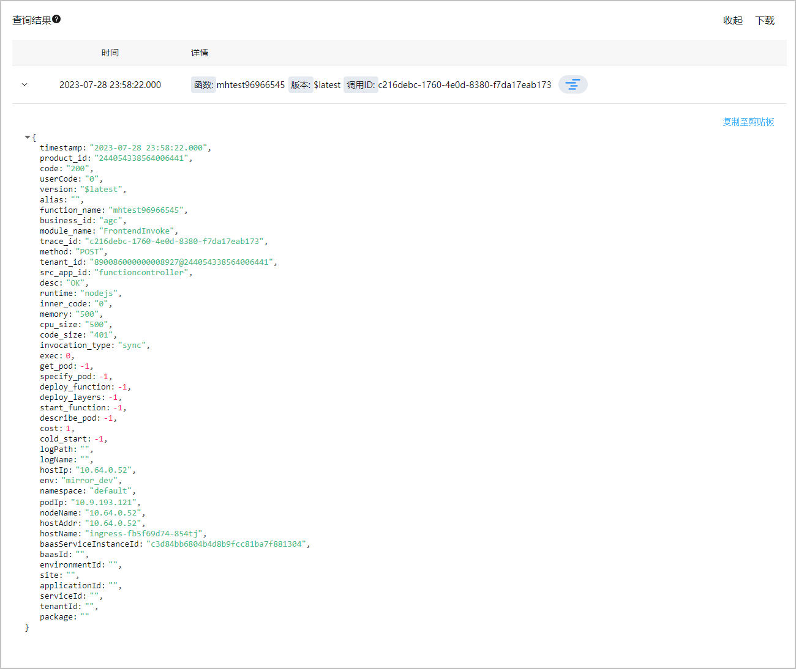
   * 点击“查询结果”区域右侧的“下载”，可将日志以txt格式导出到本地查看。
   * 点击日志末尾的，相当于添加了traceId的过滤条件，可过滤出该traceId的所有日志。若想去除过滤，鼠标放置在页面顶端该traceId过滤器上，将其禁用或者删除即可。

     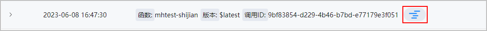
5. （可选）点击直方图区域某处展开直方图，将鼠标悬浮在直方图某一蓝色数据块上时，您可查看到该数据块代表的时间范围和日志命中次数。

   

   若您想通过直方图查看更细时间粒度的日志分布情况，操作方法与业务日志一致，详情请参见[通过直方图查看日志分布情况](#ZH-CN_TOPIC_0000002271371765__zh-cn_topic_0000001432886916_li16636165985613)。

   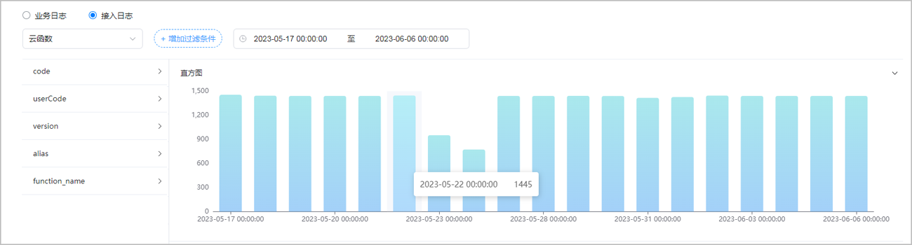
