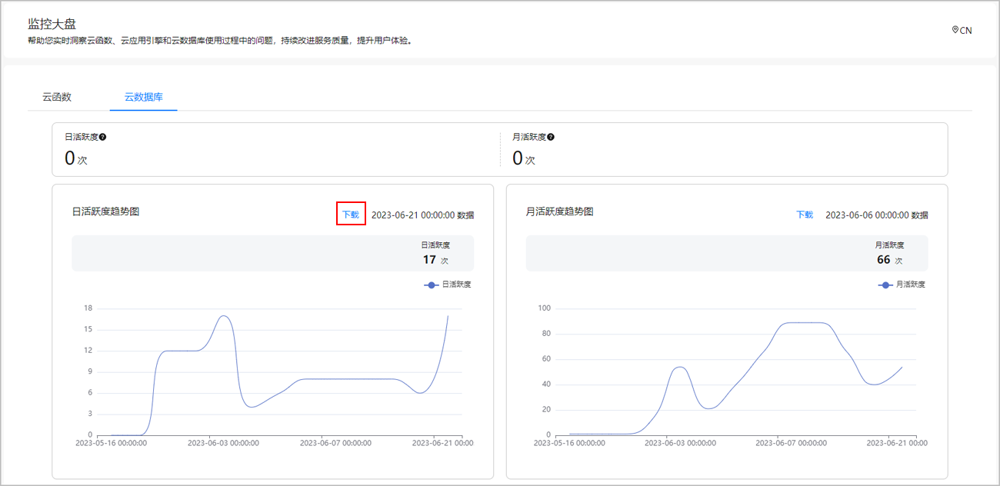
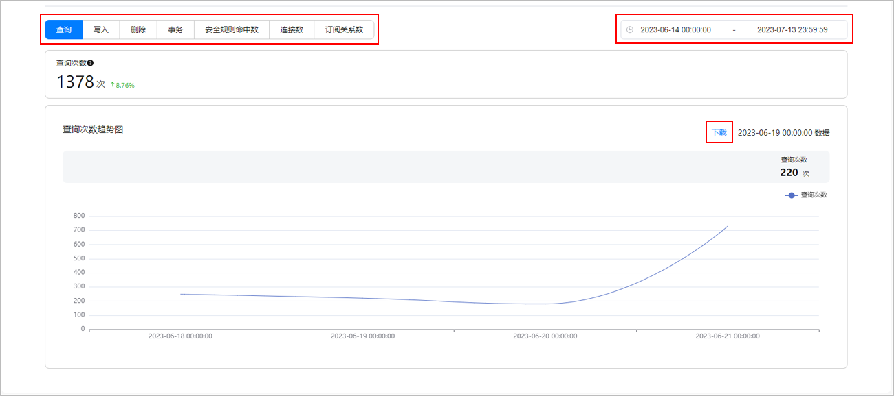

监控云数据库的使用情况，关键指标有查询、写入、删除、事务、安全规则命中数、连接数和订阅关系数。指标以今昨对比图、折线图、列表的形式来统计。

#### 前提条件

您已[开通云数据库服务](https://developer.huawei.com/consumer/cn/doc/harmonyos-guides/cloudfoundation-enable-database)，并且已创建[存储区](https://developer.huawei.com/consumer/cn/doc/harmonyos-guides/cloudfoundation-database-add-zone)和[对象类型](https://developer.huawei.com/consumer/cn/doc/harmonyos-guides/cloudfoundation-database-add-object)。

#### 查看监控数据

1. 登录[AppGallery Connect](https://developer.huawei.com/consumer/cn/service/josp/agc/index.html)，点击“开发与服务”。
2. 在项目列表中选择您的项目。
3. 在左侧导航栏选择“质量 > 云监控 > 监控大盘”，进入“监控大盘”主页面。
4. 点击“云数据库”，进入云数据库指标统计页面，您即可直观地查看云数据库服务的各项监控指标数据。

   | 指标名称 | 指标含义 | 指标计值方式 |
   | --- | --- | --- |
   | 查询次数 | 选定时间范围内用户查询成功次数。 | 累计值 |
   | 写入次数 | 选定时间范围内用户写入成功次数。 | 累计值 |
   | 删除次数 | 选定时间范围内用户删除成功次数。 | 累计值 |
   | 事务次数 | 选定时间范围内用户事务成功次数。 | 累计值 |
   | 安全规则命中数 | 选定时间范围内用户触发的安全规则命中次数。 | 累计值 |
   | 连接数 | 选定时间范围内的用户连接数最大值。 | 瞬时值 |
   | 订阅关系数 | 选定时间范围内的用户订阅关系数最大值。 | 瞬时值 |
   | 日活跃度 | 过去24小时的活跃用户数（前一小时开始向前24小时）。 | 瞬时值 |
   | 月活跃度 | 过去30天的活跃用户数（前一天开始向前30天）。 | 瞬时值 |

   

   累计值表示一个上报周期内的次数累加值，瞬时值表示上报时的瞬间值。

   * 对于统计维度为累计值的数据，云监控将某一时间段所有IP的值累加后展示。
   * 对于统计维度为瞬时值的数据，云监控取某一时间段所有IP的最大值展示。

   

   * 该区域展示日活跃度（过去24h的活跃用户数）和月活跃度（过去30天的活跃用户数）的统计值，以及日活跃度和月活跃度的变化趋势。当鼠标移动至“日活跃度趋势图”或者“月活跃度趋势图”卡片上某一点时，会展示在该时间点的日活跃度次数或者月活跃度次数。
   * 点击“下载”可将日活跃度趋势与月活跃度趋势数据以csv格式导出到本地查看。

   

   * 您可以在右侧的时间选择框中自定义时间段查询，也可以选择预定时间段，例如最近30天，进行过滤查询。
   * 选择不同页签，可查看不同监控指标（查询、写入、删除、事务、安全规则命中数、连接数、订阅关系数）在查询时间范围内的次数总和以及变化趋势图。

     例如，选中“查询”页签，“查询次数”为选择时间范围内的查询次数总和。当鼠标移动至“查询次数趋势图”上某一点时，会展示在该时间点上的查询次数。
   * 点击任一卡片中的“下载”可将监控指标的变化趋势数据以csv格式导出到本地。
