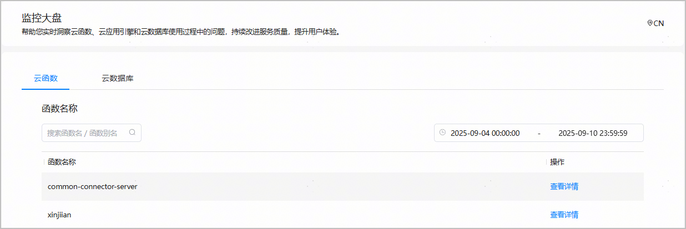
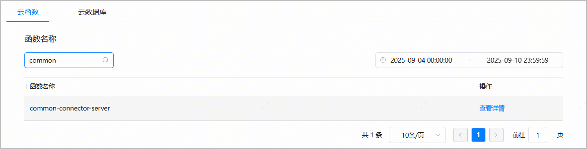
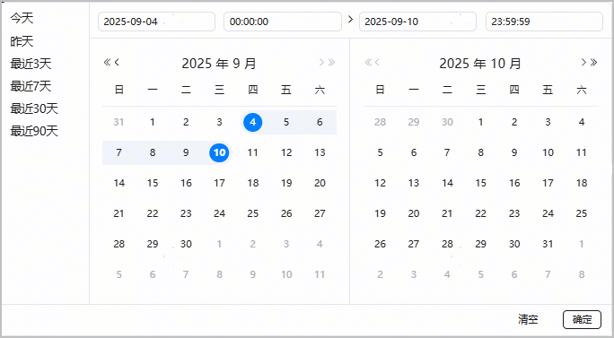
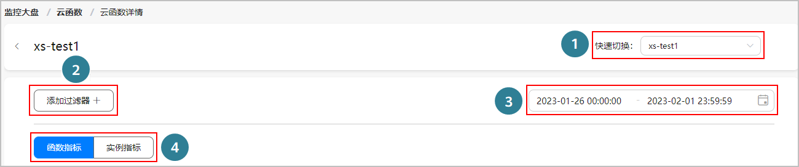
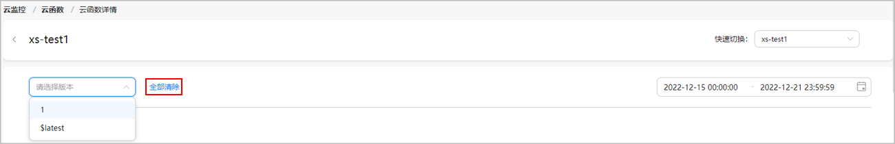
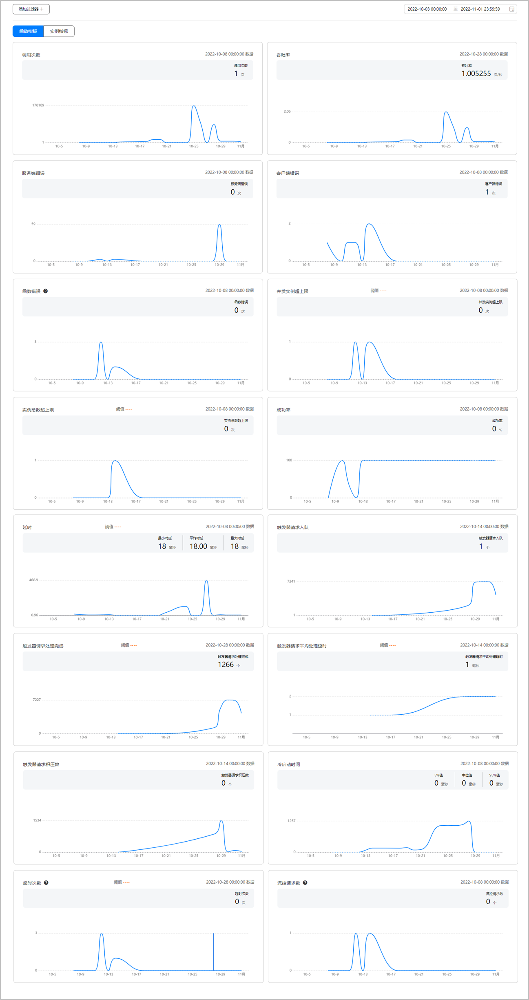
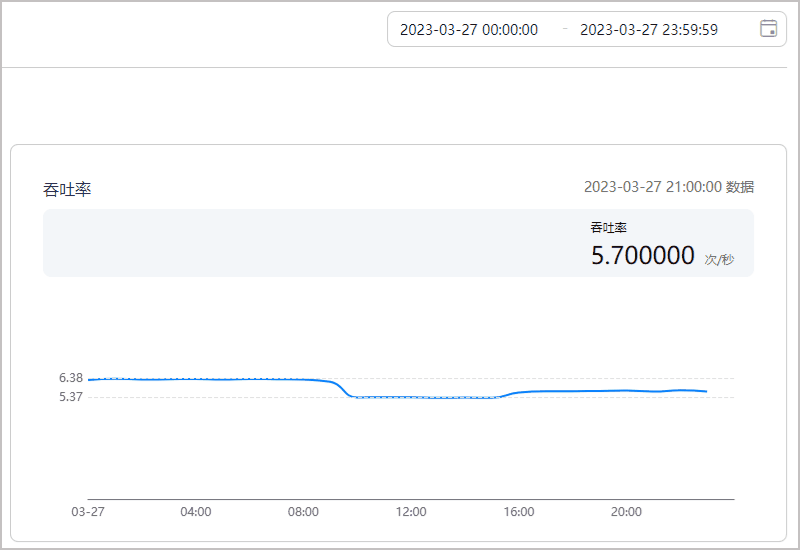
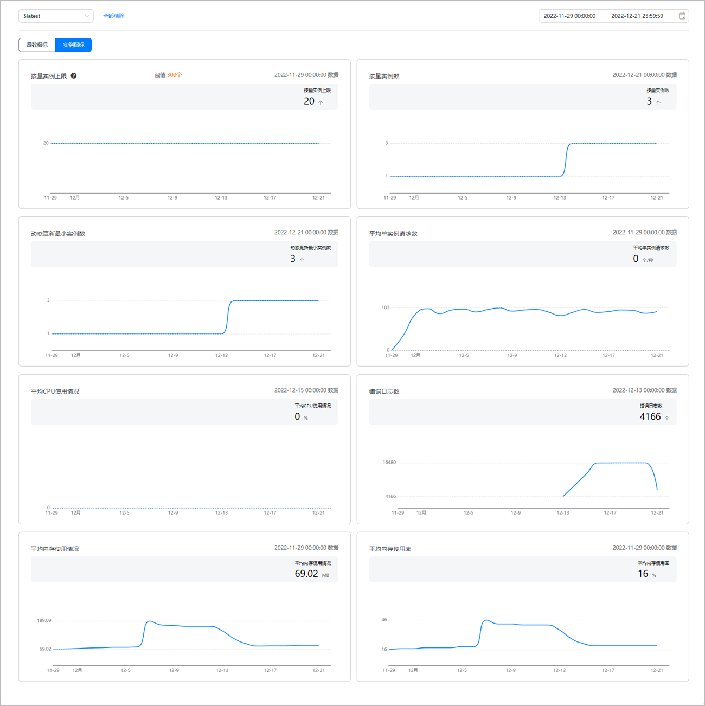
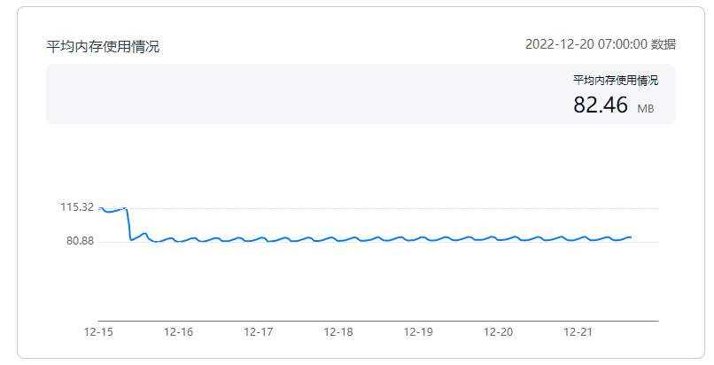

您可以在监控大盘的云函数详情页查看函数级和实例级两个维度的监控指标详情，然后根据指标统计数据判断是否需要优化函数实现。

#### 前提条件

您已[创建函数](/docs/dev/app-dev/application-services/cloud-foundation-kit-guide/cloudfoundation-function-service/cloudfoundation-develop-cloud-function/cloudfoundation-create-and-config-function)。

#### 查看函数

1. 登录[AppGallery Connect](https://developer.huawei.com/consumer/cn/service/josp/agc/index.html)，点击“开发与服务”。
2. 在项目列表中选择您的项目。
3. 在左侧导航栏选择“质量 > 云监控 > 监控大盘”，进入“监控大盘”主页面。
4. 点击“云函数”，进入云函数统计页面。

   

   函数列表仅展示“触发方式”为“事件调用”的云函数。

   

   在该页面您可以执行以下操作：

   * 当函数列表中函数数量较多时，您可以在搜索框中输入函数名称或者函数别名，点击右侧的对函数进行模糊查询。

     
   * 默认展示7天内的查询数据，您可以在时间选择框中自定义时间段查询，也可以选择左侧的预定时间段，例如最近7天，进行筛选。

     
5. 点击函数列表中某一函数“操作”列的“查看详情”，可进入函数详情页[查看监控数据](#section652104172811)。

#### 查看监控数据

当函数列表中存在多个函数时，可点击“快速切换”下拉框选择函数名，查看不同函数的监控指标数据。

当函数配置了发布版本，可点击“添加过滤器”，通过添加“版本”过滤器查询该函数不同版本下的监控指标数据。

也可以点击“全部清除”清除已添加的过滤器。

系统默认展示最近7天的统计数据，您可以在右侧的时间选择框中自定义时间段查询，也可以选择预定时间段，例如最近3天，进行过滤查询。

当前监控的系统指标分为两类：函数指标和实例指标。您可通过点击“函数指标”和“实例指标”页签切换查看两类指标在选定时间段内的监控数据。

#### [h2]函数指标

| 指标名称 | 单位 | 指标说明 | 计算方式 |
| --- | --- | --- | --- |
| 调用次数 | 次 | 调用函数的总请求次数。按1分钟、1小时或1天粒度统计求和。 | 单位时间内求和 |
| 吞吐率 | 次/秒 | 单位时间内函数处理请求的次数。 | 单位时间内求平均值 |
| 服务端错误 | 次 | 调用InvokeFunction接口访问服务中的函数且返回HTTP Status为5xx的请求次数，以及系统因为服务端错误而执行失败的异步调用请求次数。 | 单位时间内求和 |
| 客户端错误 | 次 | 调用InvokeFunction接口访问服务中的函数且返回HTTP Status为4xx的请求次数，以及系统因为客户端错误而执行失败的异步调用请求次数。 | 单位时间内求和 |
| 函数错误 | 次 | 调用服务中的函数时，由于内存溢出和函数执行时间超时等导致的错误次数。 | 单位时间内求和 |
| 并发实例超上限 | 次 | 调用函数时，由于函数并发实例超过上限导致函数执行失败，且返回429状态码的总调用次数。按1分钟、1小时或1天粒度统计求和。 | 单位时间内求和 |
| 实例总数超上限 | 次 | 调用函数时，由于实例总数超上限导致函数执行失败，且返回503状态码的总调用次数。按1分钟、1小时或1天粒度统计求和。 | 单位时间内求和 |
| 成功率 | % | 单位时间内，函数计算处理完成的请求数/函数计算接收的总请求数。  说明：  仅通过HTTP触发器触发的请求才能统计到正确的成功率，其余请求方式，例如测试函数，均不计入该指标统计范围内。 | 中位值 |
| 最小时延 | 毫秒 | 在调用函数时，函数执行请求从抵达函数计算系统开始到离开函数计算系统所消耗的时间，且包含平台消耗的时间。按1分钟、1小时或1天粒度统计求最小值。 | 单位时间内求最小值 |
| 平均时延 | 毫秒 | 在调用函数时，函数执行请求从抵达函数计算系统开始到离开函数计算系统所消耗的时间，且包含平台消耗的时间。按1分钟、1小时或1天粒度统计求平均值。 | 单位时间内求平均值 |
| 最大时延 | 毫秒 | 在调用函数时，函数执行请求从抵达函数计算系统开始到离开函数计算系统所消耗的时间，且包含平台消耗的时间。按1分钟、1小时或1天粒度统计求最大值。 | 单位时间内求最大值 |
| 触发器请求入队 | 个 | 异步调用中，到达函数计算的请求数。 | 单位时间内求和 |
| 触发器请求处理完成 | 个 | 异步调用中，函数计算处理完成的请求数。 | 单位时间内求和 |
| 触发器请求平均处理延时 | 毫秒 | 指定的时间范围内，所有异步调用请求从入队到开始处理的平均时延。 | 单位时间内求平均值 |
| 触发器请求积压数 | 个 | 函数异步调用时，入队请求中等待处理或处理中的总请求个数。按1分钟、1小时或1天粒度统计求和。 | 单位时间内求和 |
| 冷启动时间 | 毫秒 | 函数下载、启动函数实例容器、运行时初始化、代码初始化等环节总时长。 | 单位时间内求和 |
| 超时次数 | 次 | 函数执行时间超过函数最大Timeout时间的次数。 | 单位时间内求和 |
| 流控请求数 | 个 | 超出函数承载最大请求数而被拒绝的请求数量。 | 单位时间内求和 |

上图为所有函数指标在选定时间范围内的采样数据样例，每个卡片对应一个函数类指标，横轴为时间线，纵轴为采样点数据。

当您选择的查询时间范围不同时，指标的统计粒度也不同：

* 当您选择的查询时间段小于2天时，可以查询到分钟粒度的采样数据。

* 当您选择的查询时间段在2-7天时，可以查询到小时粒度的采样数据。
* 当您选择的查询时间段大于7天时，可以查询到天粒度的采样数据。

当您移动鼠标时，如下图所示，值会随着鼠标的移动显示所选指标在对应时间点上的采样数据。

#### [h2]实例指标

| 指标名称 | 单位 | 指标说明 | 计算方式 |
| --- | --- | --- | --- |
| 按量实例上限 | 个 | 当前账号的按量实例上限，可理解为最大实例数。默认值为300。 | 单位时间内求平均值 |
| 按量实例数 | 个 | 调用函数时，函数计算系统根据当前实际接收到的请求数而自动扩缩容的函数实例个数。按1分钟、1小时或1天粒度统计求平均值。 | 单位时间内求平均值 |
| 动态更新最小实例数 | 个 | 可以动态更新的最小实例数，从而提高预留函数实例的利用率。 | 单位时间内求平均值 |
| 平均单实例请求数 | 个/秒 | 单个实例一段时间内接受请求的平均数量。总请求量/实例个数。 | 单位时间内求平均值 |
| 平均CPU使用情况 | % | 在调用函数时，函数的CPU使用率。当CPU使用率在50%-60%时，系统资源使用一般处于比较优的状态。函数所有实例按1分钟、1小时或1天粒度统计求平均值。 | 单位时间内求平均值 |
| 错误日志数 | 个 | 日志级别为ERROR的日志数量。 | 单位时间内求和 |
| 平均内存使用情况 | MB | 在调用函数时，函数执行所消耗的内存，表示函数实际消耗的内存。函数所有实例按1分钟、1小时或1天粒度统计求平均值。 | 单位时间内求平均值 |
| 平均内存使用率 | % | 内存使用情况/内存配额。其中内存配额为调用函数时，函数可使用的内存上限。如果函数实际消耗内存超过此上限，则会出现内存溢出OOM错误。 | 单位时间内求平均值 |

上图为所有实例指标在选定时间范围内的采样数据样例，每个卡片对应一个实例类指标，横轴为时间线，纵轴为采样点数据。

当您选择的查询时间范围不同时，指标的统计粒度也不同：

* 当您选择的查询时间段小于2天时，可以查询到分钟粒度的采样数据。

* 当您选择的查询时间段在2-7天时，可以查询到小时粒度的采样数据。
* 当您选择的查询时间段大于7天时，可以查询到天粒度的采样数据。

当您移动鼠标时，如下图所示，值会随着鼠标的移动显示所选指标在对应时间点上的采样数据。

